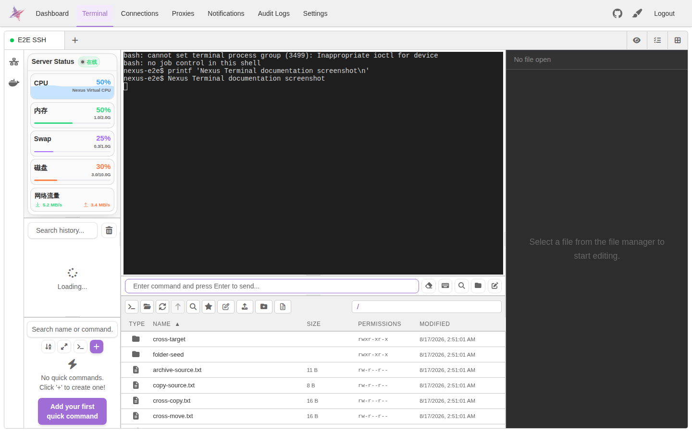
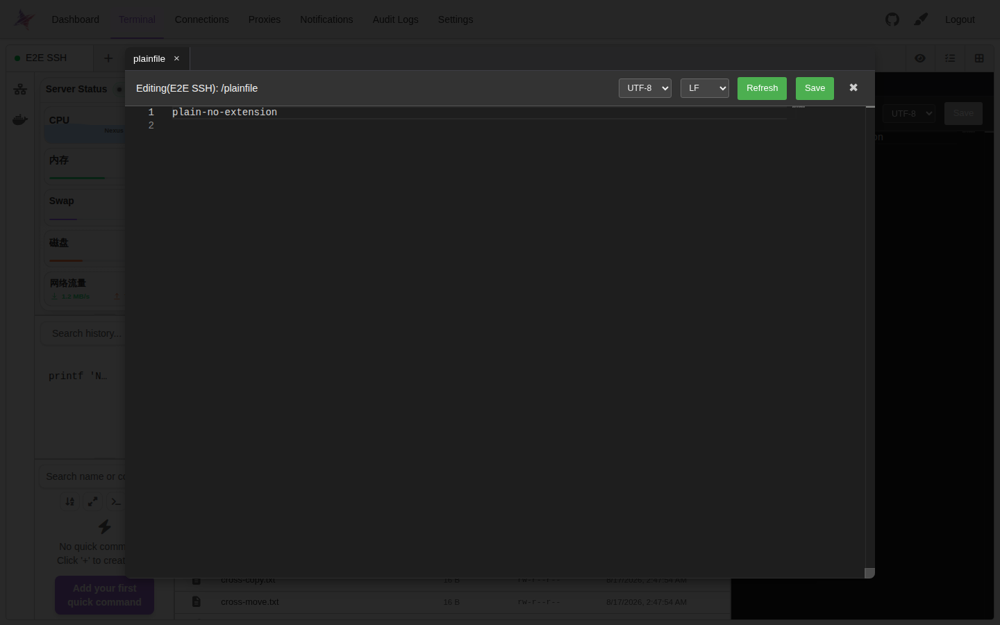
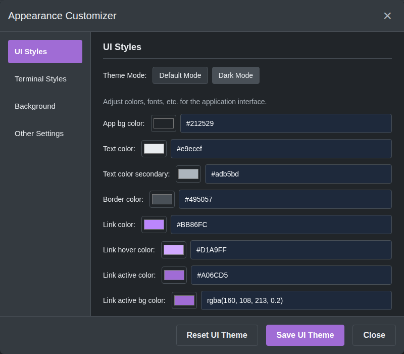
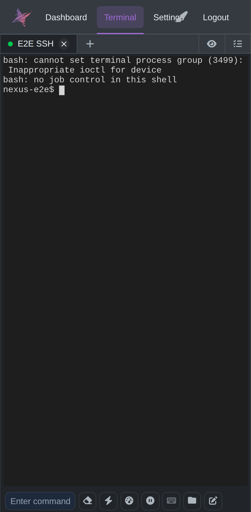

<div align="center">

[][docker-url]
[](./LICENSE)

[中文](./README.md) | [English](./doc/README_EN.md)

[docker-url]: https://github.com/0honus0/nexus-terminal/pkgs/container/nexus-terminal

</div>

## 概述

**星枢终端（Nexus Terminal）** 是面向浏览器的 SSH / SFTP / RDP / VNC 远程连接工具，提供多会话终端、文件管理与在线编辑、远程桌面、安全认证、审计和界面定制等能力，并提供独立桌面端发布版本。

## 核心功能

- SSH 多标签终端、SFTP 文件管理、Monaco 在线编辑与文件预览。
- RDP / VNC 远程桌面连接。
- SSH 会话挂起、恢复与断线自动重连。
- 快捷命令、命令历史、标签与可定制工作区布局。
- Docker 容器管理与状态查看。
- Passkey / WebAuthn、2FA、hCaptcha / reCAPTCHA。
- IP 白名单 / 黑名单、通知与审计日志。
- PWA、响应式移动端界面、主题与终端配色定制。
- Frontend、Backend、Remote Gateway 统一镜像发布，支持 AMD64 / ARM64。

## 功能截图

以下截图由仓库中的 Playwright 用户场景自动生成，和 E2E 使用同一套登录、SSH、SFTP 与 UI 测试环境。UI 发生变化后可通过 GitHub Actions 自动刷新。

| SSH 终端                                           | 文件管理与在线编辑                                                  |
| -------------------------------------------------- | ------------------------------------------------------------------- |
|  |  |

| 主题定制                                                  | 移动端工作区                                               |
| --------------------------------------------------------- | ---------------------------------------------------------- |
|  |  |

## 快速开始

使用 Docker Compose：

```bash
mkdir -p nexus-terminal && cd nexus-terminal
wget https://raw.githubusercontent.com/0honus0/nexus-terminal/refs/heads/main/docker-compose.yml -O docker-compose.yml
wget https://raw.githubusercontent.com/0honus0/nexus-terminal/refs/heads/main/.env -O .env
docker compose up -d
```

默认访问端口为 `18111`。生产环境建议通过 HTTPS 反向代理访问。

更新：

```bash
docker compose pull
docker compose up -d --remove-orphans
```

## 文档

- [部署、环境变量、Nginx、IPv6 与更新](./doc/DEPLOYMENT.md)
- [SSH、文件管理、快捷操作与安全功能使用说明](./doc/USAGE.md)
- [E2E 测试说明](./verification/e2e/README.md)
- [English README](./doc/README_EN.md)

## 从源码构建

```bash
git clone https://github.com/0honus0/nexus-terminal.git
cd nexus-terminal
./build.sh docker
```

详细的镜像名称、环境变量和自定义构建参数见 [部署文档](./doc/DEPLOYMENT.md#从源码构建统一镜像)。

## 桌面端

桌面端发布包见 [GitHub Releases](https://github.com/0honus0/nexus-terminal/releases/latest)。Web 端专属的部分认证与会话能力在桌面端可能有所不同。

## 数据与安全

部署数据保存在 `./data`，升级前建议整体备份。Passkey / WebAuthn 需要正确配置 `RP_ID` 与 `RP_ORIGIN`；浏览器剪贴板等能力建议在 HTTPS 或 localhost 安全上下文中使用。

## 致谢

预设终端主题方案参考 [iTerm2-Color-Schemes](https://github.com/mbadolato/iTerm2-Color-Schemes)。

## 开源协议

本项目采用 [GPL-3.0](./LICENSE) 开源协议。
