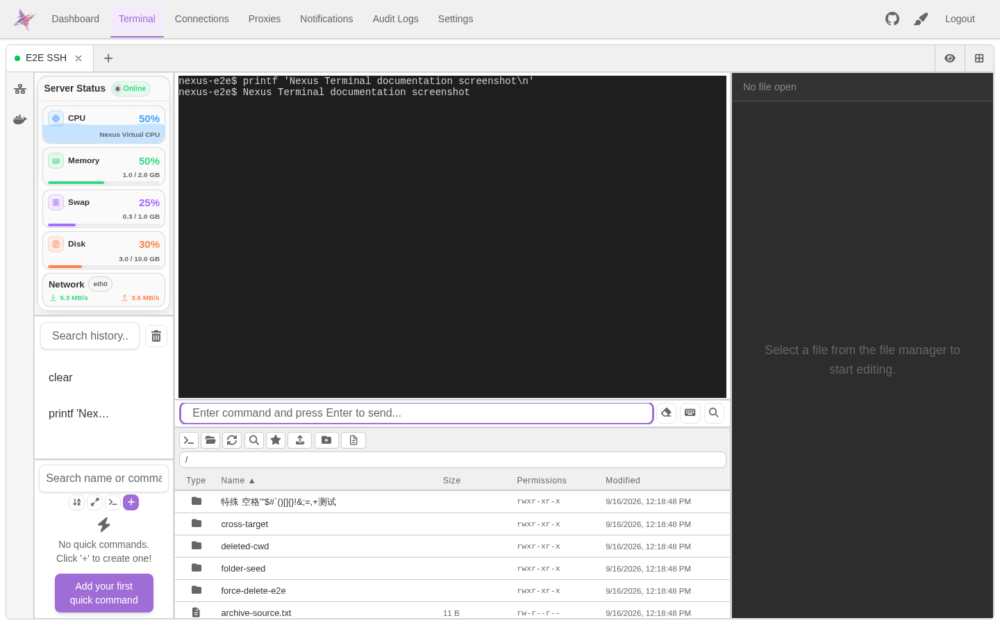
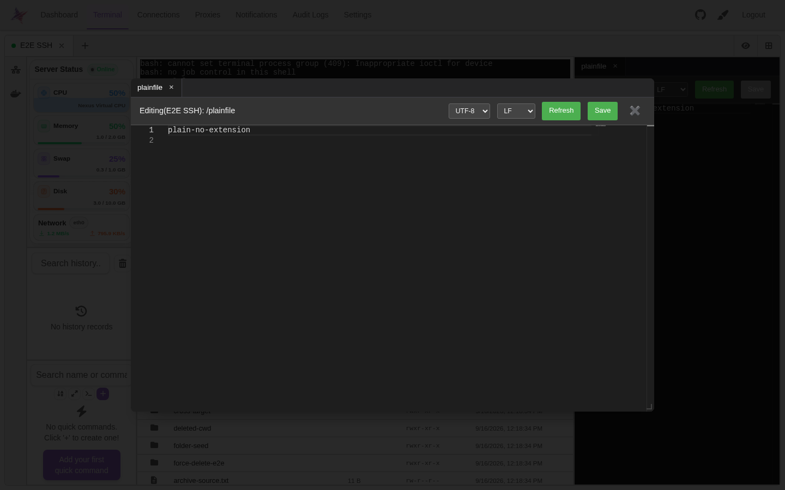
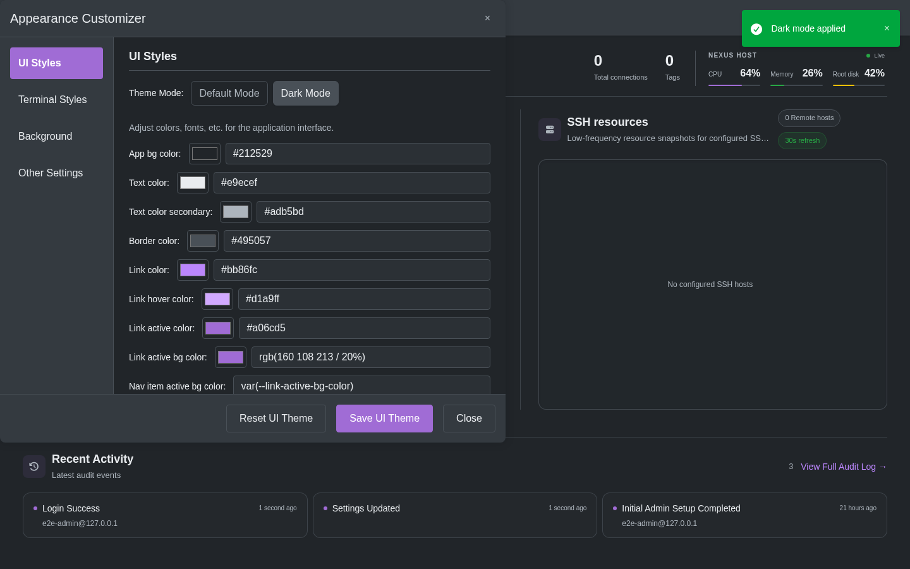
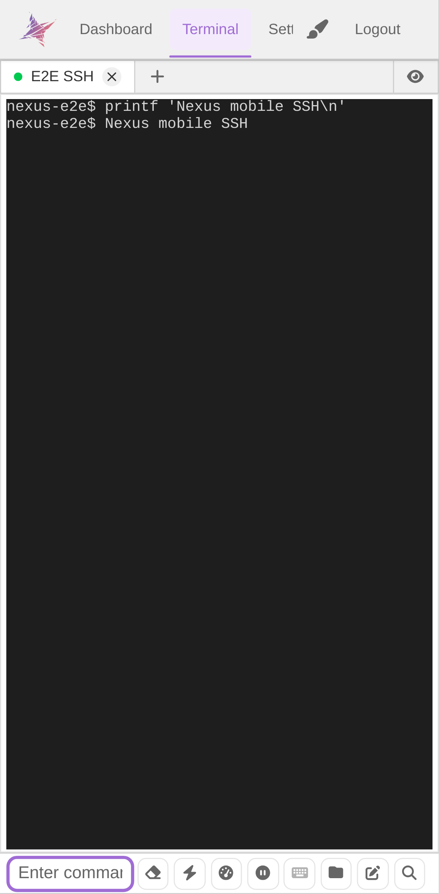

<div align="center">

<h1>Nexus Terminal</h1>

[][docker-url]
[](./LICENSE)

[中文](./README.md) | [English](./doc/README_EN.md)

[docker-url]: https://github.com/0honus0/nexus-terminal/pkgs/container/nexus-terminal

</div>

## 快速开始

```bash
mkdir -p nexus-terminal && cd nexus-terminal

wget https://raw.githubusercontent.com/0honus0/nexus-terminal/refs/heads/main/{docker-compose.yml,.env}

docker compose up -d
```

访问 `http://localhost:18111` · [部署与更新](./doc/DEPLOYMENT.md)

## 功能

浏览器中的 SSH / SFTP / RDP / VNC 远程连接工具，支持终端、文件管理、在线编辑、远程桌面、安全认证、移动端和界面定制。

## 功能截图

### SSH 终端

<p align="center">
  
</p>

### 文件管理与在线编辑

<p align="center">
  
</p>

### 主题定制

<p align="center">
  
</p>

### 移动端

<p align="center">
  
</p>

## 文档

[功能](./doc/FEATURES.md) · [使用](./doc/USAGE.md) · [部署与更新](./doc/DEPLOYMENT.md) · [工程文档](./doc/README.md) · [工程约束](./doc/software-requirements/engineering-constraints.md) · [English](./doc/README_EN.md)

## License

[GPL-3.0](./LICENSE)
