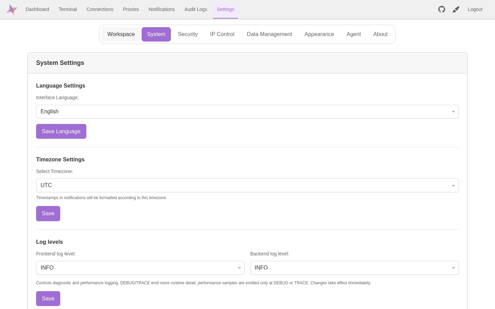
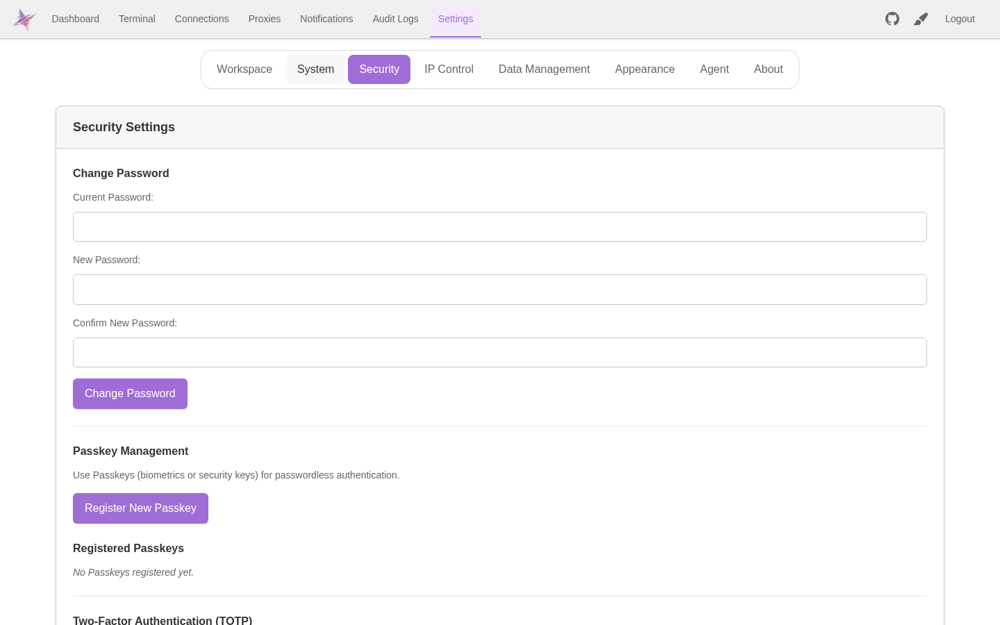

# 功能

Nexus Terminal 提供 SSH / SFTP、远程桌面、安全认证、界面定制和多平台支持。操作方式见 [使用](./USAGE.md)，部署与构建见 [部署与更新](./DEPLOYMENT.md)。

## SSH 与终端

- SSH 多标签会话。
- 会话挂起、恢复与断线自动重连。
- 快捷命令、命令历史和命令输入辅助；分组名称仅在点击文字时进入编辑，点击箭头或标题空白区域用于展开/收起，工具栏会随 Workspace pane 宽度缩放。
- 会话标签与工作区布局定制。
- Docker 容器状态查看与基础管理。

## 文件管理

- 基于 SFTP 的远程文件浏览与管理；路径输入、路径历史与收藏弹层采用响应式圆角布局，长路径可换行且弹层会约束在可用视口内。
- Monaco Editor 在线编辑文本文件。
- 文件预览、搜索、多选、拖放上传和移动。
- Markdown、图片、PDF、XLS/XLSX/CSV 与 DOCX 预览，支持多标签、刷新、统一圆角搜索和宽内容横向滚动；电子表格只有在确实存在多页时显示分页栏。
- 上传、复制/移动、压缩和跨会话传输统一进入可隐藏/恢复的 Progress Display。
- 复制、剪切、粘贴、删除、重命名和权限修改等常用操作。

## 远程桌面

- RDP 远程桌面。
- VNC 远程桌面。
- Remote Gateway 与 Web 前端配合提供浏览器内远程访问。

## 安全与认证

- Passkey / WebAuthn。
- TOTP 2FA。
- hCaptcha / Google reCAPTCHA。
- IP 白名单与黑名单。
- 登录与安全相关通知。
- 审计日志。

安全配置见 [安全与认证](./USAGE.md#安全与认证) 和 [环境配置](./DEPLOYMENT.md#env-与持久化配置)。

### 功能截图

系统设置：

安全设置：

## 界面与客户端

- Dashboard 在常见桌面首屏内优先保留“最近活动”入口，Quick Connect/SSH 资源列表使用受限高度和内部滚动避免把整页撑得过长。
- 响应式移动端界面。
- PWA 支持。
- 明暗主题、终端配色和工作区样式定制。
- 页面/终端背景、终端文字效果、本地 HTML theme 与可配置 GitHub 远程 HTML theme catalog。官方示例位于 `assets/html-themes/remote/`。
- 独立桌面端发布版本。

桌面端安装包见 [GitHub Releases](https://github.com/0honus0/nexus-terminal/releases/latest)。Web 端专属的部分认证与会话能力在桌面端可能有所不同。

## 构建与平台

Frontend、Backend 与 Remote Gateway 使用统一镜像发布，并支持 AMD64 / ARM64。稳定发布跟随 `:latest`，手动开发发布默认更新 `:dev`；镜像结构、Docker Compose、更新和源码构建方式见 [部署与更新](./DEPLOYMENT.md)。
