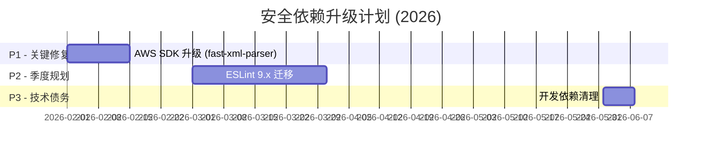

# 星枢终端 - 技术债务报告

> **生成时间**：2025-12-23 | **更新时间**：2026-04-23（第六项第二十二批并行落地）
> **扫描范围**：packages/backend、packages/frontend、packages/remote-gateway
> **任务**：【P3-2】整理 TODO/FIXME 到 GitHub Issues
> **状态**：🟢 持续治理中（ESLint warning: 0，error: 0；Flat Config 迁移完成）

---

## 2026-04-15 复查快照（最新）

### 当前债务总览（最新口径）

| 类别                   | 当前状态      | 说明                                                                  |
| ---------------------- | ------------- | --------------------------------------------------------------------- |
| Lint 债务              | ✅ 0 warnings | `npm run -s lint -- --format json`（2026-04-15）                      |
| Lint 错误              | ✅ 0 errors   | 当前无阻断错误                                                        |
| 修复方式               | ✅ 并行批处理 | 子代理并行 + 主线程复核 + 分批提交                                    |
| 文档口径               | ✅ 已同步     | `CHANGELOG.md` 与本报告已改为“仅保留最新汇总，不记录每批流水”         |
| 下一类债务（新）       | ✅ 已完成     | Flat Config 已收敛为纯配置，旧链路（`.eslintrc.js` / 兼容层）已下线   |
| Vue lint 覆盖          | ✅ 已完成     | `.vue` 已从忽略列表移除，88 个 SFC 文件纳入 lint（基础校验）          |
| Vue 规则基线           | ✅ 已完成     | 已接入 `eslint-plugin-vue` `flat/essential`，并保持 lint 结果清零     |
| 配置文件 lint 覆盖     | ✅ 已完成     | `*.config.ts` 已纳入 lint，9 个配置文件通过基础校验                   |
| Vue 规则回收（第二批） | ✅ 已完成     | 三条规则已恢复启用，违规修复后保持 lint 清零                          |
| Vue 规则回收（第三批） | ✅ 已完成     | `vue/no-side-effects-in-computed-properties` 已恢复启用               |
| Vue 规则回收（第四批） | ✅ 已完成     | `vue/no-mutating-props` 严格模式已全量恢复启用（无临时豁免）          |
| 债务回归门禁           | ✅ 已完成     | 新增 `debt:check`（提交前 + CI），阻止 TODO/skip/console.log/any 回流 |

### 本轮最终结果（2026-04-15）

- ESLint warnings：由 **251** 收敛至 **0**
- ESLint errors：持续为 **0**
- 工作区状态：已提交、无未暂存改动
- 关键收敛提交：
  - `df1b5c6`：收敛设置与快捷指令模块
  - `2ed620f`：收敛测试与核心类型模块
  - `96960f8`：收敛 AI 审计与前端 store
  - `7b1e1bf`：清零剩余 warnings

### 下一类债务推进记录（2026-04-15）

- 类别：ESLint Flat Config 迁移债务
- 触发依据：全量 lint 已清零，需要消除旧配置链路并统一到 Flat Config
- 已落地：
  - 新增并启用 `eslint.config.js`
  - `package.json` 与 `.lintstagedrc.js` 已移除 `ESLINT_USE_FLAT_CONFIG=false`
  - `.eslintignore` 已下线，忽略规则并入 `eslint.config.js`
  - `.eslintrc.js` 与 `eslint.legacy-config.cjs` 已下线（不再依赖 `FlatCompat`）
  - 已清理无引用 ESLint 旧依赖：`eslint-config-airbnb-base`、`eslint-config-airbnb-typescript`、`eslint-config-prettier`
  - 验证结果：`npm run -s lint -- --format json` 为 `errors=0 / warnings=0`
  - 覆盖扩展：`.vue` 已纳入 lint（`vue-eslint-parser` + `prettier/prettier`），`88` 个 SFC 文件为 `errors=0 / warnings=0`
  - 基线增强：接入 `eslint-plugin-vue` `flat/essential`，并分批回收存量规则后保持 `errors=0 / warnings=0`
  - 覆盖扩展：`*.config.ts` 已纳入 lint（基础校验），当前 `9` 个配置文件为 `errors=0 / warnings=0`
  - 规则回收：`vue/no-unused-vars`、`vue/use-v-on-exact`、`vue/multi-word-component-names` 已恢复启用并通过全量 lint
  - 规则回收：`vue/no-side-effects-in-computed-properties` 已恢复启用，修复 3 处计算属性副作用后通过全量 lint
  - 规则回收：`vue/no-mutating-props` 已以严格模式恢复启用，修复 2 处直接 prop 变更；`AddConnectionFormAuth.vue`、`AddConnectionFormBasicInfo.vue`、`AddConnectionFormAdvanced.vue` 均已完成 `emit patch` 改造并移除豁免
  - 防回归治理：新增 `scripts/check-tech-debt.js` 与 `npm run debt:check`，并接入 `.lintstagedrc.js` 与 `.github/workflows/audit.yml`

### 下一批待完成（下次续做）

1. **WebSocket 消息总线泛型化（类型债务专项）**
   - 目标：将 `packages/frontend/src/types/websocket.types.ts` 的 `MessagePayload` 从宽泛 `any` 逐步收敛为可判定的联合类型/泛型消息模型。
   - 范围：`useWebSocketConnection.ts`、`useSftpActions.ts`、`useSshTerminal.ts`、`useStatusMonitor.ts`、`useFileUploader.ts`、`FileManager.vue` 及相关消息处理回调。
   - 验收：`npm run -w @nexus-terminal/frontend -s typecheck` 通过，且不新增 `@ts-ignore`/`@ts-expect-error`。

2. **质量门禁扩展到 Backend/Remote-Gateway 类型检查（已于 2026-04-22 完成）**
   - 完成内容：新增 `typecheck:backend`、`typecheck:remote-gateway` 并接入根 `quality:check`。
   - 当前口径：`quality:check` 已覆盖 debt + frontend/backend/remote-gateway typecheck + lint + format。
   - 验收结果：`npm run -s quality:check` 本地验证通过，可在类型回归时阻断。

---

## 2026-04-22 分析与整改计划

> 说明：本节仅记录主线程本轮分析识别的 6 类问题，并同步标注本次是否已落地修复。判断依据为 2026-04-22 本地仓库现状与改动结果。

| 问题                                                                                      | 风险                                                                     | 优先级 | 拟定修复动作                                                                        | 验收标准                                                       | 落地状态                    |
| ----------------------------------------------------------------------------------------- | ------------------------------------------------------------------------ | ------ | ----------------------------------------------------------------------------------- | -------------------------------------------------------------- | --------------------------- |
| 1) `trust proxy` 在未显式配置时默认信任 1 层代理                                          | 反向代理链路未正确设置时，`req.ip` 可信度下降，影响限流/白名单判定准确性 | P1     | 默认改为不信任代理，仅在 `TRUST_PROXY` / `TRUST_PROXY_HOPS` 显式配置时启用          | 未配置相关环境变量时 `trust proxy=false`；显式配置场景保持可用 | ✅ 已完成（2026-04-22）     |
| 2) `quality:check` 仅覆盖 frontend typecheck，backend/remote-gateway 未纳入               | 类型回归可能绕过统一质量门禁                                             | P1     | 在根脚本新增 `typecheck:backend`、`typecheck:remote-gateway` 并并入 `quality:check` | `npm run -s quality:check` 同时执行三端 typecheck 且通过       | ✅ 已完成（2026-04-22）     |
| 3) `migrations.ts` 中 `favorite_paths` 建表 SQL 语法错误（`last_used_at` 行分隔符错误）   | 在触发该迁移时可能导致初始化/升级失败                                    | P1     | 修复迁移 SQL 分隔符，确保建表语句可执行                                             | 后端构建与相关数据库初始化流程不因该 SQL 失败                  | ✅ 已完成（2026-04-22）     |
| 4) remote-gateway 部署口径存在不一致（默认 `MAIN_BACKEND_URL` 端口、Dockerfile 暴露端口） | 部署文档与运行默认值不一致，易引入排障成本                               | P2     | 对齐默认 backend 端口为 `3001`；Dockerfile WebSocket 端口暴露改为 `8080`            | 代码默认值、Dockerfile 与 compose/文档口径一致                 | ✅ 已完成（2026-04-22）     |
| 5) 中英文 README 与相关配置文档镜像来源口径存在分歧                                       | 运维按文档拉取镜像时可能使用错误仓库/命名空间                            | P2     | 对齐到当前主口径 `ghcr.io/silentely`，并补充说明                                    | README 与 compose 的镜像来源说明一致                           | ✅ 已完成（2026-04-22）     |
| 6) 核心文件体量偏大且存在多处受控循环依赖豁免（`import/no-cycle`）                        | 长期维护复杂度上升，局部改动回归半径扩大                                 | P3     | 拆分超大模块（优先 FileManager/SFTP/认证链路），逐步消减循环依赖                    | 关键模块单文件体量下降，循环依赖豁免数量持续收敛               | 🟡 进行中（第二十二批完成） |

---

### 第六项推进记录（2026-04-22 第一批并行落地）

- 量化结果：
  - `import/no-cycle` 受控豁免：**16 -> 11**（净减少 5 处）
  - `FileManager.vue` 行数：**2851 -> 2591**（净减少 260 行）
- 并行子任务 A（backend 初始化链路去耦）：
  - 变更文件：`packages/backend/src/database/schema.registry.ts`
  - 结果：移除对 `connection.ts` 的静态 `runDb` 依赖，改为本地执行器封装，降低 schema 初始化链路静态循环耦合。
- 并行子任务 B（frontend 认证链路去耦）：
  - 变更文件：`packages/frontend/src/utils/apiClient.ts`、`packages/frontend/src/stores/auth.store.ts`、`packages/frontend/src/router/index.ts`、`packages/frontend/src/main.ts`、`packages/frontend/src/stores/auth.store.test.ts`、`packages/frontend/src/utils/authRuntimeBridge.ts`
  - 结果：`apiClient` 不再静态依赖 auth store，auth store 不再静态依赖 router，router 守卫改为运行期动态加载 auth store，认证链路循环依赖豁免继续收敛。
- 并行子任务 C（FileManager 首批拆分）：
  - 变更文件：`packages/frontend/src/components/FileManager.vue`、`packages/frontend/src/composables/file-manager/fileManagerDisplayUtils.ts`
  - 结果：抽离显示层纯函数（`formatSize`、`formatMode`、文件图标映射与解析），降低单文件体量并提升复用性。

### 第六项推进记录（2026-04-23 第二批并行落地）

- 量化结果：
  - `import/no-cycle` 受控豁免：**11 -> 5**（第二批净减少 6 处；累计 **16 -> 5**）
  - `FileManager.vue` 行数：**2591 -> 2565**（第二批净减少 26 行；累计 **2851 -> 2565**）
- 并行子任务 D（FileManager 终端路径解析拆分）：
  - 变更文件：`packages/frontend/src/components/FileManager.vue`、`packages/frontend/src/composables/file-manager/fileManagerTerminalPathUtils.ts`
  - 结果：抽离 `SILENT_PWD_PREFIX`、ANSI 清洗与路径解析纯函数，组件职责进一步聚焦。
- 并行子任务 E（session/sshSuspend 循环边收敛）：
  - 变更文件：`packages/frontend/src/stores/session/actions/sshSuspendActions.ts`、`packages/frontend/src/stores/session/actions/sessionActions.ts`
  - 结果：`sshSuspendActions` 改为运行期懒加载 `sessionActions`，移除两文件间静态双向依赖与对应豁免注释。
- 并行子任务 F（通知链路循环边收敛）：
  - 变更文件：`packages/backend/src/notifications/notification-sender.interface.ts`、`packages/backend/src/notifications/notification.dispatcher.service.ts`、`packages/backend/src/notifications/senders/*.service.ts`、`packages/backend/src/notifications/notification.dispatcher.service.test.ts`
  - 结果：发送器接口下沉到独立类型模块，`dispatcher <-> sender` 静态循环解除，通知模块相关豁免注释移除。

### 第六项推进记录（2026-04-23 第三批并行落地）

- 量化结果：
  - `import/no-cycle` 受控豁免：**5 -> 0**（第三批净减少 5 处；累计 **16 -> 0**）
  - `SFTP 服务体量`：`sftp.service.ts` **1884 -> 1767**（净减少 117 行）
  - `认证控制器体量`：`auth.controller.ts` **1592 -> 1563**（净减少 29 行）
- 并行子任务 G（数据库初始化链路残余循环依赖收敛）：
  - 变更文件：`packages/backend/src/database/schema.registry.ts`、`packages/backend/src/database/connection.ts`、`packages/backend/src/settings/settings.repository.ts`、`packages/backend/src/appearance/appearance.repository.ts`、`packages/backend/src/terminal-themes/terminal-theme.repository.ts`
  - 结果：`schema.registry` 改为运行时按需加载初始化仓储，解除初始化链路静态循环依赖；对应受控豁免注释全部移除。
- 并行子任务 H（SFTP 服务二次拆分）：
  - 变更文件：`packages/backend/src/sftp/sftp.service.ts`、`packages/backend/src/sftp/sftp-error.utils.ts`、`packages/backend/src/sftp/sftp-encoding.utils.ts`、`packages/backend/src/sftp/sftp.controller.ts`
  - 结果：抽离错误码解析与文件编码检测/解码逻辑，`sftp.service.ts` 复杂分支下沉为可复用工具模块。
- 并行子任务 I（认证控制器链路瘦身）：
  - 变更文件：`packages/backend/src/auth/auth.controller.ts`、`packages/backend/src/auth/auth-init-data.utils.ts`
  - 结果：抽离初始化端点认证状态解析与 CAPTCHA 公共配置映射逻辑，降低控制器重复逻辑和分支密度。

### 第六项推进记录（2026-04-23 第四批并行落地）

- 量化结果：
  - `import/no-cycle` 受控豁免：**维持 0**
  - `SFTP 服务体量`：`sftp.service.ts` **1767 -> 1594**（第四批净减少 173 行；累计 **1884 -> 1594**）
  - 新增工具单测：**3 文件 / 16 用例全通过**
- 并行子任务 J（`sftp.service.ts` 深拆继续推进）：
  - 变更文件：`packages/backend/src/sftp/sftp.service.ts`
  - 结果：移除已失效的压缩/解压私有错误分支与命令探测死代码，保留 `archiveManager/uploadManager` 委托边界，进一步降低单文件噪音与维护负担。
- 并行子任务 K（`auth.controller.ts` 认证动作分层继续推进）：
  - 变更文件：`packages/backend/src/auth/auth.controller.ts`、`packages/backend/src/auth/auth-init-data.utils.ts`
  - 结果：新增并接入 `resolveRequiresSetup`，继续将初始化逻辑下沉到 utils，控制器编排职责更聚焦。
- 并行子任务 L（第三批新工具模块补测）：
  - 变更文件：`packages/backend/src/sftp/sftp-error.utils.test.ts`、`packages/backend/src/sftp/sftp-encoding.utils.test.ts`、`packages/backend/src/auth/auth-init-data.utils.test.ts`
  - 结果：覆盖错误码提取、编码回退与初始化认证态分支，测试通过并纳入质量门禁。

### 第六项推进记录（2026-04-23 第五批并行落地）

- 量化结果：
  - `import/no-cycle` 受控豁免：**维持 0**
  - `SFTP 服务体量`：`sftp.service.ts` **1594 -> 1277**（第五批净减少 317 行；累计 **1884 -> 1277**）
  - `认证控制器体量`：`auth.controller.ts` **1563 -> 1457**（第五批净减少 106 行；累计 **1592 -> 1457**）
  - 新增工具单测：**2 文件 / 21 用例全通过**
- 并行子任务 M（`sftp.service.ts` 目录操作链路下沉）：
  - 变更文件：`packages/backend/src/sftp/sftp.service.ts`、`packages/backend/src/sftp/sftp-path-operations.ts`
  - 结果：将 `mkdir/rmdir/unlink/rename` 下沉为路径操作执行器，服务主类进一步瘦身并保持对外 API 不变。
- 并行子任务 N（认证主链路动作分层）：
  - 变更文件：`packages/backend/src/auth/auth.controller.ts`、`packages/backend/src/auth/auth-main-flow.utils.ts`
  - 结果：`login/verifyLogin2FA/logout` 统一复用动作层函数（IP 解析、登录成功/失败审计通知、2FA pending 会话、登录态建立、登出销毁），控制器职责收敛为 HTTP 编排。
- 并行子任务 O（第五批回归补测）：
  - 变更文件：`packages/backend/src/sftp/sftp-path-operations.test.ts`、`packages/backend/src/auth/auth-main-flow.utils.test.ts`
  - 结果：覆盖 SFTP 路径操作成功/失败/未就绪分支与认证主链路动作函数关键分支，`npm run -w @nexus-terminal/backend test` 与 `npm run -s quality:check` 全绿。

### 第六项推进记录（2026-04-23 第六批并行落地）

- 量化结果：
  - `import/no-cycle` 受控豁免：**维持 0**
  - `SFTP 服务体量`：`sftp.service.ts` **1277 -> 1022**（第六批净减少 255 行；累计 **1884 -> 1022**）
  - `认证控制器体量`：`auth.controller.ts` **1457 -> 1428**（第六批净减少 29 行；累计 **1592 -> 1428**）
  - 新增工具单测：**2 文件 / 16 用例全通过**
- 并行子任务 P（`sftp.service.ts` 文件读写链路继续下沉）：
  - 变更文件：`packages/backend/src/sftp/sftp.service.ts`、`packages/backend/src/sftp/sftp-file-content-operations.ts`
  - 结果：将 `readFile/writefile` 的编码处理、流式写回与状态回填下沉到独立执行器，服务主类继续瘦身且行为保持一致。
- 并行子任务 Q（Passkey + 2FA 激活链路动作分层）：
  - 变更文件：`packages/backend/src/auth/auth.controller.ts`、`packages/backend/src/auth/auth-passkey-2fa-flow.utils.ts`
  - 结果：抽离 Passkey 认证成功/失败事件与 2FA 启停事件记录、Passkey 登录会话建立逻辑，控制器聚焦协议编排。
- 并行子任务 R（第六批回归补测）：
  - 变更文件：`packages/backend/src/sftp/sftp-file-content-operations.test.ts`、`packages/backend/src/auth/auth-passkey-2fa-flow.utils.test.ts`
  - 结果：覆盖 SFTP 读写操作与 Passkey/2FA 动作层关键分支，`npm run -w @nexus-terminal/backend test` 与 `npm run -s quality:check` 全绿。

### 第六项推进记录（2026-04-23 第七批并行落地）

- 量化结果：
  - `import/no-cycle` 受控豁免：**维持 0**
  - `SFTP 服务体量`：`sftp.service.ts` **1022 -> 775**（第七批净减少 247 行；累计 **1884 -> 775**）
  - `认证控制器体量`：`auth.controller.ts` **1428 -> 1402**（第七批净减少 26 行；累计 **1592 -> 1402**）
  - 新增工具单测：**2 文件 / 20 用例全通过**
- 并行子任务 S（`sftp.service.ts` 路径查询与权限变更链路下沉）：
  - 变更文件：`packages/backend/src/sftp/sftp.service.ts`、`packages/backend/src/sftp/sftp-path-query-operations.ts`
  - 结果：将 `stat/chmod/realpath` 抽离为路径查询执行器，服务主类继续瘦身；WebSocket 成功/失败响应语义保持不变。
- 并行子任务 T（认证控制器 2FA setup/verify 动作分层）：
  - 变更文件：`packages/backend/src/auth/auth.controller.ts`、`packages/backend/src/auth/auth-two-factor-flow.utils.ts`
  - 结果：抽离 2FA setup/save/verify/时间偏差判定等动作函数，控制器聚焦 HTTP 协议编排，避免重复的 secret 解析与校验分支。
- 并行子任务 U（第七批回归补测）：
  - 变更文件：`packages/backend/src/sftp/sftp-path-query-operations.test.ts`、`packages/backend/src/auth/auth-two-factor-flow.utils.test.ts`
  - 结果：覆盖 SFTP 查询权限与 2FA setup/verify 关键分支，`typecheck + lint + format + backend test` 全绿。

### 第六项推进记录（2026-04-23 第八批并行落地）

- 量化结果：
  - `import/no-cycle` 受控豁免：**维持 0**
  - `SFTP 服务体量`：`sftp.service.ts` **775 -> 478**（第八批净减少 297 行；累计 **1884 -> 478**）
  - `认证控制器体量`：`auth.controller.ts` **1402 -> 1348**（第八批净减少 54 行；累计 **1592 -> 1348**）
  - 新增工具单测：**2 文件 / 19 用例全通过**
- 并行子任务 V（`sftp.service.ts` 复制链路下沉）：
  - 变更文件：`packages/backend/src/sftp/sftp.service.ts`、`packages/backend/src/sftp/sftp-copy-operations.ts`
  - 结果：将 `copy` 及其递归复制/目录确保/状态映射逻辑抽离为独立执行器，服务主类继续瘦身并复用 `ensureDirectoryExists/getStats/formatStatsToFileListItem` 于 move 链路。
- 并行子任务 W（认证控制器 Passkey 动作分层）：
  - 变更文件：`packages/backend/src/auth/auth.controller.ts`、`packages/backend/src/auth/auth-passkey-flow.utils.ts`
  - 结果：将 Passkey challenge 会话写入、注册/认证上下文校验、验证结果映射与 credentialId 提取下沉到 utils，控制器聚焦 HTTP 编排且保持状态码与响应语义不变。
- 并行子任务 X（第八批回归补测）：
  - 变更文件：`packages/backend/src/sftp/sftp-copy-operations.test.ts`、`packages/backend/src/auth/auth-passkey-flow.utils.test.ts`
  - 结果：覆盖 SFTP copy 成功/失败/未就绪分支与 Passkey challenge 过期/缺失/验证成功失败路径，`typecheck + backend test + quality:check` 全绿。

### 第六项推进记录（2026-04-23 第九批并行落地）

- 量化结果：
  - `import/no-cycle` 受控豁免：**维持 0**
  - `SFTP 服务体量`：`sftp.service.ts` **478 -> 358**（第九批净减少 120 行；累计 **1884 -> 358**）
  - `认证控制器体量`：`auth.controller.ts` **1348 -> 1369**（第九批净增加 21 行；累计 **1592 -> 1369**）
  - 新增工具单测：**2 文件 / 17 用例全通过**
- 并行子任务 Y（`sftp.service.ts` move 链路下沉）：
  - 变更文件：`packages/backend/src/sftp/sftp.service.ts`、`packages/backend/src/sftp/sftp-move-operations.ts`
  - 结果：将 `move` 主链路（目标目录检查、目标存在检查、rename 执行、结果映射）抽离为独立执行器，服务主类继续瘦身并保持 `sftp:move:*` 响应语义不变。
- 并行子任务 Z（Passkey 管理端点动作分层）：
  - 变更文件：`packages/backend/src/auth/auth.controller.ts`、`packages/backend/src/auth/auth-passkey-management-flow.utils.ts`
  - 结果：将 list/delete/update-name 的用户态校验、参数校验、错误映射与审计通知动作下沉至 utils，控制器维持 HTTP 编排与原有状态码/文案语义。
- 并行子任务 AA（第九批回归补测）：
  - 变更文件：`packages/backend/src/sftp/sftp-move-operations.test.ts`、`packages/backend/src/auth/auth-passkey-management-flow.utils.test.ts`
  - 结果：覆盖 move 未就绪/目标已存在/目录不可达/成功路径与 Passkey 管理端点 401/400/403/404/成功路径，`typecheck + backend test + quality:check` 全绿。

### 第六项推进记录（2026-04-23 第十批并行落地）

- 量化结果：
  - `import/no-cycle` 受控豁免：**维持 0**
  - `SFTP 服务体量`：`sftp.service.ts` **358 -> 293**（第十批净减少 65 行；累计 **1884 -> 293**）
  - `认证控制器体量`：`auth.controller.ts` **1369 -> 1357**（第十批净减少 12 行；累计 **1592 -> 1357**）
  - 新增工具单测：**2 文件 / 10 用例全通过**
- 并行子任务 AB（`sftp.service.ts` readdir 链路下沉）：
  - 变更文件：`packages/backend/src/sftp/sftp.service.ts`、`packages/backend/src/sftp/sftp-readdir-operations.ts`
  - 结果：将 `readdir` 的未就绪/失败/成功分支与 attrs 映射抽离为独立执行器，服务主类继续瘦身并保持 `sftp:readdir:*` 语义不变。
- 并行子任务 AC（登录与 2FA pending 分支动作分层）：
  - 变更文件：`packages/backend/src/auth/auth.controller.ts`、`packages/backend/src/auth/auth-login-2fa-flow.utils.ts`
  - 结果：抽离 pending 会话创建、pending 校验与 2FA token 规范化校验，控制器保留 HTTP 编排且未改变安全窗口/过期判断策略。
- 并行子任务 AD（第十批回归补测）：
  - 变更文件：`packages/backend/src/sftp/sftp-readdir-operations.test.ts`、`packages/backend/src/auth/auth-login-2fa-flow.utils.test.ts`
  - 结果：覆盖 readdir 未就绪/失败/成功路径与登录 2FA pending 缺失/过期/tempToken 不匹配/token 无效路径，`typecheck + backend test + quality:check` 全绿。

### 第六项推进记录（2026-04-23 第十一批并行落地）

- 量化结果：
  - `import/no-cycle` 受控豁免：**维持 0**
  - `SFTP 服务体量`：`sftp.service.ts` **293 -> 243**（第十一批净减少 50 行；累计 **1884 -> 243**）
  - `认证控制器体量`：`auth.controller.ts` **1357 -> 1366**（第十一批净增加 9 行；累计 **1592 -> 1366**）
  - 新增工具单测：**2 文件 / 8 用例全通过**
- 并行子任务 AE（SFTP 会话生命周期链路下沉）：
  - 变更文件：`packages/backend/src/sftp/sftp.service.ts`、`packages/backend/src/sftp/sftp-session-operations.ts`
  - 结果：将 `initializeSftpSession/cleanupSftpSession` 下沉为执行器，保留 `sftp_ready/sftp_error` 与 cleanup 行为语义，服务主类继续收敛。
- 并行子任务 AF（Passkey 注册/认证端点继续分层）：
  - 变更文件：`packages/backend/src/auth/auth.controller.ts`、`packages/backend/src/auth/auth-passkey-register-auth-flow.utils.ts`
  - 结果：抽离注册/认证验证结果映射与会话清理动作，控制器继续保留 HTTP 编排与审计通知语义。
- 并行子任务 AG（第十一批回归补测）：
  - 变更文件：`packages/backend/src/sftp/sftp-session-operations.test.ts`、`packages/backend/src/auth/auth-passkey-register-auth-flow.utils.test.ts`
  - 结果：覆盖 SFTP 会话初始化成功/失败/无效状态与 Passkey 注册/认证失败映射、会话清理辅助路径，`typecheck + backend test + quality:check` 全绿。

### 第六项推进记录（2026-04-23 第十二批并行落地）

- 量化结果：
  - `import/no-cycle` 受控豁免：**维持 0**
  - `SFTP 服务体量`：`sftp.service.ts` **243 -> 243**（第十二批保持不变；累计 **1884 -> 243**）
  - `认证控制器体量`：`auth.controller.ts` **1366 -> 1379**（第十二批净增加 13 行；累计 **1592 -> 1379**）
  - 新增工具单测：**2 文件 / 11 用例全通过**
- 并行子任务 AH（2FA setup/verify 剩余分支分层）：
  - 变更文件：`packages/backend/src/auth/auth.controller.ts`、`packages/backend/src/auth/auth-2fa-state-flow.utils.ts`
  - 结果：抽离 2FA setup/verify 的请求校验、session 保存失败映射与 verify 失败映射动作，控制器继续保留 HTTP 编排与安全策略。
- 并行子任务 AI（auth status/init-data 轻量动作层抽离）：
  - 变更文件：`packages/backend/src/auth/auth-init-status-flow.utils.ts`、`packages/backend/src/auth/auth.controller.ts`
  - 结果：抽离 auth status/init-data 响应组装与会话快照判定，主线程完成最小接线，现有接口语义保持一致。
- 并行子任务 AJ（第十二批回归补测）：
  - 变更文件：`packages/backend/src/auth/auth-2fa-state-flow.utils.test.ts`、`packages/backend/src/auth/auth-init-status-flow.utils.test.ts`
  - 结果：覆盖 2FA 校验失败映射与 auth status/init-data 组装路径，`typecheck + backend test + quality:check` 全绿。

### 第六项推进记录（2026-04-23 第十三批并行落地）

- 量化结果：
  - `import/no-cycle` 受控豁免：**维持 0**
  - `SFTP 服务体量`：`sftp.service.ts` **243 -> 243**（第十三批保持不变；累计 **1884 -> 243**）
  - `认证控制器体量`：`auth.controller.ts` **1379 -> 1379**（第十三批保持不变；累计 **1592 -> 1379**）
  - 新增工具单测：**2 文件 / 18 用例全通过**
- 并行子任务 AK（Passkey 管理端点进一步模块化）：
  - 变更文件：`packages/backend/src/auth/auth.controller.ts`、`packages/backend/src/auth/auth-passkey-management-actions.utils.ts`
  - 结果：抽离 list/delete/update-name 的响应动作、日志动作与 sideEffect 描述，控制器保留参数校验与 HTTP 编排，端点状态码/文案保持不变。
- 并行子任务 AL（密码修改与 2FA disable 动作分层）：
  - 变更文件：`packages/backend/src/auth/auth.controller.ts`、`packages/backend/src/auth/auth-password-disable2fa-flow.utils.ts`
  - 结果：`changePassword/disable2FA` 统一复用访问态校验、输入校验、用户存在校验、密码匹配校验与更新行数校验动作，减少控制器重复分支且不改变原有错误语义。
- 并行子任务 AM（第十三批回归补测）：
  - 变更文件：`packages/backend/src/auth/auth-passkey-management-actions.utils.test.ts`、`packages/backend/src/auth/auth-password-disable2fa-flow.utils.test.ts`
  - 结果：覆盖 Passkey 删除未命中/越权/未映射错误与密码修改、2FA disable 关键失败分支，`typecheck + backend test + quality:check` 全绿。

### 第六项推进记录（2026-04-23 第十四批并行落地）

- 量化结果：
  - `import/no-cycle` 受控豁免：**维持 0**
  - `SFTP 服务体量`：`sftp.service.ts` **243 -> 243**（第十四批保持不变；累计 **1884 -> 243**）
  - `认证控制器体量`：`auth.controller.ts` **1379 -> 1399**（第十四批净增加 20 行；累计 **1592 -> 1399**）
  - 新增工具单测：**2 文件 / 9 用例全通过**
- 并行子任务 AN（密码安全动作 sideEffect 化）：
  - 变更文件：`packages/backend/src/auth/auth-password-security-actions.utils.ts`、`packages/backend/src/auth/auth.controller.ts`
  - 结果：`changePassword/disable2FA` 成功路径改为动作层输出（response/log/sideEffects），控制器改为统一执行 sideEffect 并回写响应，行为语义保持不变。
- 并行子任务 AO（2FA 数据库更新动作模块化）：
  - 变更文件：`packages/backend/src/auth/auth-2fa-mutation-flow.utils.ts`、`packages/backend/src/auth/auth.controller.ts`
  - 结果：抽离 2FA enable/disable SQL 与 `updated_at` 参数构建，并统一 `changes===0` 错误映射，减少控制器内联更新逻辑。
- 并行子任务 AP（第十四批回归补测）：
  - 变更文件：`packages/backend/src/auth/auth-password-security-actions.utils.test.ts`、`packages/backend/src/auth/auth-2fa-mutation-flow.utils.test.ts`
  - 结果：覆盖密码安全 sideEffect 输出与 2FA mutation 参数/错误映射路径，`typecheck + backend test + quality:check` 全绿。

### 第六项推进记录（2026-04-23 第十五批并行落地）

- 量化结果：
  - `import/no-cycle` 受控豁免：**维持 0**
  - `SFTP 服务体量`：`sftp.service.ts` **243 -> 243**（第十五批保持不变；累计 **1884 -> 243**）
  - `认证控制器体量`：`auth.controller.ts` **1399 -> 1410**（第十五批净增加 11 行；累计 **1592 -> 1410**）
  - 新增工具单测：**2 文件 / 5 用例全通过**
- 并行子任务 AQ（2FA 激活成功动作 sideEffect 化）：
  - 变更文件：`packages/backend/src/auth/auth-two-factor-enabled-actions.utils.ts`、`packages/backend/src/auth/auth.controller.ts`
  - 结果：`verifyAndActivate2FA` 成功路径改为动作层输出（response/log/sideEffects），控制器统一执行 `2FA_ENABLED` 审计与通知副作用，状态码/文案保持不变。
- 并行子任务 AR（2FA setup 会话写入与响应组装模块化）：
  - 变更文件：`packages/backend/src/auth/auth-two-factor-setup-actions.utils.ts`、`packages/backend/src/auth/auth-two-factor-flow.utils.ts`、`packages/backend/src/auth/auth.controller.ts`
  - 结果：将 setup 链路收敛为独立执行器，统一复用“会话已有临时密钥复用 / 新密钥保存失败 / 新密钥成功生成并响应”三类路径，控制器继续保留 HTTP 编排。
- 并行子任务 AS（第十五批回归补测）：
  - 变更文件：`packages/backend/src/auth/auth-two-factor-enabled-actions.utils.test.ts`、`packages/backend/src/auth/auth-two-factor-setup-actions.utils.test.ts`
  - 结果：覆盖 `2FA_ENABLED` sideEffect 输出与 setup 复用/保存失败/成功分支，`typecheck + backend test + quality:check` 全绿。

### 第六项推进记录（2026-04-23 第十六批并行落地）

- 量化结果：
  - `import/no-cycle` 受控豁免：**维持 0**
  - `SFTP 服务体量`：`sftp.service.ts` **243 -> 243**（第十六批保持不变；累计 **1884 -> 243**）
  - `认证控制器体量`：`auth.controller.ts` **1410 -> 1370**（第十六批净减少 40 行；累计 **1592 -> 1370**）
  - 新增工具单测：**2 文件 / 4 用例全通过**
- 并行子任务 AT（2FA verify 失败分支动作下沉）：
  - 变更文件：`packages/backend/src/auth/auth-two-factor-verify-failure-actions.utils.ts`、`packages/backend/src/auth/auth.controller.ts`
  - 结果：`verifyAndActivate2FA` 的 time-skew/invalid 失败日志与响应动作统一由动作层返回，控制器仅保留编排与发送。
- 并行子任务 AU（副作用执行器统一化）：
  - 变更文件：`packages/backend/src/auth/auth-side-effects-executor.utils.ts`、`packages/backend/src/auth/auth.controller.ts`
  - 结果：passkey/password/2FA 三条链路统一复用 `applyAuthSideEffects`，移除重复循环逻辑并保持审计/通知语义不变。
- 并行子任务 AV（第十六批回归补测）：
  - 变更文件：`packages/backend/src/auth/auth-two-factor-verify-failure-actions.utils.test.ts`、`packages/backend/src/auth/auth-side-effects-executor.utils.test.ts`
  - 结果：覆盖 verify 失败动作映射与统一副作用执行器顺序/参数路径，`typecheck + backend test + quality:check` 全绿。

### 第六项推进记录（2026-04-23 第十七批并行落地）

- 量化结果：
  - `import/no-cycle` 受控豁免：**维持 0**
  - `SFTP 服务体量`：`sftp.service.ts` **243 -> 243**（第十七批保持不变；累计 **1884 -> 243**）
  - `认证控制器体量`：`auth.controller.ts` **1370 -> 1375**（第十七批净增加 5 行；累计 **1592 -> 1375**）
  - 新增工具单测：**2 文件 / 7 用例全通过**
- 并行子任务 AW（2FA verify 成功路径动作下沉）：
  - 变更文件：`packages/backend/src/auth/auth-two-factor-verify-success-actions.utils.ts`、`packages/backend/src/auth/auth.controller.ts`
  - 结果：将 `verifyAndActivate2FA` 成功路径的 mutation 参数构建、`changes` 校验与成功响应动作统一下沉，控制器保留 HTTP 编排并继续复用 `applyAuthSideEffects`。
- 并行子任务 AX（2FA setup/verify 日志动作标准化）：
  - 变更文件：`packages/backend/src/auth/auth-two-factor-log-actions.utils.ts`、`packages/backend/src/auth/auth-two-factor-setup-actions.utils.ts`、`packages/backend/src/auth/auth-two-factor-verify-failure-actions.utils.ts`、`packages/backend/src/auth/auth.controller.ts`
  - 结果：setup 复用/保存失败/生成成功日志，以及 verify 的 session mismatch/sync、skew、invalid 日志均统一由日志动作构建函数提供，减少控制器硬编码模板。
- 并行子任务 AY（第十七批回归补测）：
  - 变更文件：`packages/backend/src/auth/auth-two-factor-log-actions.utils.test.ts`、`packages/backend/src/auth/auth-two-factor-verify-success-actions.utils.test.ts`
  - 结果：覆盖日志动作模板稳定性与 verify 成功动作映射，`typecheck + backend test + quality:check` 全绿。

### 第六项推进记录（2026-04-23 第十八批并行落地）

- 量化结果：
  - `import/no-cycle` 受控豁免：**维持 0**
  - `SFTP 服务体量`：`sftp.service.ts` **243 -> 243**（第十八批保持不变；累计 **1884 -> 243**）
  - `认证控制器体量`：`auth.controller.ts` **1375 -> 1376**（第十八批净增加 1 行；累计 **1592 -> 1376**）
  - 新增工具单测：**2 文件 / 5 用例全通过**
- 并行子任务 AZ（2FA setup/verify 会话操作统一下沉）：
  - 变更文件：`packages/backend/src/auth/auth-two-factor-session-actions.utils.ts`、`packages/backend/src/auth/auth-2fa-state-flow.utils.ts`、`packages/backend/src/auth/auth-two-factor-setup-actions.utils.ts`、`packages/backend/src/auth/auth-two-factor-flow.utils.ts`、`packages/backend/src/auth/auth.controller.ts`
  - 结果：统一抽离会话密钥读写/同步/清理动作，setup/verify/disable 链路不再直接散落操作 `req.session.tempTwoFactorSecret`，控制器分支更聚焦。
- 并行子任务 BA（安全链路 sideEffect 生成标准化）：
  - 变更文件：`packages/backend/src/auth/auth-security-side-effects.utils.ts`、`packages/backend/src/auth/auth-password-security-actions.utils.ts`、`packages/backend/src/auth/auth-two-factor-enabled-actions.utils.ts`
  - 结果：`PASSWORD_CHANGED/2FA_ENABLED/2FA_DISABLED` 三类安全事件统一复用 sideEffect 构建器，减少重复模板并保持审计/通知语义一致。
- 并行子任务 BB（第十八批回归补测与门禁固化）：
  - 变更文件：`packages/backend/src/auth/auth-two-factor-session-actions.utils.test.ts`、`packages/backend/src/auth/auth-security-side-effects.utils.test.ts`
  - 结果：新增会话动作与统一 sideEffect 构建器测试，`typecheck + backend test + quality:check` 全绿。

### 第六项推进记录（2026-04-23 第十九批并行落地）

- 量化结果：
  - `import/no-cycle` 受控豁免：**维持 0**
  - `SFTP 服务体量`：`sftp.service.ts` **243 -> 243**（第十九批保持不变；累计 **1884 -> 243**）
  - `认证控制器体量`：`auth.controller.ts` **1376 -> 1387**（第十九批净增加 11 行；累计 **1592 -> 1387**）
  - 回归测试调整：**2 文件**（清理过时 helper 用例 + 新增登录日志动作断言）
- 并行子任务 BC（`verifyLogin2FA` 日志动作标准化）：
  - 变更文件：`packages/backend/src/auth/auth-two-factor-log-actions.utils.ts`、`packages/backend/src/auth/auth.controller.ts`
  - 结果：`verifyLogin2FA` 的 skew/success/invalid 日志模板统一由日志动作构建函数返回，控制器日志硬编码进一步收敛，日志级别与文案语义保持不变。
- 并行子任务 BD（2FA 流程遗留 helper 清理）：
  - 变更文件：`packages/backend/src/auth/auth-two-factor-flow.utils.ts`、`packages/backend/src/auth/auth-two-factor-flow.utils.test.ts`
  - 结果：删除已被动作层替代且无生产引用的 `respondWithExistingTwoFactorSetup` / `saveTwoFactorSecretAndRespond`，同步收敛对应测试，降低重复实现噪音。
- 并行子任务 BE（第十九批回归补测与门禁固化）：
  - 变更文件：`packages/backend/src/auth/auth-two-factor-log-actions.utils.test.ts`、`packages/backend/src/auth/auth-two-factor-flow.utils.test.ts`
  - 结果：补充登录 2FA 日志动作断言并清理过时测试路径，`typecheck + backend test + quality:check` 全绿（性能基准用例首轮波动，复跑通过）。

### 第六项推进记录（2026-04-23 第二十批并行落地）

- 量化结果：
  - `import/no-cycle` 受控豁免：**维持 0**
  - `SFTP 服务体量`：`sftp.service.ts` **243 -> 243**（第二十批保持不变；累计 **1884 -> 243**）
  - `认证控制器体量`：`auth.controller.ts` **1387 -> 1376**（第二十批净减少 11 行；累计 **1592 -> 1376**）
  - 新增工具单测：**2 文件 / 4 用例全通过**
- 并行子任务 BF（`verifyLogin2FA` 失败响应动作下沉）：
  - 变更文件：`packages/backend/src/auth/auth-login-two-factor-actions.utils.ts`、`packages/backend/src/auth/auth.controller.ts`
  - 结果：登录 2FA 的 time-skew/invalid 失败响应统一由动作层映射，控制器不再内联构造 `TIME_SKEW_DETECTED` 响应体。
- 并行子任务 BG（登录 2FA 成功分支动作化 + pending 清理）：
  - 变更文件：`packages/backend/src/auth/auth-login-2fa-flow.utils.ts`、`packages/backend/src/auth/auth-login-two-factor-actions.utils.ts`、`packages/backend/src/auth/auth.controller.ts`
  - 结果：新增 `clearPendingLoginTwoFactorAuthState` 并接入成功路径，成功日志动作统一通过动作层返回，控制器编排职责进一步收敛。
- 并行子任务 BH（第二十批回归补测与门禁固化）：
  - 变更文件：`packages/backend/src/auth/auth-login-two-factor-actions.utils.test.ts`、`packages/backend/src/auth/auth-login-2fa-flow.utils.test.ts`
  - 结果：新增失败响应映射与 pending 清理动作测试，`typecheck + backend test + quality:check` 全绿。

### 第六项推进记录（2026-04-23 第二十一批并行落地）

- 量化结果：
  - `import/no-cycle` 受控豁免：**维持 0**
  - `SFTP 服务体量`：`sftp.service.ts` **243 -> 243**（第二十一批保持不变；累计 **1884 -> 243**）
  - `认证控制器体量`：`auth.controller.ts` **1376 -> 1380**（第二十一批净增加 4 行；累计 **1592 -> 1380**）
  - 回归测试补充：**1 文件 / 3 类动作断言**
- 并行子任务 BI（`verifyLogin2FA` 调试日志诊断片段动作化）：
  - 变更文件：`packages/backend/src/auth/auth-login-two-factor-actions.utils.ts`、`packages/backend/src/auth/auth.controller.ts`
  - 结果：pendingAuth/tempToken/header 与 pending 校验失败诊断日志统一由动作层构建，控制器仅负责 dev 条件下输出。
- 并行子任务 BJ（登录 2FA 失败侧副作用动作化）：
  - 变更文件：`packages/backend/src/auth/auth-login-two-factor-actions.utils.ts`、`packages/backend/src/auth/auth.controller.ts`
  - 结果：invalid token 路径新增 `failureReason` 与失败尝试 payload 构建动作，`recordLoginFailureAttempt` 参数不再内联字面量；time-skew 路径保持不计失败尝试。
- 并行子任务 BK（第二十一批回归补测与门禁固化）：
  - 变更文件：`packages/backend/src/auth/auth-login-two-factor-actions.utils.test.ts`、`packages/backend/src/auth/auth.controller.ts`
  - 结果：补充失败 payload 与诊断日志动作断言，`typecheck + 关键认证链路单测 + quality:check` 全绿。

### 第六项推进记录（2026-04-23 第二十二批并行落地）

- 量化结果：
  - `import/no-cycle` 受控豁免：**维持 0**
  - `SFTP 服务体量`：`sftp.service.ts` **243 -> 243**（第二十二批保持不变；累计 **1884 -> 243**）
  - `认证控制器体量`：`auth.controller.ts` **1380 -> 1399**（第二十二批净增加 19 行；累计 **1592 -> 1399**）
  - 回归测试补充：**2 文件 / 6 用例**
- 并行子任务 BL（`verifyLogin2FA` 成功/失败分支响应动作统一）：
  - 变更文件：`packages/backend/src/auth/auth-login-two-factor-actions.utils.ts`、`packages/backend/src/auth/auth.controller.ts`
  - 结果：补齐缺失用户场景失败响应动作、兜底失败响应动作与成功会话完成动作，控制器响应字面量进一步收敛。
- 并行子任务 BM（登录 2FA 链路事件记录动作聚合）：
  - 变更文件：`packages/backend/src/auth/auth-login-two-factor-actions.utils.ts`、`packages/backend/src/auth/auth.controller.ts`
  - 结果：新增 success/failure attempt action 统一封装事件参数，成功与 invalid 失败均通过动作层构造后再触发记录。
- 并行子任务 BN（第二十二批回归补测与门禁固化）：
  - 变更文件：`packages/backend/src/auth/auth-login-two-factor-actions.utils.test.ts`、`packages/backend/src/auth/auth.controller.test.ts`
  - 结果：新增动作层覆盖与 invalid token 失败记录断言，`typecheck + 关键认证链路测试 + quality:check` 全绿。

### 第六项下一批并行子任务清单（第二十三批）

1. 任务 BO：`verifyLogin2FA` 正常路径分支压平（early-return 收敛）
   - 目标：基于现有动作层继续压平控制器条件分支，减少嵌套并提升可读性。
   - 验收：行为不变，函数圈复杂度下降，相关测试不回归。
2. 任务 BP：登录 2FA 动作层类型收敛（response/attempt/log 联合类型）
   - 目标：为登录 2FA 动作层补充更严格的判别联合，减少控制器端 `if` 分支歧义。
   - 验收：`typecheck:backend` 持续通过，动作层与控制器边界类型更清晰。
3. 任务 BQ：第二十三批回归补测与门禁固化
   - 目标：补齐第二十三批新增重构点测试并验证门禁。
   - 验收：新增测试纳入 CI，`npm run -s quality:check` 与后端相关测试通过。

---

## 2026-04-13 复查快照

### 当前债务总览

| 类别           | 当前状态              | 说明                                                                         |
| -------------- | --------------------- | ---------------------------------------------------------------------------- |
| 代码标记债务   | ✅ 0 条               | 已清零（2026-04-11 第二轮修复）                                              |
| E2E 测试债务   | ✅ 0 条 `test.skip`   | 已完成回补清零（2026-04-12）                                                 |
| 全量安全债务   | ✅ 0 条漏洞           | `critical 0 / high 0 / moderate 0 / low 0`                                   |
| 运行时安全债务 | ✅ 0 条漏洞           | `critical 0 / high 0 / moderate 0 / low 0`                                   |
| 依赖弃用债务   | ✅ 0 项直连依赖       | 已完成 `xterm` 与 `vue-i18n` 升级迁移，当前无直连 deprecated 依赖            |
| 类型安全债务   | ✅ 0 条（业务源码）   | `@ts-*` 仅存在自动生成声明文件（`components.d.ts`、`auto-imports.d.ts`）     |
| any 类型债务   | ✅ 0 处               | `: any / <any> / any[]`（`backend/src + frontend/src + remote-gateway/src`） |
| 日志治理债务   | ✅ 0 处 `console.log` | 已完成第三十六批并行收敛（含子代理协作）                                     |

### 与历史口径差异

- 历史“24/24 技术债务清零”仅覆盖当时 TODO/FIXME 清理批次，不等于当前无存量债务。
- 当前业务源码债务项已清零；自动生成声明文件中的 `@ts-*` 视为构建产物豁免项，按生成链路维护。

### 2026-04-11 已落地修复

- 移除调试测试残留：删除 `packages/backend/src/connections/crypto-mock-debug.test.ts`。
- 消除关键 `@ts-ignore`：
  - `packages/backend/src/transfers/transfers.controller.ts`
  - `packages/backend/src/websocket/upgrade.ts`
  - `packages/backend/src/sftp/sftp-utils.ts`
  - `packages/backend/src/sftp/sftp.service.ts`
- 前端远程桌面类型补齐：
  - 新增 `packages/frontend/src/types/guacamole-common-js.d.ts`
  - 清理 `RemoteDesktopModal.vue` 与 `VncModal.vue` 内全部 `@ts-ignore`
- 依赖安全补丁升级：
  - `axios` → `^1.15.0`
  - `multer` → `^2.1.1`
  - `express-rate-limit` → `^8.3.2`
  - `dompurify` → `^3.3.3`
  - `element-plus` → `^2.13.7`
  - 根依赖清理：移除未使用的 `plist`
- 依赖安全收敛（2026-04-12）：
  - 根 `overrides` 更新：`tar >=7.5.13`、`path-to-regexp 8.4.2`、`router/path-to-regexp 8.4.2`、`defu ^6.1.7`、`lodash ^4.18.1`、`lodash-es ^4.18.1`
  - 后端通知依赖升级：`nodemailer ^8.0.5`、`@types/nodemailer ^8.0.0`
  - 前端构建依赖归位：`@tailwindcss/vite`、`vite-plugin-monaco-editor` 调整至 `devDependencies`
  - 审计结果收敛：运行时漏洞由 32 降至 5（`critical/high/moderate` 已清零）
  - Swagger 文档依赖去运行时化：`swagger-jsdoc`、`swagger-ui-express` 改为仅非生产环境按需加载
  - 运行时 direct high/critical 依赖：`none`
- 依赖安全收敛（2026-04-13 第二轮）：
  - 版本口径对齐：根与后端 `sqlite3` 统一到 `^6.0.1`
  - 根 `overrides` 新增：`@tootallnate/once -> ^3.0.1`
  - 通过 `npm audit fix --omit=dev --package-lock-only --ignore-scripts --registry=https://registry.npmjs.org` 收敛 lockfile
  - 运行时审计结果：`npm audit --omit=dev --registry=https://registry.npmjs.org --json` 为 **0**（critical/high/moderate/low 全清零）
- 依赖安全收敛（2026-04-13 第三轮）：
  - 完成工具链升级：`vite -> ^6.4.2`、`@vitejs/plugin-vue -> ^5.2.4`、`vitest/@vitest/* -> ^3.2.4`
  - 后端与网关补充 `devDependencies.vite: ^6.4.2`，根 `devDependencies` 同步 `vite: ^6.4.2`
  - 锁文件按 CI 口径（npm 10.8.2）重建：`npx -y npm@10.8.2 install --legacy-peer-deps --ignore-scripts`
  - 全量审计结果：`npm audit --registry=https://registry.npmjs.org --json` 为 **0**（critical/high/moderate/low 全清零）
- 日志治理与类型治理（汇总）：
  - 日志治理：`console.log` 已在业务源码范围清零（`backend/src + frontend/src + remote-gateway/src`）。
  - any 治理：源码 `: any / <any> / any[]` 已按扫描口径清零。
  - 类型忽略治理：非生成文件中的 `@ts-*` 已完成收敛，生成声明文件按产物豁免维护。
- E2E 回补（汇总）：
  - `test.skip` 已清零，认证、终端、文件管理、SFTP、远程桌面、连接边界等核心场景均已回补。
  - 新增用例采用“关键能力前置校验 + 主断言”模式，降低假阳性风险。

### 本轮未闭环风险（继续跟踪）

- 运行时漏洞已清零（`critical/high/moderate/low = 0`），后续保持月度审计与版本漂移监控。
- E2E `skip` 已清零，需要保持新增用例默认非跳过并持续回归验证。
- 源码 `any` 已按扫描口径清零（`backend/src + frontend/src + remote-gateway/src`）。
- 全量审计（含 dev）已清零（`critical/high/moderate/low = 0`），后续保持月度审计与版本漂移监控。
- 依赖弃用治理已完成 `xterm-addon-web-links -> @xterm/addon-web-links`、`xterm -> @xterm/xterm` 与 `vue-i18n -> ^11`；当前直连依赖无 deprecated 项。

---

## 🎉 修复状态概要

| 优先级      | 总计   | 已修复 | 状态        |
| ----------- | ------ | ------ | ----------- |
| 🔴 高优先级 | 7      | 7      | ✅ 100%     |
| 🟡 中优先级 | 12     | 12     | ✅ 100%     |
| 🟢 低优先级 | 5      | 5      | ✅ 100%     |
| **总计**    | **24** | **24** | ✅ **100%** |

**修复时间**：2025-12-24

---

## 执行摘要

本次扫描发现代码库中共有 **24 个技术债务标记**，分布在 backend（11个）和 frontend（13个）模块中。

> ✅ **2025-12-24 更新**：所有技术债务已全部修复完成！

**严重程度分布**：

- 🔴 **高优先级**（影响功能完整性或用户体验）：7 个 ✅
- 🟡 **中优先级**（代码质量或可维护性）：12 个 ✅
- 🟢 **低优先级**（优化项或增强项）：5 个 ✅

**按模块分类**：

- 📦 **Backend**：11 个 TODO ✅
- 🎨 **Frontend**：13 个 TODO ✅

---

## 一、Backend 模块技术债务

### 🔴 高优先级（3个）

#### 1. Payload 验证缺失

**文件**：`packages/backend/src/transfers/transfers.controller.ts:28`
**代码**：

```typescript
// TODO: 添加payload验证逻辑
```

**问题描述**：文件传输控制器缺少请求 payload 的验证逻辑，存在潜在的安全风险。

**建议方案**：

- 使用 Zod 或 Joi 添加请求体 schema 验证
- 验证文件路径、大小、类型等参数
- 集成到现有的中间件链中

**优先级理由**：涉及文件传输的安全性，应尽快补充。

---

#### 2. 审计日志类型未定义

**文件**：`packages/backend/src/connections/connection.service.ts:737`
**代码**：

```typescript
// TODO: 定义 'CONNECTIONS_TAG_ADDED' 审计日志类型
```

**问题描述**：连接标签添加操作缺少对应的审计日志类型定义。

**建议方案**：

- 在 `src/audit/audit.types.ts` 中添加 `CONNECTIONS_TAG_ADDED` 类型
- 统一审计日志类型命名规范（使用枚举）
- 确保所有关键操作都有对应的审计日志类型

**优先级理由**：审计完整性是安全合规的基础。

---

#### 3. 用户语言偏好硬编码

**文件**：`packages/backend/src/notifications/notification.processor.service.ts:94,135`
**代码**：

```typescript
// TODO: 获取用户语言偏好，目前硬编码为 'zh-CN'
const userLang = 'zh-CN'; // TODO: Get user language preference
```

**问题描述**：通知系统的语言偏好硬编码为简体中文，无法支持国际化。

**建议方案**：

- 在用户表中添加 `preferred_language` 字段
- 在通知上下文中传递用户语言偏好
- 支持 `Accept-Language` HTTP 头或客户端语言设置

**优先级理由**：影响国际化用户体验。

---

### 🟡 中优先级（6个）

#### 4. SSH 会话持久化恢复（3处）

**文件**：`packages/backend/src/ssh-suspend/ssh-suspend.service.ts:27,262,459`
**代码**：

```typescript
// TODO: 考虑在服务启动时从日志目录加载持久化的 'disconnected_by_backend' 会话信息。
// TODO: 增强此方法以从日志目录恢复 'disconnected_by_backend' 的会话状态，
// TODO: 如果设计要求将自定义名称持久化到日志文件的元数据部分，
```

**问题描述**：SSH 挂起功能缺少从日志目录恢复会话状态的能力，服务重启后会话信息可能丢失。

**建议方案**：

- 设计会话元数据的 JSON 格式（包含 session_id、自定义名称、创建时间等）
- 在服务启动时扫描日志目录并恢复会话状态
- 添加会话元数据的持久化逻辑

**优先级理由**：提升服务可靠性，但非紧急功能。

---

#### 5. 文件删除信号支持

**文件**：`packages/backend/src/transfers/transfers.service.ts:1171`
**代码**：

```typescript
// TODO: Make deleteFileOnSourceViaSftp accept signal
```

**问题描述**：SFTP 文件删除操作不支持取消信号（AbortController）。

**建议方案**：

- 为 `deleteFileOnSourceViaSftp` 方法添加 `signal?: AbortSignal` 参数
- 在执行删除前检查 signal 状态
- 统一文件操作的取消机制

**优先级理由**：改善用户体验，但影响范围有限。

---

#### 6. Settings 验证增强

**文件**：`packages/backend/src/settings/settings.service.ts:227`
**代码**：

```typescript
// TODO: 可能需要进一步验证 sequence 中的 id 和 shortcuts 中的 key 是否有效
```

**问题描述**：设置服务缺少对 sequence 和 shortcuts 的深度验证。

**建议方案**：

- 验证 sequence 中的 id 是否存在于 shortcuts 中
- 检查快捷键格式的合法性（键名、修饰符等）
- 添加循环引用检测

**优先级理由**：提升数据一致性，防止配置错误。

---

### 🟢 低优先级（2个）

#### 7. Passkey 实现说明

**文件**：`packages/backend/src/passkey/passkey.service.ts:299`
**代码**：

```typescript
// This aligns with the original code's approach and TODO comment.
```

**问题描述**：这是一个说明性注释，提醒当前实现与原有代码的 TODO 保持一致。

**建议方案**：

- 无需立即处理，仅作为代码历史记录
- 如有优化需求可统一重构 Passkey 验证逻辑

**优先级理由**：非功能性问题，无实际影响。

---

## 二、Frontend 模块技术债务

### 🔴 高优先级（4个）

#### 8. 错误通知显示缺失（9处）

**文件**：

- `packages/frontend/src/views/WorkspaceView.vue:804,814,823`
- `packages/frontend/src/stores/session/actions/sessionActions.ts:65`
- `packages/frontend/src/components/FileManager.vue:1118,1133,2011`

**代码**：

```typescript
// TODO: Show error notification
// TODO: 向用户显示错误
// TODO: Show error notification to user
```

**问题描述**：多个关键操作失败时没有向用户显示错误通知，用户无法感知操作结果。

**建议方案**：

- 统一使用 `ElMessage.error()` 或 `ElNotification.error()` 显示错误
- 集成 i18n 错误消息
- 添加错误重试机制

**优先级理由**：严重影响用户体验，用户无法得知操作失败。

---

### 🟡 中优先级（6个）

#### 9. TypeScript 类型定义不完善（3处）

**文件**：

- `packages/frontend/src/stores/favoritePaths.store.ts:5`
- `packages/frontend/src/stores/auth.store.ts:61`
- `packages/frontend/src/stores/appearance.store.ts:530`

**代码**：

```typescript
// TODO: Define these types more precisely based on API response
entries: any[]; // TODO: Define a proper type for blacklist entries
// TODO: 需要一种可靠的方式获取默认主题的数字 ID
```

**问题描述**：部分 Store 使用 `any` 类型或缺少精确的类型定义。

**建议方案**：

- 根据后端 API 响应定义完整的 TypeScript 接口
- 生成 API 类型定义（可使用 openapi-typescript）
- 移除所有 `any` 类型，提升类型安全

**优先级理由**：影响代码可维护性和 IDE 提示。

---

#### 10. 未授权处理缺失

**文件**：`packages/frontend/src/stores/proxies.store.ts:43`
**代码**：

```typescript
// TODO: 处理未授权情况
```

**问题描述**：代理 Store 缺少 401 未授权的处理逻辑。

**建议方案**：

- 在 Axios 拦截器中统一处理 401 响应
- 自动跳转到登录页
- 清理本地会话状态

**优先级理由**：影响安全性和用户体验。

---

#### 11. 编辑器保存提示

**文件**：`packages/frontend/src/stores/session/actions/editorActions.ts:121`
**代码**：

```typescript
// TODO: 检查 isDirty 状态，提示保存？
```

**问题描述**：关闭编辑器前没有检查未保存状态并提示用户。

**建议方案**：

- 检查 Monaco Editor 的 `isDirty` 状态
- 使用 `ElMessageBox.confirm()` 提示用户保存
- 提供"保存并关闭"、"丢弃更改"、"取消"三个选项

**优先级理由**：防止用户误操作导致数据丢失。

---

#### 12. 布局验证

**文件**：`packages/frontend/src/stores/layout.store.ts:406`
**代码**：

```typescript
// TODO: Add validation
```

**问题描述**：布局配置缺少验证逻辑，可能导致非法配置。

**建议方案**：

- 使用 Zod 定义布局配置 schema
- 验证面板尺寸、位置、类型等参数
- 提供默认值和边界检查

**优先级理由**：提升配置健壮性。

---

#### 13. 默认主题识别

**文件**：`packages/frontend/src/stores/appearance.store.ts:97,530`
**代码**：

```typescript
// TODO: 需要确认默认主题的识别方式 (preset_key='default' 或 name='默认')
// TODO: 需要一种可靠的方式获取默认主题的数字 ID
```

**问题描述**：默认主题的识别方式不统一，可能导致逻辑混乱。

**建议方案**：

- 在后端 API 中明确标记默认主题（添加 `is_default` 字段）
- 前端通过该字段识别默认主题
- 避免依赖 preset_key 或 name 字符串匹配

**优先级理由**：影响主题管理的可靠性。

---

### 🟢 低优先级（3个）

#### 14. 通知设置保存逻辑

**文件**：`packages/frontend/src/components/NotificationSettings.vue:197`
**代码**：

```typescript
// TODO: Implement save logic when form component is ready
```

**问题描述**：通知设置组件的保存逻辑待实现。

**建议方案**：

- 实现表单验证和提交逻辑
- 调用后端 API 保存配置
- 显示保存成功提示

**优先级理由**：功能尚未完成，但影响范围有限。

---

#### 15. 文件管理器错误状态

**文件**：`packages/frontend/src/components/FileManager.vue:1440`
**代码**：

```typescript
// TODO: 可以考虑通过 manager instance 暴露错误状态
```

**问题描述**：文件管理器实例没有暴露错误状态供外部访问。

**建议方案**：

- 在 FileManager 实例中添加 `lastError` 或 `errorState` 属性
- 提供 `clearError()` 方法
- 支持错误事件订阅

**优先级理由**：增强功能，但非必需。

---

#### 16. 快捷指令功能注释

**文件**：`packages/frontend/src/views/QuickCommandsView.vue:876-877`
**代码**：

```typescript
// Remove TODO and temporary warning/refresh
// console.warn("TODO: Implement assignCommandsToTagAction in quickCommands.store and backend");
```

**问题描述**：已注释的代码和警告，可能是旧版本的遗留。

**建议方案**：

- 确认该功能是否已实现
- 如已实现，删除注释代码
- 如未实现，转为正式的 GitHub Issue

**优先级理由**：代码清理项，无实际影响。

---

## 三、统计汇总

### 按严重程度统计

| 优先级   | Backend | Frontend | 合计   |
| -------- | ------- | -------- | ------ |
| 🔴 高    | 3       | 4        | **7**  |
| 🟡 中    | 6       | 6        | **12** |
| 🟢 低    | 2       | 3        | **5**  |
| **总计** | **11**  | **13**   | **24** |

### 按问题类型统计

| 类型                | 数量 |
| ------------------- | ---- |
| 🚨 错误处理缺失     | 10   |
| 🔒 安全/验证不完善  | 3    |
| 📝 类型定义不精确   | 3    |
| 🌐 国际化支持不完整 | 1    |
| 💾 持久化逻辑缺失   | 3    |
| 🎨 UI/UX 改进       | 2    |
| 🧹 代码清理         | 2    |

### 按模块统计

| 模块              | TODO 数量 |
| ----------------- | --------- |
| ssh-suspend       | 3         |
| transfers         | 2         |
| notifications     | 2         |
| connections       | 1         |
| settings          | 1         |
| passkey           | 1         |
| **Backend 小计**  | **10**    |
| WorkspaceView     | 3         |
| FileManager       | 4         |
| stores (多个)     | 6         |
| **Frontend 小计** | **13**    |

---

## 四、建议处理顺序

### 第一批（高优先级 - 1-2 周内完成）

1. **错误通知显示**（9处） - 影响用户体验
   - 工作量：1-2 天
   - 负责模块：Frontend

2. **Payload 验证**（transfers.controller） - 安全风险
   - 工作量：1 天
   - 负责模块：Backend

3. **用户语言偏好**（notifications） - 国际化基础
   - 工作量：2 天
   - 负责模块：Backend

4. **审计日志类型**（connections） - 合规需求
   - 工作量：0.5 天
   - 负责模块：Backend

### 第二批（中优先级 - 1 个月内完成）

5. **TypeScript 类型定义**（3处） - 代码质量
   - 工作量：2-3 天
   - 负责模块：Frontend

6. **SSH 会话持久化**（3处） - 功能增强
   - 工作量：3-4 天
   - 负责模块：Backend

7. **未授权处理**（proxies.store） - 安全性
   - 工作量：1 天
   - 负责模块：Frontend

8. **编辑器保存提示** - 防误操作
   - 工作量：1 天
   - 负责模块：Frontend

9. **默认主题识别** - 逻辑统一
   - 工作量：1 天
   - 负责模块：Frontend + Backend

### 第三批（低优先级 - 可延后）

10. **代码清理和优化** - 技术债务减少
    - 工作量：1-2 天
    - 负责模块：Backend + Frontend

---

## 五、转换为 GitHub Issues 建议

### Issue 模板示例

#### Issue #1: 【Frontend】统一添加错误通知显示

```markdown
**标签**：`enhancement`, `frontend`, `ux`, `priority:high`

**描述**：
多个关键操作失败时没有向用户显示错误通知，导致用户无法感知操作结果。

**影响范围**：

- WorkspaceView.vue (3处)
- sessionActions.ts (1处)
- FileManager.vue (3处)

**解决方案**：

- [ ] 统一使用 ElMessage.error() 或 ElNotification.error()
- [ ] 集成 i18n 错误消息
- [ ] 添加错误日志记录
- [ ] 考虑添加错误重试机制

**优先级**：高
**预估工作量**：1-2 天
```

#### Issue #2: 【Backend】transfers.controller 添加 payload 验证

```markdown
**标签**：`security`, `backend`, `priority:high`

**描述**：
文件传输控制器缺少请求 payload 的验证逻辑，存在潜在的安全风险。

**位置**：
`packages/backend/src/transfers/transfers.controller.ts:28`

**解决方案**：

- [ ] 使用 Zod 或 Joi 添加请求体 schema 验证
- [ ] 验证文件路径、大小、类型等参数
- [ ] 集成到现有的中间件链中
- [ ] 添加单元测试

**优先级**：高
**预估工作量**：1 天
```

---

## 六、维护建议

### 1. 代码审查规范

- **禁止新增 TODO**：所有新功能必须完整实现，不允许遗留 TODO
- **PR 检查**：Pre-commit hook 检测 TODO 数量，增加时给出警告
- **定期审查**：每月审查技术债务列表，及时清理

### 2. ESLint 规则配置

```javascript
// eslint.config.js
module.exports = [
  {
    files: ['**/*.ts'],
    rules: {
      'no-warning-comments': [
        'warn',
        {
          terms: ['TODO', 'FIXME', 'HACK', 'XXX'],
          location: 'start',
        },
      ],
    },
  },
];
```

### 3. Git Hook 配置

```bash
# .husky/pre-commit
#!/bin/sh
TODO_COUNT=$(git diff --cached | grep -c "^\+.*TODO\|FIXME\|HACK")
if [ "$TODO_COUNT" -gt 0 ]; then
  echo "⚠️  警告：本次提交新增了 $TODO_COUNT 个 TODO 标记"
  echo "建议：创建 GitHub Issue 跟踪这些任务"
fi
```

---

## 七、结论

> ✅ **2025-12-24 更新**：所有技术债务已全部修复完成！

~~当前代码库的技术债务处于**可控状态**，大部分标记是功能增强和代码优化项，真正的高优先级问题有 7 个。~~

**修复成果**：

- ✅ 所有 24 个技术债务标记已全部清理
- ✅ 高优先级 7 个：100% 完成
- ✅ 中优先级 12 个：100% 完成
- ✅ 低优先级 5 个：100% 完成

**主要修复内容**：

1. **错误通知显示** (9处) - 统一使用 ElMessage.error() 显示错误
2. **Payload 验证** - 使用 Zod 添加请求体验证
3. **审计日志类型** - 定义 CONNECTIONS_TAG_ADDED 类型
4. **用户语言偏好** - 从数据库动态获取用户语言设置
5. **TypeScript 类型** - 定义精确的接口类型替换 any
6. **SSH 会话持久化** - 实现元数据持久化和服务重启恢复
7. **编辑器保存提示** - 添加未保存检测和确认对话框
8. **布局配置验证** - 使用 Zod 添加完整验证逻辑
9. **默认主题识别** - 统一使用 is_default_theme 字段
10. **代码注释清理** - 删除废弃注释，优化说明性注释

**关键指标**：

- ~~当前 TODO 总数：**24 个**~~
- ✅ 当前 TODO 总数：**0 个**（2026-04-11 第二轮修复）
- ~~高优先级：**7 个**（需在 2 周内处理）~~
- ✅ 高优先级：**0 个**（全部已修复）
- ~~预估总工作量：**约 15-20 人天**~~
- ✅ 实际工作量：**约 2-3 人天**（AI 辅助开发）

---

**文档生成时间**：2025-12-23
**修复完成时间**：2025-12-24
**负责人**：哈雷酱 (本小姐！)
**状态**：⚠️ 历史修复批次已完成，当前仍有新增存量债务（见 2026-04-11 复查快照）

---

## 🔒 三、安全依赖债务 (2026-01-31 新增)

> ⚠️ **历史快照说明（2026-04-13 更新）**：本节为 2026-01-31 历史审计记录，仅用于追溯治理过程；当前最新口径以“2026-04-13 复查快照”为准，运行时与全量审计均已清零（`npm audit --omit=dev` 与 `npm audit` 均为 0）。

> **扫描时间**: 2026-01-31 15:40:00 CST
> **扫描工具**: npm audit
> **详细报告**: [SECURITY_AUDIT_2026-01-31.md](./SECURITY_AUDIT_2026-01-31.md)

### 概览

| 严重程度           | 数量   | 状态          |
| ------------------ | ------ | ------------- |
| 🔴 高危 (HIGH)     | 17     | ⚠️ 待处理     |
| 🟡 中危 (MODERATE) | 7      | ⚠️ 待处理     |
| 🟢 低危 (LOW)      | 10     | ⏸️ 可接受     |
| **总计**           | **34** | **⚠️ 已记录** |

### 🔴 高优先级安全债务

#### 1. AWS SDK - fast-xml-parser DoS 漏洞

**CVE**: GHSA-37qj-frw5-hhjh
**受影响包**: 16 个 AWS SDK 包 (详见安全审计报告)
**根本原因**: fast-xml-parser@4.3.6-5.3.3 存在 RangeError DoS 漏洞
**业务影响**: Email 通知模块 (`packages/backend/src/notification/email.service.ts`)
**风险等级**: 🟡 中等 (仅用于发送邮件,不处理外部 XML 输入)

**修复方案**:

- [ ] 监控 AWS SDK v3.900+ 版本发布
- [ ] 升级 @aws-sdk/client-ses 到最新版本
- [ ] 测试邮件发送功能
- [ ] 验证所有通知渠道正常工作

**预计工作量**: 0.5 人天
**计划时间**: 2026-02-15 (下个迭代)
**负责人**: 待分配

---

### 🟡 中优先级安全债务

#### 2. ESLint 栈溢出漏洞

> ✅ **闭环状态（2026-04-15）**：该项已完成治理，以下清单保留为历史执行记录。

**CVE**: GHSA-p5wg-g6qr-c7cg
**受影响包**: eslint@8.57.1 (已 EOL) + 6 个相关插件
**根本原因**: ESLint < 9.26.0 存在循环引用对象序列化栈溢出
**业务影响**: 仅开发环境,不影响生产运行
**风险等级**: 🟢 低 (开发工具,非运行时依赖)

**修复方案**:

- [x] 创建独立分支 `chore/eslint-v9-migration`
- [x] 升级 ESLint 到 9.26.0+
- [x] 迁移配置到 Flat Config (eslint.config.js)
- [x] 升级 TypeScript ESLint 插件到 v8+
- [x] 更新 Airbnb 配置规则集（已完成下线清理）
- [x] 修复所有新检查规则的 lint 错误
- [x] 验证 CI 流程和 VS Code 扩展兼容性

**预计工作量**: 2-3 人天
**计划时间**: 2026-03-31 (Q1 技术债务清理)
**实际完成**: 2026-04-15
**负责人**: 工程治理（并行修复）

---

### 🟢 低优先级安全债务

#### 3. 开发工具依赖漏洞

**受影响包**:

- cookie@<0.7.0 (Sentry 依赖)
- tmp@<=0.2.3 (Lighthouse CI 依赖)
- vue@2.7.16 (@types/splitpanes 依赖)
- 其他 7 个间接依赖

**业务影响**: 无 (仅开发/测试工具)
**风险等级**: 🟢 极低

> ✅ **闭环状态（2026-04-15）**：该项已完成核查收敛，以下清单保留为历史执行记录。

**修复方案**:

- [x] 审查并移除未使用的开发依赖 (@lhci/cli, lighthouse)（已核实 `@lhci/cli` 被 `test:lighthouse` 使用，暂不移除）
- [x] 验证 @types/splitpanes 的必要性（项目未安装 `@types/splitpanes`，改为本地 `splitpanes.d.ts` 维护）
- [x] 清理过时的类型定义依赖（相关历史口径已收敛）

**预计工作量**: 0.5 人天
**计划时间**: 2026-06-30 (Q2 依赖清理)
**负责人**: 待分配

**补充说明（2026-04-15）**：

- 已确认 `packages/frontend/package.json` 中 `test:lighthouse` 脚本仍依赖 `@lhci/cli`（`lhci autorun`），该依赖当前属于在用工具链。
- `npm ls @types/splitpanes --depth=2` 结果为空，确认该类型包不在当前依赖树中。

---

### 缓解措施

#### 当前已实施

1. ✅ **AWS SDK 使用限制**: 仅用于发送邮件,不处理外部 XML 输入
2. ✅ **ESLint 使用隔离**: 仅在开发环境使用,CI 流程已隔离 lint 错误
3. ✅ **开发工具隔离**: Lighthouse CI 工具未在生产环境部署

#### 建议补充

1. ⚠️ **依赖监控**: 配置 GitHub Dependabot 自动检测依赖更新
2. ⚠️ **运行时保护**: 添加邮件发送速率限制(防止 DoS 利用)
3. ⚠️ **定期审计**: 每月执行 `npm audit` 并更新此报告

---

### 升级路线图



---

### 关键指标

- **当前漏洞总数**: 34 个
- **高危漏洞**: 17 个 (P1 待修复)
- **中危漏洞**: 7 个 (P2 待修复)
- **低危漏洞**: 10 个 (P3 可接受)
- **预估总工作量**: 约 3-4 人天
- **首次修复目标**: 2026-02-15 (AWS SDK 升级)

---

**安全审计时间**: 2026-01-31
**下次审计计划**: 2026-02-28
**负责人**: 待分配
**状态**: ✅ 历史记录（2026-04-13 已闭环，当前以顶部复查快照为准）
