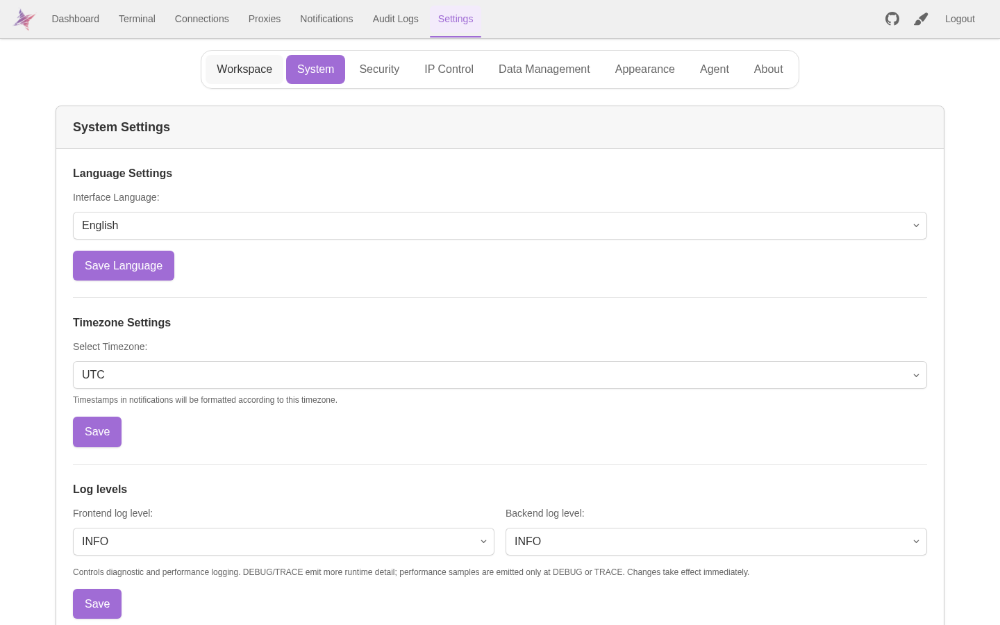
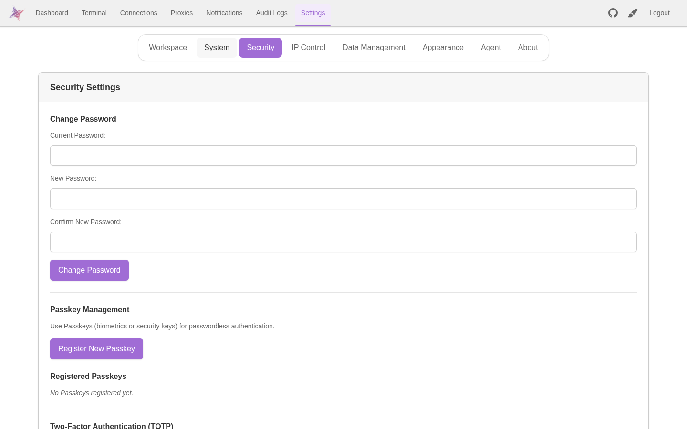

# 使用

本文统一记录正式产品的功能、操作、限制和失败恢复。新后端开发入口单独标注，不等于正式功能已迁移。部署命令见 [DEPLOYMENT](DEPLOYMENT.md)，设计见 [Frontend](architecture/FRONTEND.md) / [Backend](architecture/BACKEND.md)，开发流程见 [AGENTS](AGENTS.md)。

## 每版产品行为维护

按 [人工规则 H-09](rules/HUMAN.md#人工规则列表)，每版逐项维护所有变更功能点：

- 已有功能就地修改对应章节；新增功能补充章节及导航；删除功能清理失效说明。
- 同版写清变更后的操作、输入输出、权限、容量和失败恢复，合并旧描述，不另追加近义条目。
- 仅内部调整且行为一致时，核对原说明仍真实即可。
- 使用短句、列表、表格和必要示例；保留有效限制，不堆历史叙述或无归属的文末变更项。
- 设计、施工任务和验证证据分别维护在 architecture、实施方案和 testing；未实现、未验收不能写成完成。

## 章节导航

| 功能                   | 章节                                                             |
| ---------------------- | ---------------------------------------------------------------- |
| 连接、代理、密钥与通知 | [连接、代理与通知管理](#连接代理与通知管理)                      |
| SSH 挂起与重连         | [SSH 会话](#ssh-会话)                                            |
| 输入、快捷指令与历史   | [命令输入框](#命令输入框)、[历史命令](#历史命令)                 |
| 终端交互               | [终端](#终端)                                                    |
| 文件、编辑、预览与传输 | [文件管理器与在线编辑](#文件管理器与在线编辑)                    |
| RDP / VNC              | [远程桌面](#远程桌面)                                            |
| Agent、工具与集成      | [Agent](#agent)                                                  |
| 布局与外观             | [布局与通用操作](#布局与通用操作)、[外观自定义](#外观自定义)     |
| 首页、状态与 Docker    | [Dashboard](#dashboard)、[状态监控与 Docker](#状态监控与-docker) |
| 认证与审计             | [安全与认证](#安全与认证)                                        |
| 数据备份               | [备份与恢复](#备份与恢复)                                        |
| 客户端与发布           | [客户端与平台](#客户端与平台)、[镜像发布](#镜像发布)             |

## 连接、代理与通知管理

- 连接支持搜索、筛选、排序、批量操作；连接、代理和通知采用自适应卡片及表单，长名称、地址和测试说明可换行。
- 手机批量操作分为“全选/取消/反选”和“编辑/删除”两排；管理操作通常四列，窄卡片两列。代理/通知桌面按钮至少 44×96px，手机按钮底部等宽，代理不显示更新时间。
- Proxy 的 password/key 认证必须有密码/私钥；省略保留原凭据，显式空值拒绝，passphrase 可清空。缺凭据旧记录须补齐或切换认证方式。

### 引用、跳板与导入

- 被引用的 Proxy、SSH Key 不可删除；跳板连接不可删除或改为非 SSH，须先解除引用。保存时事务内重检，不自动改路由。
- 跳板链按显式顺序逐跳连接，只消费各跳的地址、用户名与认证，不递归执行该连接自身的 Proxy/Jump 路由。
- 标签替换最多 1,000 个安全正整数连接 ID，重复合并，空数组清空。引用不存在返回 404，失败保留原关联。
- 导入按记录提交，可部分成功；单条的内联 Proxy、Connection、标签同事务成功，失败不遗留新 Proxy，保留 Legacy 导入格式。
- 登出后旧响应不回填连接/代理/标签/通知缓存；已提交的服务端修改不撤销。

### 通知配置与投递

- Webhook 常见凭据 Header 自动脱敏；自定义秘密须显式标记。响应为 `null`，更新 `null` 保留、字符串替换、删除条目移除；取消秘密标记须同时替换或删除值。
- Header 大小写不敏感判重；重复返回 400，不修改配置。
- 管理员可配置内网 SMTP、Webhook、自定义 Telegram 域名及 HTTP 重定向。只使用可信目标，出站隔离由部署网络提供。

### 通知容量与失败

| 范围              | 限制                                                               |
| ----------------- | ------------------------------------------------------------------ |
| 通知/测试共用队列 | 4 个并发、128 个排队；队列不跨进程保存                             |
| 通道              | 最多新建 64 条；旧超额配置保留，每事件投递 ID 最小的 64 条匹配通道 |
| SMTP              | 连接/问候 10 秒，socket 空闲 15 秒，不是总期限                     |

认证不等待投递；满载通知丢弃并记诊断，测试报错，退出可能丢失待投递任务。

### 独立重构管理入口

`/__targets-next` 使用独立后端/数据。完整 JSON 按 UTF-8 字节计量，包含外壳与转义；前端预检，后端超限返回 413 `body_too_large`。

| 请求                 | 上限                                   |
| -------------------- | -------------------------------------- |
| Connection / SSH Key | 128 KiB                                |
| Proxy                | 64 KiB                                 |
| Tag / Host Key       | 16 KiB                                 |
| 连接导入             | 每批 50 项且合计 128 KiB；超限整批拒绝 |

开发认证与终端见对应章节。

## SSH 会话

支持多标签、挂起、续接和布局定制；普通 Workspace 与 Agent SSH 分别授权和管理。

### 挂起与恢复

- 点击挂起仅标记保留；关闭标签或断线后 Backend 接管原 SSH/PTY，适合长任务。
- 有权限的设备可恢复无人使用的会话，或确认接管使用中的会话；不要求原设备的普通续接凭据。接管撤销原设备控制权，不允许双写。
- 挂起成功返回真实会话 ID；失效或注册失败不报成功。
- 恢复在历史基线和所有权提交完成后确认，不等待 SFTP。历史先显示不证明恢复完成，未确认输入不自动重发。
- 保留最近 100 MiB 原始历史，先恢复状态和尾部，旧历史按需分页；达到上限仍可恢复原 PTY。

### 自动重连

- 异常断线约 120 秒内保留原 SSH/PTY、压缩及复制/移动任务，优先续接并补回输出/结果，不重新 SSH 登录替换终端。
- 回到前台、恢复网络或返回终端时检查存活；正常链路不重连，并发恢复共用一次请求。
- 普通续接校验原标签凭据、用户、Workspace 和连接；新标签不可接管旧 Workspace。
- 待挂起标签自动恢复无人使用的会话，不抢占其他设备或关闭后来打开的启动页。页面被回收后通过挂起目录恢复；未标记会话超出窗口不保证保留。
- 主动关闭立即释放；远端退出或宽限期结束无法恢复。断线时可按终端/命令栏 Enter，或再次点击同一连接提前尝试。

### 会话容量与关闭

| 范围           | 限制                                                             |
| -------------- | ---------------------------------------------------------------- |
| 普通 Workspace | 单 Backend 64 个，包含建连预留及弱网续接；已有会话续接不重复占槽 |
| 挂起 Registry  | 每用户 32、全进程 64，包含附着/断开记录                          |
| 连续挂起       | 24 小时后终止；已恢复不按旧时间终止，再挂起重新计时              |

满载拒绝新建/恢复；Server Transfer/Suspend 的独立预算不计入普通 Workspace 上限。Backend reset/shutdown 清理挂起日志，启动清理无 owner 遗留日志，不提供跨重启挂起恢复。

跳板总期限覆盖握手/forwarding，取消后关闭已建资源，晚到 channel 不发布。远端断线回收会话，旧关闭事件不误关新 owner。命令仅零退出码且无 exit signal 算成功；关闭但缺退出状态属于未知结果，不自动重放，也不证明远端进程停止。

### 新后端开发终端

仅原 Access 会话可操作；WS 断开关闭 PTY，无挂起恢复/命令重放。正常退出等待尾部渲染，异常断线或清理失败报不可用，主动关闭不冒充正常退出。退订失败仍继续关闭底层资源；所有清理失败保留到停机汇总，不能报告清理成功。

| 范围              | 限制                                                |
| ----------------- | --------------------------------------------------- |
| 终端尺寸          | 500 列、300 行                                      |
| 输入/输出数据单帧 | 32 KiB                                              |
| 待渲染确认输出    | 128 KiB                                             |
| 已完成释放结果    | 同会话最多保留 128 条、120 秒，窗口内复用成功或失败 |

## 命令输入框

- Enter 发送；`↑/↓` 选择历史/快捷命令，命令同步发送至选定目标。
- `Alt + ↑/↓` 切 SSH 标签，`Alt + ←/→` 切编辑器标签。
- 桌面宽栏单行，480px 及以下输入在上、按钮换行在下；矮栏可滚动，不按高度切列。手机保留常驻输入和横向工具。
- 快捷指令单击执行，Copy/Edit/Delete 使用右键菜单；仅点击分组文字编辑名称，箭头/空白展开收起，工具栏适应 pane 宽度。

### 快捷命令标签与提交

- 批量关联每批 1–1,000 个安全正整数命令 ID，标签 ID 同样校验，重复合并；非法/超量返回 400，引用不存在返回 404 `QUICK_COMMAND_TAG_REFERENCE_NOT_FOUND`，不部分写入。
- 新增/编辑命令与标签关联同事务，失败整体回滚。
- “创建标签后批量关联”是两个请求：关联失败标签仍存在，先刷新再重试关联或删除，不重复建同名标签。

## 历史命令

截断命令可悬停查看全文。

### 命令与路径历史

- 最近命令 10,000 条、路径 2,000 条；新增/复用时同事务裁剪，同秒优先保留本次触及记录。
- 并发写入按值合并，旧重复保留最小 ID 并更新时间。旧超额备份可导入，读取只展示窗口，下次写入再清理。

## 终端

- 点连接立即显示等待页，连接中禁用输入，成功启用；`＋` 打开连接/挂起启动页，不停止已有会话，后台连接完成不关闭后来打开的启动页。
- 启动页桌面双栏、手机纵向滚动且连接在前；会话栏可横滑，分组、批量管理、启动/停止录制入口常显。
- `Ctrl + Shift + C/V` 复制/粘贴；桌面有选区右键复制，无选区右键粘贴。接管鼠标的程序保留自身右键，Shift 拖选/右键可执行本地操作。
- OSC 52 只允许当前聚焦且可输入的终端，在用户按键/松开鼠标后 2 秒内写入有效 UTF-8 文本，Base64 最多 1 MiB；不读取本机剪贴板。需浏览器写入许可及 HTTPS/localhost。
- 示例：OpenCode v2.0.18 `Ctrl+X` 后 `Y`，Codex CLI 0.159.2 `Ctrl+O`；实际以应用键位为准。Shift 选区只复制终端缓冲，不拼接应用翻页。
- 移动端双指缩放字体；长按复制不反复唤起软键盘，Copy 后不强制聚焦，普通点按/Paste 恢复输入。触摸能力按设备判断，拖动不交给外层页面；选区清除后尺寸变化不复活选区。
- 小键盘固定 Esc/Fn/Shift、Tab/Ctrl/Alt；Shift 为修饰键，↑ 为方向键，Fn 切换 F1–F12。

| 范围                   | 限制    |
| ---------------------- | ------- |
| 单次终端输入           | 256 KiB |
| SSH 浏览器发送缓冲     | 1 MiB   |
| 文件二进制累计读取     | 128 MiB |
| 终端历史单次二进制响应 | 1 MiB   |

未连接/超量/背压时拒绝并提示，不重发输入；读取超限取消并释放缓冲。输出解析过慢暂停发送，解析后继续，不丢中间输出；历史恢复暂停与网络背压分别解除。

- 前台输出直接解析，后台按 80ms 或 512 KiB 合并；重绘使用动画帧及每批一次 100ms 兜底，DEC 2026 完整画面提交。浏览器冻结不触发自动重发。
- 恢复实时画面不等待历史游标重置；新翻页等待重置，旧页面不能覆盖新画面。
- 重连、前台恢复和字体加载后同步尺寸；隐藏时保留最近有效尺寸，恢复按可见区域测量。

## 文件管理器与在线编辑

- SFTP 浏览支持自然数字排序，目录始终在前，同列相等按名称排序；刷新/搜索替换远端快照，不用本地 metadata 冒充操作成功。
- `↑/↓` 选择搜索结果，`Ctrl/Shift` 多选；右键复制、剪切、粘贴、删除、重命名、权限修改；内部拖动移动，外部拖入文件/目录上传。
- 桌面列表选中项后 `Ctrl+V` 上传截图；输入框仍粘贴文字。手机使用可用文件选择器，取消不上传/报错，失败可重新选择；系统菜单由浏览器决定。
- 表格列为 Type/Name/Size/Permissions/Modified，列宽/行缩放持久化，窄栏收起次要列；路径历史/收藏弹层随视口调整，长路径可换行。
- Monaco 编辑文本；预览 Markdown、图片、PDF、电子表格、DOCX，支持多标签、刷新、宽内容横滚。文本类预览共用 `Ctrl/Cmd+F` 搜索、计数和跳转，电子表格多页时才显示分页。
- 上传/复制移动/归档/跨会话传输进入 Progress Display，可隐藏/恢复/取消/移除记录。浮窗不透明，默认 360×190px、最小 280×130px，保存位置/尺寸且不超视口；显示文件、状态、数量/字节、速度与错误，多任务窗内滚动。
- 顶部工具两端对齐、最小间距 4px；窄面板输入/按钮上下排列。大量文件或深目录建议先压缩再上传。

### 上传、下载与搜索

| 范围               | 限制                                                       |
| ------------------ | ---------------------------------------------------------- |
| Workspace 文件操作 | 16 个准备/上传/复制移动/归档操作，控制 WS 64 个请求        |
| 上传目录 batch     | 30 分钟滑动有效期，过期须重新 prepare                      |
| 活跃上传           | 5 分钟无有效块或写入无法收敛则失败并清理临时文件           |
| GET/ZIP 下载       | 单用户部署共用 8 个在途任务，满载 429；HEAD 不打开流       |
| 下载预读           | 每流 16 KiB × 最多 64 块，约 1 MiB；按顺序输出，支持 Range |
| 递归搜索           | 8 个并行目录、500 个结果、5,000 个扫描目录                 |
| 上传目录准备       | 按深度分层，每层最多 8 路，全部准备后才上传文件            |

- 上传保留分块顺序、声明大小和完成校验，使用临时文件。下载名额等待真实读取收敛后归还，HTTP 断开不提前释放；不承诺带宽/公平分配。
- 搜索超限标记截断；根目录失败报错，子目录失败跳过，不跟随目录链接，不承诺遍历顺序。
- 目录准备失败停止新任务并等待已启动任务，可能留下空目录，不递归回滚；仅明确目录类型冲突可释放变更租约，其他未知结果保留隔离。隐式父目录不自动成为授权上传目标。
- 重复二进制 requestId 拒绝，不接管原读取；原请求仍可取消。

### 编辑、预览与失败恢复

- 文本打开/重载/换编码最多 16 MiB，Large File Mode 不突破容量；预览每 socket 4 个读取，单请求最多 64 MiB，实际接收时检查增长。`maxBytes` 必须正安全整数；关闭预览取消读取，不保证远端即时终止。
- 保存先写同目录临时文件再 replace，保留编码/mode，失败不先截断原文件；原子性取决于远端 replace/rename 支持，断链后须核对实际文件。
- 重命名/删除失效旧路径及后代文档，草稿保留但旧标签不可保存；保存中阻止该文件操作。操作失败须检查实际路径后重新打开。
- 关闭文档/批量标签/弹窗确认丢弃草稿，保存中不可关闭；强制断连保留可复制草稿但不能保存。草稿不跨网页刷新，旧打开请求不插入已失效标签。
- 批量删除/解压可部分成功，无逐项删除结果清单；失败刷新核对，未知结果不自动重试。双文件管理器属实验功能，多编辑器布局未完整支持。
- 失败/取消等待并行写入和句柄收敛后清理。归档须远端退出码/exit signal 才确认结束；仅 channel 关闭或清理结果不明返回 `OPERATION_OUTCOME_UNKNOWN`，隔离资源，不推定回滚或 writer 停止。

### 服务器传输

| 范围   | 限制                                                                        |
| ------ | --------------------------------------------------------------------------- |
| 任务   | 全进程 32 个在途，保留最近 100 个已收敛终态；取消未收敛不裁剪，不跨重启保存 |
| 单任务 | 64 个目标、256 个源项，乘积最多 1,024；重复目标 ID/源路径拒绝，须主动分批   |

探测 sshpass/rsync/scp 可取消；不同路径的同名源保留原路径，目标重名按覆盖策略，不自动改名。直传含 auto 会把目标密码/私钥/口令交给源端，须信任源服务器并逐次确认，0600/清理不隔离源端管理员；不是 Backend relay。

### 新后端独立开发入口的只读文件功能

`/__targets-next` 确认 Host Key、保存凭据后打开独立 SFTP 资源，不借 PTY 或 Agent 项目授权。使用绝对路径，支持完整目录、stat/lstat、只读 UTF-8；按自然顺序且目录在前。

| 范围      | 限制                                                                 |
| --------- | -------------------------------------------------------------------- |
| 完整目录  | 200 项、48 KiB metadata，超限失败，不返回截断快照                    |
| 文本      | 16 KiB，按实际接收字节限制，拒绝无效 UTF-8、明显二进制和链接文件内容 |
| 资源/期限 | 单实例 8 个，闲置约 2 分钟；打开/读取含认证约 30 秒                  |

绑定当前会话、目标及配置指纹，读取前后复查；切目标/离页取消并尝试释放，同会话短期重复关闭共用结果。取消/超时/退役后资源不可复用，须重开。无写入、上传、下载流、编辑、传输、分页快照或恢复；与正式文件容量不同，真实浏览器验收仍待完成。

## 远程桌面

支持 RDP/VNC，经 Backend Guacamole runtime 与 guacd 在浏览器访问；单 Backend 最多 16 个建连/活跃会话，满载拒绝新建，不踢旧会话。票据配额独立，任务/socket 收敛后归还名额。

手机点按只操作鼠标；选输入区域后用右上“键盘”按钮开关软键盘，全屏可用，最小化/断开释放焦点。设计见 [远程桌面架构](architecture/REMOTE_DESKTOP.md)。

## Agent

- 首次启用按 onboarding 安装官方签名 Plugin，在 Settings 配 Provider/模型/SSH 授权；认证后悬浮 Host 可跨页面保留 Thread/Run，设置 Goal、提交输入、查看 Plan/审批/Artifact/Checkpoint/历史。
- 运行中输入进入持久队列，按状态中断或后续消费。远程 File/Shell/ACP 只使用显式授权 SSH，Browser 使用独立 Backend CDP，不回落 Backend 本机。
- Agent Workspace/Runner/Toolchain 与旧 environment/profile/manifest/job 契约已移除，旧配置、Runner Manifest/备份不能自动转换。迁移 #58 删除旧表及相关设置，不删除普通终端/SSH 数据或用户外部备份；普通 Workspace、Artifact/Memory 保留。
- Plugin 只获得声明并授权的 capability。旧 Workspace 或混合 grant 拒绝，不自动转 SSH；Root/Child mutation 仍受目标、审批、lease 约束。
- 悬浮按钮 44px，可拖动、贴边半隐藏、悬停/聚焦展开，手机点击露出部分打开；保存位置/贴边侧，右键重置。窗口拖动，缩放围绕中心，边界限制鼠标/键盘扩展。
- 设置开关靠右，窄栏状态/数量/开关等宽；SSH/模型弹层随视口定位。SSH 列表独立滚动，全选显示空/部分/全选及数量，运行冻结时不可改目标。

### Provider 与模型配置

每模型选择调用协议，未设置沿用 Provider 默认；保存、测试、运行一致，不自动降级。测试执行真实模型请求，显示本地化类别与安全码；能访问网站/模型列表不等于调用成功。模型名称完整换行，桌面操作四列、手机两列，按钮至少 32px。

| 错误码                                                                                | 含义                               |
| ------------------------------------------------------------------------------------- | ---------------------------------- |
| `PROVIDER_RESPONSE_INVALID` / `PROVIDER_RESPONSE_EMPTY` / `PROVIDER_STREAM_TRUNCATED` | 格式、空响应、未完成流             |
| `PROVIDER_HTTP_<status>`                                                              | 原上游 HTTP 状态，包括 401/403/429 |
| `PROVIDER_DNS_FAILED` / `PROVIDER_TLS_FAILED` / `PROVIDER_NETWORK_FAILED`             | DNS、证书、网络故障                |
| `PROVIDER_NETWORK_TIMEOUT` / `PROVIDER_TEST_TIMEOUT` / `PROVIDER_DISCOVERY_TIMEOUT`   | 对应超时                           |
| `PROVIDER_REQUEST_FAILED`                                                             | 未分类失败                         |
| `PROVIDER_UNAVAILABLE`                                                                | Provider 不存在/停用               |

响应缺 ID 不伪造。OpenAI-compatible 支持可信管理员配置的本地/内网 HTTP(S)，discovery/test/run 共用 baseUrl；无私网封禁/逐跳 allowlist/DNS pinning，网络隔离由部署负责。

### Agent 长对话上下文

- 使用冻结模型按历史顺序分批摘要，保留近期完整交互，关注目标/约束/纠正/决策/状态/下一步/证据；不按关键词或首尾裁切代替语义摘要。
- 摘要计入请求/活动时间/token，不作为回复、不提前消费输入/mailbox；空、截断、取消、超预算或来源变化不覆盖有效摘要。
- 不缩小或不能安全压缩时，仅完整原始历史仍符合硬预算才继续，否则明确结束/中断；超大单条明确失败。原始对话/工具结果保留，摘要可能遗漏细节且不授予权限。
- `tool_result_read` 用 ToolCall 引用/hash、Unicode offset/nextOffset 分页当前已捕获结果，不重执行原工具；范围隔离/预算仍生效，capture limit 外内容不可恢复，读取不改变原验证结论。
- Child 不继承 Root 私有对话、Recall、Goal/Plan，只使用委派资料与自身历史；保留已消费纠正，不因 8 组工具自动遗忘。摘要失败不覆盖旧历史，不能安全继续则明确结束，由父级决定重委派。
- Child 交接从全部已保存成功且已验证历史收集证据，最多 64 个引用/16 个工具摘要；超量或读取失败明确失败，不删除原始数据。
- 实时事件按字段解码，其余合法事件刷新快照，sequence 去重/续接；未知事件、非法 payload/schema 报错，不静默跳过。

### 审批、协作与 Browser

- `ask` 逐次审批；`full_access` 只在已有 capability/目标/deny 内自动批准，无按路径/命令记忆批准的第三档。Child 仍受 grant；审批后重检，拒绝/过期/新输入失效旧审批。
- `plan` 对 Root/Child 仅开放 read/control，执行和审批消费前拒绝写入，full_access 不解除禁写。
- execute 的 deferred 原生/MCP 及 Child MCP 用 `tool_search` + 版本绑定 `tool_invoke` 按需发现；发现不授予执行权限，过期引用/旧检查拒绝，须重新发现检查。plan 直接提供可用原生 read/control。
- Child 仅瞬态连接/429/502/503/504 在冻结模型、期限/预算内退避；失败计 usage，不提交部分回复/建议或消费 mailbox，不重放工具副作用。
- `/interrupt` 只中断 streaming Root；仅 Child streaming 返回冲突。Goal/普通输入/队列更新不自动取消 Child，纠正用 mailbox；移动/删除待输入仅中断 Root 流，不中断已开始命令。
- Root join 未满足时让出执行槽，不发模型请求；单独取消 Child 可唤醒 Root。取消 Run 中断全部参与者，结算后 cancelling→cancelled，使审批失效并回收 Browser，不回滚副作用。
- 停机/新输入/目标更新不误记用户取消；重启只按安全 checkpoint 创建新执行，不恢复旧模型流/Child 原地执行。
- `browser_session_open` 必须配置 targetId，仅 via=backend，按 user/App/Run/runtime 隔离。改目标 endpoints/URL allowlist 或删除目标会关旧 Session；无关设置变化不误关。导航/子请求/下载仍受 URL 与审批边界。
- 点击/输入须最新 snapshot nodeRef。派发前拒绝旧引用返回 `BROWSER_NODE_STALE`，读取新 snapshot 后再决策；派发后的断连/超时仍可能有副作用。

### Agent 执行额度与进度

| 范围        | 默认额度                                         |
| ----------- | ------------------------------------------------ |
| Balanced    | 80 次模型请求、1800 秒                           |
| Deep        | 150 次、3600 秒                                  |
| hard limits | 400 次模型请求、4000 次工具执行、7200 秒活动时间 |
| 收尾预留    | Root 最多 2 次请求、30 秒，Child 不占用请求预留  |

- `maxModelRequests` 包含 Root/Child/摘要/重试/fallback 每次获准请求，失败/取消不退；`toolExecutions` 仅实际启动，批量逐项计，检查拒绝不计。
- App 策略可降低自动扩展上限，Run 冻结边界；修改设置不改在途 Run。工具/请求受各自及冻结期限限制，不为初始软额度强行打断副作用。
- 新成功观察或验证/Artifact 证据、无循环警告且最近三次工具非连续失败时，当前批次完成后按 1.5 倍扩展至上限，记录 `budget.auto_extended`。旧证据/重复结果/只改 Plan 不支持再扩展，启发式不保证完成。
- 无进展或逼近上限记录 `budget.finishing`，停止新工具/委派，保存安全 checkpoint 和已完成/验证/未完成结果，以 interrupted 收尾；未知写操作保持隔离。
- 普通执行不等待手动增额；`awaiting_budget`/versioned API 仅保留协作 mailbox 数量/字节增额。
- checkpoint 继承累计消耗，耗尽/收尾 Run 不通过恢复绕过上限；独立新任务才有新额度。仅接受当前字段，不保留 maxRunSteps/maxSteps/usage.steps 别名。
- 进度展示持久 Goal/Plan/验证、消耗与剩余额度，不虚构百分比，Plan 完成不等于验证通过。deadlineAt 使用服务器 currentUnixSeconds，不能超过 Root 剩余硬时间或父委派期限。

### Agent 项目目录规则

- SSH 用 `project_directory_bind(connectionId, directory)` 绑定绝对目录，read/clear 查看/清除。按 user/App/Thread/connection 持久隔离，获文件权限的 Child 可共享；删 Thread/停用 App 清除，不改变 cwd/连接或授予权限。
- 从绑定根到已探索子目录读取 AGENTS.md/AGENT.md，大小写不限，目录浅到深/同目录文件名排序；不读远端 home、项目外或 CLAUDE.md。配置变更不自动换目标。
- 仅从已观察且有显式 SSH ID 的 File/Shell 路径推导最多 8 个目标目录，不从 Goal/Plan 猜目标或全仓扫描。
- 规则只指导对应目标/子树，不覆盖用户/安全/审批，冲突提出；每次请求重读，不可用不伪造或写长期 Memory。
- 最多 16 文件，每正文 16 KiB，合计 64 KiB；源文件超过 64 KiB 不加载，上下文预算可再截断。历史 Workspace 根规则不恢复退役的 Agent Workspace 执行能力。

### Agent SSH 长会话与后台任务

| 范围     | 限制                                                                  |
| -------- | --------------------------------------------------------------------- |
| 前台命令 | 最长 300 秒，受剩余工具期限限制                                       |
| 后台 Job | 默认 3600 秒、最长 86400 秒，每用户 32 个活跃任务                     |
| 长会话   | 默认闲置 1800 秒，0 不空闲关闭，最大 86400 秒；每用户 32、服务 128 条 |

- `ssh_session_open(connectionId, idleTimeoutSeconds?)` 返回 sessionId；list 查看当前 Thread 的目标状态/活动数，close 普通拒绝活动会话，force 按破坏性操作审批。
- 同 user/App/Thread 的 Root/Child 可显式共享，仍校验授权；跨范围拒绝。exec/SFTP 各自独立 channel，不继承前次 cwd/env；远端共享文件/服务可能互相影响。
- 任务结束不自动关长连接；删 Thread、停用 App、撤权、配置变更、服务退出清理。任务运行时不空闲回收。
- `shell_execute` 接受 `{kind:"argv",argv:[...]}` 或 `{kind:"shell",shellScript:"..."}`、可选 cwd/sessionId；argv 安全引用，shellScript 由远端 Shell 执行。旧 text/Workspace 拒绝，env 显式传入。
- 不带 sessionId 临时建连，指定时同连接检查/执行/验证；失效不自动重连、降级或重放，后台必须显式 sessionId。
- 后台返回原 jobId；`shell_job_control(target="ssh", id=连接ID, jobId, action="status/wait/cancel")` 管理，list 不带 jobId，只列本范围活跃受管 Job，不列任意进程。授权/配置失效拒绝，不重绑。
- accepted/running 不算成功；wait 超时保留原身份，服务用健康检查验收。timeoutSeconds 是实际执行期限，不是启动探测，过期不自动重启。
- Job 状态/终态持久保存，不存原命令/凭据；断连、force close、重启未确认任务标 unknown，不重放。单 Job 取消不关闭共享连接，远端退出证据才确认停止。
- 临时文件操作取消关闭临时连接；显式长连接只关闭本次 SFTP channel，待 I/O 拒绝，不影响其他操作/Job。force close 不证明全部远端进程停止。

### SSH 工具与控制中断

- 工具使用当前 shell__/ssh__/file__/machine__/workspace__/collaboration__/memory__/browser__/tool__/skill__/plan__/user__/artifact__/acp__/mcp_* 名称，不保留旧别名。
- 七项 file_read/list/search/write/patch/move/delete 仅显式 target=ssh 和授权连接，不改选目标或本地执行；代码调查用这些文件工具，验证用授权 Shell，不提供语言语义导航。
- file_search 用 JS Unicode 正则 u flag，每行首匹配，column 为 1-based UTF-16；glob 相对搜索目录或 basename，不按是否有 rg 改语义。不限制扫描目录/文件/累计字节，结果及输出有界；单文件 1 MiB，超量跳过并标 truncated，继续其他文件，不改变 file_read 契约。
- file_write 新建默认 0600，覆盖/patch 保留 mode；可选十进制权限 0–511（384=0600，420=0644），纳入审批 hash 并验证。
- file_move 源不存在/同路径/目标存在分别 FILE_NOT_FOUND / FILE_MOVE_SAME_PATH / FILE_MOVE_DESTINATION_EXISTS，不覆盖；write 目录为 FILE_WRITE_REQUIRES_FILE，delete/search 不存在为 FILE_NOT_FOUND。FILE_ARGUMENT_* 指明字段/约束，不回显值/路径。
- 多文件 patch 全部预检后逐文件替换，非集合原子提交；仅全部成功为 applied，失败可部分修改，重读全部内容/hash 后重规划。
- 已确认非零命令退出保留 stdout/stderr/码，不仅因此隔离；超时/断链/缺退出状态/signal 属未知副作用，不自动重放。

### ACP

仅 SSH：配置远端 argv JSON 数组、绝对 cwd，env 显式传入，不自动装程序。`acp_execute` 必须 integrationId、target=ssh、已选 connection ID、prompt，可选绝对 cwd；旧 Workspace/profile/generation/别名或省略目标拒绝。

非 PTY ACP v1 channel 执行前重检集成版本、SSH 配置和冻结目标；full_access 不跳过内层敏感操作审批。取消关本次执行，晚批准不继续；断链 unknown 可使 Run interrupted，不重放、不保证回滚。ACP 非 OS 沙箱，协议完成仍须独立验证。

### 执行、完成判定与治理

- 副作用身份是持久 ToolCall；协议重放先核对，不重新启动 Job，新 ToolCall 即使同参数也是新操作，审批 hash 不代替执行身份。
- 重复失败/观察或无进展先提示调整，再暂停；loopPause 与澄清输入分开，暂停不取消后台 Job，不自动重放/停止占端口者。
- Plan 只含当前交付，未请求修复/部署作为建议。完成门禁拒绝后继续必要工作、取消范围外未来项，或结构化询问并挂起；blocked 不等于已请求输入，不自动放行/推定授权。
- 遵守用户最终输出格式，必要 Plan/验证先记录；模型指令不保证输出成功，权限/完成门禁独立执行。
- 派发前参数/授权/目标拒绝明确未执行，保留 VALIDATION_FAILED、TOOL_ARGUMENTS_INVALID、APP_CAPABILITY_DENIED 等原码，不统一成 RESOURCE_FORBIDDEN；后派发异常仍核对副作用。
- 成功测试后普通已确认空闲 close 不废弃证据；改文件/重启命令/force close 须重新验证，accepted/running 不是测试通过。
- Root/Child 共用 Runtime 并发，满载 queued，Root 按 App 轮转，不承诺严格公平。单轮 Root 64、Child 32 个 ToolCall；Responses continuation 512 parts/64 identity，超量批次不执行。

### 运行额度、终态与清理

Run completed/completed_unverified/failed/cancelled/interrupted 回收 Browser Session；等待审批/预算或新输入不自动关闭，Child 结束不关闭整个 Run。interrupted 的 checkpoint 新 Run 须新建 Session；显式/global close 仍生效。关闭连接不等于停远端浏览器，失败诊断及全局清理兜底。

### Memory

候选 confidence 为 0–1 有限小数，经用户审核发布才 Recall。管理/跨 App 导入每页 200，创建时间/ID 倒序，审核不改排序，重载从首页；非跨请求快照。revoked/expired 历史保留，无总量硬配额，Recall 限制不等于存储容量。

### Artifact 容量与清理

每批预览最旧 1,000 个可回收对象，确认重检保留/授权/活跃 Run，仅清理本批，可再次预览继续。

### Plugin 与 MCP

- Stage 全 Backend 8 个，24 小时过期后清理；每个 archive 50 MiB/展开 200 MiB，约 2 GiB payload 不是总磁盘上限。
- 包身份 appId+version 全局不可变，同版本不同内容拒绝，换 publisher 不扩 namespace；改内容须新版本/App ID。verify 元数据无自动回收。
- Publisher 撤销保留记录，禁止新验证，可显式重新信任；列表全量，无分页/自动历史删除。
- 可信 catalog/包地址支持内网/重定向，无逐跳 allowlist/DNS pinning；签名不是网络隔离。
- 前端/SDK 静态代码可匿名缓存获取，含 sourcemap 不可放秘密；代码可见不授予 App/RPC 权限。
- MCP 每 integration 有限制，无 aggregate 硬配额；Backend Plugin 独立 Node 进程，也无 aggregate 进程配额，按部署资源启停。

### Plugin 安装、幂等与生命周期

- intents.create 首次前持久保存 UUID operationId，未知结果同 ID/同 payload 重试；不同 payload 拒绝，重试仍校验 App/grant。receipt 仅 10 分钟，过期先核对业务，不保证外部动作一次性。
- SDK 创建 Thread/Run、追加输入、Run 取消、审批透传稳定身份；Thread 重命名/Child 取消用 CAS，超时重读，不盲目带新版本重发。
- 同用户/App 首次安装串行，先完成版本生效，后请求走 upgrade。升级/卸载 drain App Run/runtime；Runner Manifest 拒绝，无安装引用旧包可清理。
- Frontend Run 订阅每实例 2、每页面合计 4，同实例不重复订同 Run，取消 transport 收敛后归还。
- ready 30 秒超时 PLUGIN_BACKEND_READY_TIMEOUT，RPC 写入/drain 有硬期限，不无限等待。正常关闭须 dispose/操作收敛并确认退出；SIGTERM 2 秒后 SIGKILL 再等 5 秒，未确认报错，只保证直接子进程。
- 重启恢复 builtin/已装 App 的 enabled MCP，失败显示错误，可刷新；全局 Agent 开关 quiesce/启用两类 App，生命周期失败记诊断，不回滚配置或保证所有插件按时退出。
- 删除/禁用使旧 integration refresh 失效，临时 generation 在在途任务结束回收。

### HTTP 来源与认证

正式 Agent 来源拒绝保留 `error.code=CSRF_REJECTED` envelope/request ID；通用规则见 [安全与认证](#安全与认证)。

新后端状态接口与开发前端源码已接入，正式 Agent 不切换。DEV 路由 `/__agent-next` 只支持创建 App/Thread/Run、读取/取消 Run 和事件分页；Run 仅 pending/cancelled，尚不执行模型或工具。真实浏览器行为仍待验收。

| 范围 | 限制与语义                                                                                                                      |
| ---- | ------------------------------------------------------------------------------------------------------------------------------- |
| 认证 | 使用新 Access 会话，只允许管理员 userId=1；不接受客户端自报身份                                                                 |
| 名称 | name/title 原始 UTF-8 ≤128 bytes，保存前 trim                                                                                   |
| 输入 | prompt UTF-8 ≤16 KiB，不允许全空白，保留原文；创建 Run 完整 JSON ≤128 KiB，其余 JSON ≤16 KiB                                    |
| 响应 | 完整 UTF-8 JSON ≤32 KiB，包含分页外壳及转义                                                                                     |
| 变更 | 创建/取消使用 UUID Idempotency-Key；同 key 同输入重放原提交快照，内容不同报冲突；取消带 expectedVersion，版本不一致报冲突       |
| 分页 | after 默认0，limit 默认50/最大100；nextCursor 为最后事件序号，空页保持传入游标；重复/未知 query 拒绝                            |
| 前端 | Targets/Agent 共用 Auth next 的公开认证 client；切 scope/run、登录或卸载取消旧等待并失效 generation；事件按 runId/sequence 去重 |

同 App/Thread 只允许一个活动 Run。网络失败、协议异常或提交结果未知不能证明未写入，重试保持原 key 和输入；改变输入才形成新意图，不自动生成新 key 重放。version_conflict 显示冲突并尝试读取最新 Run，不自动用新版本继续取消。安全失败只返回 code；非 JSON、未知状态/错误码或错误 shape 显示协议失败，不伪造成功，也不返回 prompt、hash、秘密或技术 cause。开发入口与剩余项见 [下一阶段方案](后端重构下一阶段实施方案.md#延后的前端事项未验收不删除)。

## 布局与通用操作

- 失败 toast 默认 8 秒，成功/信息/警告 3 秒，可提前关；常驻错误须手动关，显式时长优先。
- 导航高 48px，上下各 6px，桌面左右 8px、手机无额外边距，占正常布局且可隐藏；预留滚动条空间，设置/终端共用高度计算。
- 窄屏页面菜单/标签可访问所有入口，桌面窄栏支持鼠标拖动及原生触摸滚动；拖动不触发选择/切页或带动终端。
- 弹窗/表单/进度使用不透明主题底色；危险确认、上传冲突统一面板，保留跳过/覆盖/应用全部，长内容可滚动。桌面按钮至少 44px，手机等宽；登录控件 44px，编辑器下拉紧凑。
- 工作区偏好扁平分组，手机单列/桌面双列，保留独立保存、未保存提示、高级折叠。
- Ctrl+滚轮缩放终端/文件/编辑/快捷指令；容器水平/垂直只改直接子项排列。
- 侧栏宽度持久化，默认点击外部收回，“保持侧栏”持续展开；popup/embedded/sidebar 共用功能状态。
- SSH/文件标签右键支持关当前/左侧/其他/右侧，分组名可点改；触摸终端规则见 [终端](#终端)。

### 系统设置截图

## 外观自定义

支持明暗、终端配色、页面/终端背景、工作区样式。设置统一分区/控件，桌面侧栏/窄屏顶部导航；主题/HTML 背景共用搜索，主题可下拉切换，长名称和手机按钮不横向溢出。

内置背景深黑，应用时保存内容副本，预设更新须重新应用。背景仅非零尺寸加载，resize/恢复通知隔离文档，不重载；主题须自行处理 resize。

手机/粗指针 HTML 动画最高 20 帧/秒，不可见暂停帧/CSS，减少动态效果只保留首帧；不限制终端/桌面，自定义 timer/视频仍可能耗资源。

### 外观与 HTML Theme

支持本地 HTML 和 GitHub catalog，升级/保存/读取/备份恢复规范化，保留第三方仓库地址。内容 API 返回文本，终端只在 sandbox iframe 执行，GitHub 来源不意味着可信。

### 主题升级与背景保存

- 删除活跃主题同事务清空设置引用；同名新 preset 将用户主题改名“原名 (user ID)”（冲突再编号），保留颜色/ID/引用。
- 上传/删除顺序执行；删背景先清设置再删文件，设置失败不先删，清理失败记诊断但不改变已清引用结果。崩溃可能遗留文件，非文件/数据库跨资源原子更新。

## Dashboard

连接目录加载后结束 loading，不等待审计/挂起；返回保留内容并刷新。快速连接/SSH 资源列表限高内滚动，保留最近活动首屏，手机搜索随列表滚动，长列表有回顶按钮。

资源按主机去重、主机间隔 200ms 请求，独立显示成功/失败，不一次全量启动；页面销毁取消待请求，不让单主机失败阻止其他状态展示。采集与缓存见下节。

## 状态监控与 Docker

- 默认显示在线状态，可设置显示/复制 IP，采样/缩放/Docker 间隔持久化，Docker 默认 5 秒。
- CPU/内存/Swap/磁盘/网络显示实时数值、总量/单位，适应宽窄矮栏，历史可切指标/时间并关闭；极小面板存在可读性限制。
- 指标提示支持悬停/键盘聚焦并原位更新，不重启原生 title。
- Docker 宽栏表格/窄栏卡片；Start/Stop/Restart/Remove 管容器，Enter/Logs 进入当前 Workspace。

### 资源采集与缓存

每次采样重读机器信息，不跨采样复用；同主机/配置在途采集共用，TTL 从开始计算，慢结果可能已过期。删/改地址清旧缓存，reset 不允许旧结果回填；TTL 内可能短暂显示旧状态。

## 安全与认证

支持密码、Passkey/WebAuthn、TOTP 2FA、hCaptcha/reCAPTCHA、IP 白/黑名单、登录通知和审计。Passkey 配置见 [部署文档](DEPLOYMENT.md#passkey--webauthn)。

### 初始化、因素与会话

- 空库初始化仅成功一次，并发保护不验证部署者身份；没有部署 token，先在受控网络建管理员再开放。
- Session 目录 0700、文件 0600，权限失败/异常条目拒绝；仍明文，不隔离 root/同 UID/额外 ACL，保护数据与备份。
- 新增 Passkey/启用 TOTP 由完整会话授权，无统一 recent-auth；改密码/禁用 2FA 仍验证密码。新因素不撤销泄露旧会话。
- 部分 2FA 会话固定 5 分钟、不续期，Backend 最多 64 个，满载拒绝；记住我第二因素成功才生效，不是完整会话/磁盘总配额。
- 2FA 验证失败记 LOGIN_FAILURE、通知及 IP 失败；不存验证码/secret，投递依实际配置。
- Passkey discovery 可公开配置状态、credential ID/transports，标识不是秘密，须签名验证；false 不区分账号不存在/未配置，无专用限流保证。
- 启用 2FA 约束新密码登录，不自动注销/重挑战已有完整会话。

### 认证并发、撤销与秘密存储

- 改密码失效所有旧 session/WS，旧无凭据版本会话也须重登，Passkey 可继续认证；已接纳副作用不回滚。
- 登出撤销同 session 的 Workspace/上传/桌面/Agent WS，包括其他页面，不撤其他 session；前端缓存/传输轮询清空，晚响应不回填，交错握手可能拒绝。
- 同 session 只支持一个 Passkey 注册/登录 challenge，新流程失效旧流程；失败重新发起。提交重检签名计数器，并发旧快照拒绝；同步零计数器不要求递增。
- TOTP/CAPTCHA/通知配置按部署密钥加密，旧明文启动迁移，错误密钥不当明文。备份配置 envelope 加密、导入用目标密钥；用户/TOTP 不在 Full Backup。旧页/WAL/外部备份不擦除。
- 生产建议 HTTPS。

### 来源、反向代理与网络准入

普通写请求检查 Origin/Fetch Metadata，兄弟域 same-site 不放行；无 Origin 的 same-origin 或无浏览器 metadata API 客户端可用，认证不变。Agent 仍须 CSRF。WS 只在可信 TCP peer 时采用 forwarded host/proto，不读取 X-Real-IP，Origin 不替代认证。

代理须正确覆盖外部 Host/Proto/来源。宿主 TRUST_PROXY 默认 loopback，自定义代理指定精确 IP/最小可信 CIDR；Compose 默认 Frontend 一个 hop，不公开 Backend；Frontend 信任私网入口，必须保护转发路径，不能让不可信私网 peer 伪造 IP。具体示例见 [部署文档](DEPLOYMENT.md#反向代理来源信任)。

### 来源与登录失败策略

- loopback/RFC1918/IPv6 ULA/link-local（含 IPv4 映射）豁免 IP 白名单/失败封禁，不免密码/2FA/Origin；旧内网黑名单行可保留但不阻断。
- 公网按配置阈值/封禁；到期后下次失败开启新周期，未到期不追加延长。并发失败原子累计，仅首次进入封禁触发通知。
- 7 天无新失败且封禁结束可惰性清记录，每 5 分钟至多清一次，不删活跃封禁；分页最多 200，无保留期来源总量配额。

### 独立重构入口认证

失败策略默认关闭，显式安装启用；内部地址豁免、未知地址不豁免。限流 429 rate_limited，未实现的必需因素 403 factor_unavailable，不降级密码。普通/记住我服务端最多 30 天，仅记住我 Cookie 持久。

### 审计日志

列表时间/类型/原详情代码块逐行展示，长内容换行，窄屏纵排，不弹窗或内部滚动。关键词防抖/类型自动筛选，每批 40，近底加载/手动加载，失败保留旧项可重试，动态虚拟列表及回顶。

SSH Key 新增/更新/删除记录 ID、操作者、来源、字段名，不记录私钥/passphrase，无额外外部通知。

### 审计保留与失败

保留 50,000 条，新增/按时间及 ID 裁剪同事务。审计 best-effort，故障记安全诊断，不回滚已提交业务，也不保证存储故障时全部落库。

### 安全设置截图

## 备份与恢复

完整认证会话可导入合法备份，同实例用 instance key，跨实例需备份密码；校验完整性/密钥，不含认证表。无额外 recent-auth/服务端破坏式确认，导入前核对目标，合法旧备份可能回放旧状态。

### 容量、一致性与运行资源

| 范围              | 限制                                          |
| ----------------- | --------------------------------------------- |
| V1 快照 JSON      | 64 MiB，文件读取前计算 base64 膨胀            |
| 编码导入/导出文件 | 100 MiB，超限明确失败；内存生成，不保证低内存 |

- Artifact 配额不等于备份容量，保留整个 data 的外部备份，勿因导出失败盲删数据。
- 表快照短暂阻塞数据库，扫描文件不占事务；非跨文件/数据库同一物理时点。验证 ready Artifact 大小/hash、Plugin 包/入口/清单，缺失或并发变化拒绝，不交付缺引用包。
- 导入先停 Agent 调度/维护及旧 Plugin/模型句柄，不能安全停则拒绝；成功或回滚后按存活数据重新初始化，不复用旧队列/审批。
- 恢复清理挂起会话，保留服务维护与撤销订阅，成功/失败后仍可新建挂起会话。

## 客户端与平台

支持响应式 Web/PWA；[桌面安装包](https://github.com/0honus0/nexus-terminal/releases/latest) 的部分认证/会话能力可能不同。镜像支持 AMD64/ARM64，部署见 [DEPLOYMENT](DEPLOYMENT.md)。

## 镜像发布

Alpine latest、APK 最新 nodejs-current/nginx，更新须重建。稳定发布只发布当前 main，通过完整 E2E 与 high 级生产依赖审计；channel、架构和目标可从 Actions 识别。命令见 [部署与更新](DEPLOYMENT.md)。

## 当前限制与注意事项

具体限制就地维护在各功能章节；开发入口不替代正式能力，静态通过不等于真实行为验收完成。
