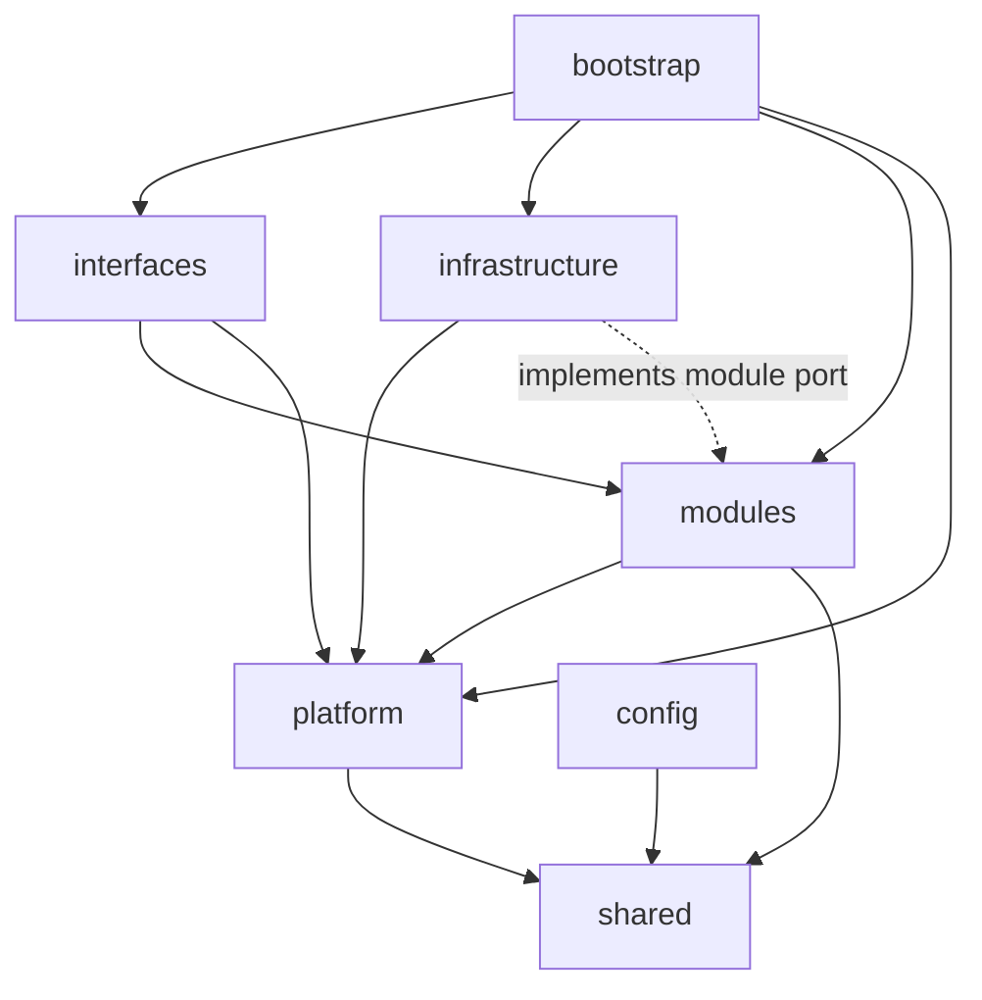

# Nexus Backend Architecture

本文描述当前 Backend 的分层、owner 与运行时边界。产品需求见 [软件需求](../software-requirements/README.md)，Agent 细节见 [Agent 架构](../AGENT.md)，强制规则见 [Engineering Constraints](../software-requirements/engineering-constraints.md)。

## 技术基线

- Node.js 24，ES2025，TypeScript 7。
- Express 5 HTTP application 与单一 WebSocket upgrade owner。
- SQLite 持久化，数据库访问由 Infrastructure adapter 实现。
- SSH/SFTP、Guacamole、通知、认证和 Agent Runner 通过明确 port/adapter 接入。
- 对外 HTTP contract 使用 camelCase；数据库列名只存在于 repository/infrastructure 边界。

## 源码布局

```text
packages/backend/src/
├── bootstrap/        composition root、启动、关闭和生命周期任务
├── config/           环境变量与 runtime config
├── infrastructure/   数据库、网络、密码学和第三方技术 adapter
├── interfaces/       HTTP/WebSocket 输入输出协议
├── locales/          Backend 用户可见文案
├── modules/          Nexus 产品用例、领域服务和 module-owned ports
├── platform/         可复用的机器能力与技术无关服务
└── shared/           错误、事件、日志、观测与安全基础 contract
```

## 层级职责

### `shared/`

Shared 提供无产品模块依赖的基础 contract，例如结构化日志、受控事件分发、运行时性能观测和密码学 port。它只依赖自身。

### `config/`

Config 解析和验证环境变量，输出稳定 runtime configuration。业务模块不直接读取 `process.env`。

### `platform/`

Platform 表达可复用的机器能力：远程连接、执行 session、POSIX shell、远程文件系统、路径、搜索、删除、Docker、系统状态和 mutation guard。Platform 不认识 HTTP、SQLite 或具体页面。

### `modules/`

Modules 持有 Nexus 产品行为和用例，例如认证、连接、设置、Workspace、传输、备份、通知、Remote Desktop session、SSH suspend 与 Agent。

Module 可以定义自己需要的 repository/adapter port。它依赖 `platform` 和 `shared`，不依赖 Infrastructure 或 Interfaces。跨模块调用必须通过明确服务或公开 contract，不能直接读取另一个模块的数据库实现。

### `infrastructure/`

Infrastructure 实现具体技术：

- SQLite schema、migration、worker 与 repositories；
- SSH transport、SFTP 和 suspend checkpoint/log；
- Guacamole runtime；
- WebAuthn、TOTP、captcha、密码散列与 secret cipher；
- 通知渠道、HTML theme catalog、备份 codec；
- Agent provider、plugin、Runner 和外部集成 adapter。

Infrastructure 可以实现 Module-owned port，但不拥有产品流程。

### `interfaces/`

Interfaces 是外部协议边界：

- HTTP route/controller 负责认证、输入 decode/validation、调用 use case 和响应映射；
- WebSocket server 统一处理 upgrade、Origin/IP/session/2FA 校验与协议分发；
- terminal/upload/workspace/agent/remote desktop session 负责 frame decode、backpressure、关闭和错误映射。

Interface 不直接访问数据库，不把 transport DTO 作为 Module domain model，也不在 route 中实现业务事务。

### `bootstrap/`

Bootstrap 是唯一 composition root。它创建 config、database、repositories、adapters、services、HTTP/WebSocket interfaces、Agent/Plugin/Runner wiring 和 lifecycle sweeps，并控制启动失败与有序关闭。

## 依赖方向



允许的静态依赖以 [EC-ARCH-001](../software-requirements/engineering-constraints.md#ec-arch-001) 为准。Infrastructure 对 Module 的依赖只允许用于实现 Module-owned `*.port` / `*.types` contract，并优先使用 type-only import。

## Workspace 与远程能力

`modules/workspace` 持有 Workspace session registry、session 生命周期、事件 hub 和用户可见用例。`platform/execution`、`platform/filesystem` 与 SSH Infrastructure 提供执行和文件能力。

关键 owner：

- Workspace registry：活动 session 与生命周期；
- SSH transport：连接、channel 和 SFTP 技术状态；
- execution session：命令执行与 shell 语义；
- filesystem：路径和文件操作；
- transfer module：跨 session 传输、任务状态与取消；
- SSH suspend module：挂起 catalog 与恢复事务；
- Interfaces：HTTP/WebSocket streaming、认证和 backpressure。

恢复挂起 SSH 会话时，Backend 负责 prepare、有限尾部回放、transport 交接、commit/rollback 与更早历史分页。Frontend 只负责 Runtime tab 的创建、替换与展示。

## Remote Desktop

`RemoteDesktopSessionService` 读取连接并签发一次性 opaque ticket。`GuacamoleRuntimeAdapter` 在 Backend 内存中持有短生命周期的具体连接请求。浏览器经 `/ws/remote-desktop` 连接 Backend，Backend 再连接独立 `guacd` 服务；凭据不返回浏览器。详见 [Remote Desktop Architecture](REMOTE_DESKTOP.md)。

## Agent 与 Plugin Platform

Agent Core 位于 `modules/agent`，具体 provider、plugin、Runner、browser 与存储实现位于 `infrastructure/agent`，HTTP/WebSocket surface 位于 `interfaces`，composition 位于 `bootstrap/agent`。

Backend 持有用户、App、Thread、Run、Ledger、Plan、approval、lease、artifact、memory、checkpoint、policy 与 durable mutation authority。Runner 只执行已冻结的 Workspace generation 和 execution input；它不成为 Backend durable state 的第二 owner。

Backend 到 Runner 的所有 HTTP/WebSocket 调用集中在 Runner adapter，使用 Bearer token 与 `X-Nexus-Agent-Protocol: 2026-09-13`。Provision 发送冻结 profile；后续 lifecycle/job 调用使用 Workspace id、generation 与必要执行输入。

Plugin package、immutable installed version、AppStorage、Workspace 和 Artifact 分别维护生命周期。Frontend target 在隔离 surface 中运行；backend/runner target 通过受控进程和版本化 SDK/IPC 运行。Plugin 不能把 Host authority function 注入 Tool catalog。

## 数据、事务与并发

- SQLite schema 描述新数据库结构，migration 负责已发布结构升级。
- 写操作由真实状态 owner 建立事务和幂等边界。
- 外部副作用使用 operation identity、lease、outcome 与 reconcile 处理未知结果。
- destructive operation 先 preview/freeze/confirm，再在提交前重检前置条件。
- async callback 和 event listener 必须隔离单个消费者失败，且在 owner 关闭时解除注册。
- 日志使用结构化 logger，过滤凭据、token、cookie、私钥、文件正文和模型敏感内容。

## 诊断与关闭

Bootstrap 注册 process、database、Runner、provider、plugin 和 transport 诊断。诊断是可观测证据，不替代真实 API/UI 行为验证。

关闭顺序由 composition root 控制：停止接收新请求，停止 scheduler/sweeps，drain 或终止受管工作，关闭 WebSocket/HTTP，再关闭数据库和底层资源。各 adapter 的临时进程、listener、timer 和文件句柄由创建它们的 owner 清理。

## 放置指南

| 新代码                                 | 放置位置                       |
| -------------------------------------- | ------------------------------ |
| 新产品用例或业务规则                   | `modules/<capability>/`        |
| 新机器能力抽象                         | `platform/<capability>/`       |
| 数据库或第三方实现                     | `infrastructure/<capability>/` |
| HTTP/WebSocket decode 与响应映射       | `interfaces/`                  |
| 环境变量解析                           | `config/`                      |
| service/adapter wiring 与 lifecycle    | `bootstrap/`                   |
| 无领域依赖的日志、事件、安全 primitive | `shared/`                      |

## 验证

- `pnpm run check` 执行 transport contract、Frontend/Agent 静态检查、Frontend unit 与 type check。
- `pnpm run build:backend` 执行 Backend TypeScript build 并复制 locale/Plugin SDK runtime asset。
- Backend 回归与 Agent deterministic scenarios 位于根 `tests/backend/`。
- 用户可达 HTTP/WebSocket/SSH/Agent 行为由 `tests/e2e/` 验证。
- Docker smoke 验证统一镜像、Compose、Nginx ingress、guacd 与可选 Runner 部署路径。
