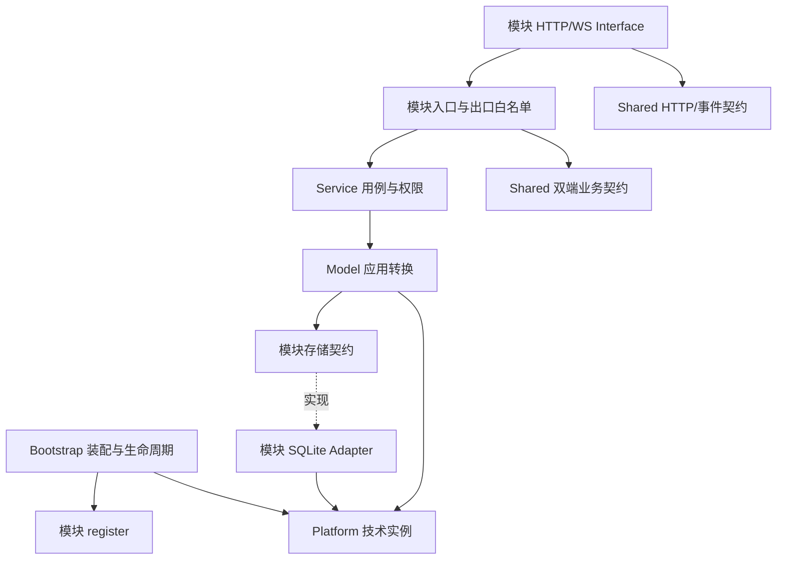

# 后端架构与开发约束

本文是后续后端开发的长期架构规则入口，统一维护职责边界、类型归属、代码放置、编码规范和当前实现限制。开发及审核前同时阅读 [AGENTS.md](../AGENTS.md)；用户行为以 [USAGE.md](../USAGE.md) 为准，验证命令与证据见 [E2E.md](../testing/E2E.md)。[架构重构](../架构重构.md)维护迁移设计，[下一阶段实施方案](../后端重构下一阶段实施方案.md)维护当前施工任务，均引用本文，不另立一套后端开发规范。

## 人工规则区域

1. 人工规则区域只能通过人工输入更新。
2. 如果人工规则相互冲突，人工核对后解决，变更到同一条上。
3. 人工规则与其余规则冲突以人工为准。
4. 内部应用类型统一定义在所属模块子功能的 `model/*-types.ts`，Service、Model 和模块内协作直接引用该唯一 owner；仅单文件使用的局部实现类型留在原文件。跨子功能共用的内部基础取值、纯校验与错误类放在所属一级模块的独立 owner，不依赖 Service、register、出口错误映射或具体技术实现。存储命令/记录/任务契约只在所属 `storage`，技术类型只在 Platform；SQLite Adapter 不引入应用 Model/Service 类型。
5. 外部类型按消费者唯一归属：前后端共同消费的基础取值、业务对象、完整请求/响应、错误码和协议容量统一放入 `packages/shared/src/<域>/<子域>/{values,model,http,events}.ts`，基础取值与对象/协议隔离，复杂纯解码可拆 `http-codec.ts`；仅后端跨模块消费的安全契约定义在模块 `public.ts`，安全错误类由 `public-errors.ts` 明确导出，安装配置定义在 `register.ts`。不把后端秘密、存储行、Service/Model 类或无人消费的预留类型放进 Shared/公开契约，Bootstrap 不深层引用私有类型。
6. 所有外部输入先在协议边界以 `unknown` 严格解码，再在模块入口 mapper 逐字段转换成内部应用类型；内部结果也逐字段转换成公开/Shared 类型。即使字段完全一致也保留这一转换，数组和嵌套对象同样采用白名单；禁止对象展开、断言、继承存储记录或直接透传代替边界隔离。应用与存储的转换由 Model 持有，HTTP/WS 投影归 interfaces；同一边界只有一个转换 owner，不复制 mapper、不保留旧路径转导出。公开写入类型不能从只读 View 自动派生。
7. 共享类型及字段迁移必须同时检查后端、前端、模块出口、编解码、脚本和测试的真实消费者并同步迁移；双端同义同表示只保留 Shared 一份定义，内部表示/用途不同则保留独立类型并显式转换。模块失败按具名类型/错误码映射，禁止靠错误文本判定业务结果，技术异常及 cause 不越过安全出口。

## 规则维护方式

人工规则区域只接收项目所有者明确输入的规则。AI 可以按该输入落文，但不得根据代码、审查结论、外部规范或一般开发要求自行增加、删除、改写人工规则；普通的“更新架构文档”不授权改变该区域。遇到人工规则相互冲突，列明相关条目并暂停受影响的决策，等待人工核对；核对后的变更更新原条目，不追加相反条目。人工规则与本文其他章节、迁移方案或其他仓库文档冲突时，后端开发以人工规则为准，并同步修正受影响的普通说明。

其余章节可随已授权的实现和架构决策更新。维护时分别说明当前事实、长期约束和未完成能力，不能把计划写成现有能力，也不能用现有越界依赖反推允许规则。新增例外需明确调用者、用途、数据和生命周期边界，不能只写“特殊情况可以”。本文不保存逐次审查历史或完成报告；施工进度归实施方案，行为证据归验收文档。

## 适用范围与当前实现

正式服务仍在 `packages/backend`，新架构施工包在 `packages/backend-next`。本文以下放置和依赖规则用于新包及后续迁移；修复旧正式包仍遵守其当前 owner，不在零散补丁中提前替换正式入口。新包不运行时导入旧 Backend/Protocol，不默认兼容旧数据或旧 wire，切换正式流量需要完整迁移及行为验收。

| 当前一级模块 | 已实现 owner                                                                    | 当前限制                                                    |
| ------------ | ------------------------------------------------------------------------------- | ----------------------------------------------------------- |
| Access       | 初始管理员、密码认证、持久会话、登录失败策略、认证 HTTP                         | 完整角色、Passkey/TOTP/CAPTCHA 及策略管理未迁移             |
| Targets      | SSH/RDP/VNC 配置、Proxy、SSH Key、Tag、导入、凭据、可信 SSH 解析、Host Key 信任 | RDP/VNC 是连接定义；完整连接测试及旧正式前端未迁移          |
| Remote       | SSH PTY、会话准入和释放、受认证 HTTP/WS、背压与正常 EOF 收敛                    | 没有挂起/接管/恢复、文件/Transfer、远程桌面                 |
| Agent        | App/Thread、Root Run 创建/取消、幂等、事件分页及同事务存储                      | 仅 pending/cancelled；没有 Provider/调度/Tool/审批/执行恢复 |

Platform 当前提供 SQLite Runtime/Worker/迁移执行、HTTP/WS、SecretBox/密码散列和通用 SSH/SFTP/命令能力。具有这些技术接口不等于已经迁移对应产品功能；静态通过不等于异常路径和浏览器行为已经验收。

SQLite Worker 请求与响应均由 Platform 在接收 `unknown` 消息后验证完整操作外壳及分支，成功写结果必须是安全整数，错误结构不得含未知字段。损坏或不可关联的响应将整实例置为不可用并拒绝全部待完成调用；事务失败仍由 Runtime 区分 `commit_unknown`、`rollback_failed` 等结果。

Access 会话签发输入由 sessions Model 独立应用类型持有，身份公开映射直接接收 Access 内部身份类型。RemoteSessionOwner 使用同模块 SessionService 的窄内部应用契约，不再通过对外安全包装调用同模块会话；完整 open/第二次身份复核及资源登记纳入停机 drain，晚到或撤销的会话须释放，公开错误仍只在 HTTP/模块出口映射。

Targets 的 Proxy name/host 规范化及输入规则由 Proxy Model 纯规则统一提供，管理和导入在进入存储前应用同一规则；正整数 ID/version 的应用级检验由 Targets 单一 owner 提供，SQL 外部行另行严格解码。Host Key 内部到公开管理视图的投影在 public mapper 中复用，HTTP 到 wire 仍保留独立投影。

Remote 的 PTY HTTP 与 WebSocket Stream 分设协议 owner：`interfaces/http/remote-http.ts` 保留 Session HTTP 鉴权、请求/结果和公开错误映射，`interfaces/http/pty-stream.ts` 处理 WS 安装、ACK 信用、输入背压、输出队列、EOF/关闭终态和订阅清理。Stream 调用 Remote 内部窄会话能力，不能把 PTY 或未来 Files 状态放进 Platform。

Targets 可信 SSH 解析接收具名 `{targetId,expectedFingerprint?}` 后端请求，复用已有的 SQLite 单事务目标/凭据/Proxy/Jump 快照，Model 从该快照计算 SHA-256 配置指纹并在解密之前核对预期，冲突返回安全 `conflict`。独立 fingerprint 查询仍供现有消费者做展示/变化检测，不能以先读指纹后再次解析替代同快照核验。指纹仅证明解析返回值与本次配置快照一致；SSH 建连、配置后续变化和 Host Key 信任另有边界。

Platform SSH SFTP 的 list 接收条目与元数据字节预算，使用 opendir → 分批 readdir(handle) → close(handle) 逐批核验并在超限时拒绝整份目录，不先全量聚合、不伪造 cursor。stat/lstat 结果和目录项需验证第三方数值、文件种类与文件名；read 使用非负安全整数的字节范围，end 为包含末字节的偏移，单次操作期限不随分批重置。租约负责操作取消、超时和流/句柄收尾，用户文件和后续 Agent 调用者分别负责自身授权与完整连接的关闭。

## 目录与一级模块

```text
packages/backend-next/src/
  main.ts                     进程配置与启动
  bootstrap/                  应用实例、模块安装、全库迁移和停机编排
  platform/                   通用技术契约、运行时与技术 Adapter
    storage/sqlite/
    http/
    security/
    ssh/adapters/ssh2/
  modules/
    access/
    targets/
    remote/
    agent/
packages/shared/src/          真实双端共用的取值、业务对象与通信契约
```

一级模块按业务数据所有权、用例和运行生命周期划分，不按表、路由、Service 数量或注册函数数量划分。Connections、Proxies、SSH Keys、Tags、Host Keys 是 Targets 的子功能。同一模块内子功能可协作；跨一级模块只能使用明确公开契约。

后续模块按以下 owner 归属；未实施的目录不创建占位：

| 一级模块        | 新功能归属                                                                                                 |
| --------------- | ---------------------------------------------------------------------------------------------------------- |
| `access`        | 账号、认证因素、会话、角色、登录来源策略                                                                   |
| `targets`       | 连接配置、凭据、标签、代理、SSH Key、目标解析与配置指纹、Host Key 信任                                     |
| `remote`        | 普通用户的 sessions/files/transfers/operations/history；终端、文件、任务、远程桌面各自持有资源             |
| `agent`         | Run/StateCommit、Provider、调度、grant/审批/lease、Tool、Memory、Artifact、Plugin/MCP/ACP 和 Agent SSH/Job |
| `preferences`   | 用户设置、布局、外观、背景与主题，不拥有运行中会话                                                         |
| `notifications` | 接收人、通知格式、渠道配置、投递策略和队列                                                                 |
| `audit`         | 审计写入与查询；审计失败不自动逆转已成功的业务                                                             |
| `system`        | 健康诊断、备份恢复、全系统管理协调                                                                         |

Remote 是功能容器，不是所有远程操作共用的巨型 Service。Agent 的 SSH Session/Job 不使用普通用户 PTY 的权限和状态；双方共用技术能力，不共用业务生命周期。

### 子功能的文件组织

```text
modules/<module>/
  public.ts                   跨模块安全契约
  public-errors.ts            安全错误出口，确有需要时创建
  public-mappers.ts           模块进出投影，复杂或多处消费时拆出
  register.ts                 内部装配、安装能力及生命周期出口
  migrations.ts / schema.ts   模块明确的迁移安装入口
  interfaces/http/            协议入口、URL 解码与 HTTP 投影
  <feature>/
    service/                  用例与规则
    model/                    应用类型、存储/技术转换与纯决策
    storage/                  内部存储任务契约
    adapters/sqlite/          SQL、行解码、事务及 DDL
```

这是职责示例，不要求每个子功能拥有所有目录。无持久化的 Remote Session 不增加 storage；复用的应用类型独立放在 `model/*-types.ts`，单文件局部类型与 helper 留本文件；只被一个文件使用的 helper 不公开。子功能之间需要共同规则时置于模块内明确 owner，不通过 Shared 共享后端私有细节。

模块 register 返回明确的管理公开能力、独立可信能力及路由安装方法；拥有后台资源的模块同时提供 quiesce/close。Bootstrap 只安装这些入口和公开注册选项。模块内部 HTTP 可以直接调用本模块明确的 Service 用例并完成出口投影，不必再绕一层无意义 public 包装；其他一级模块不能据此导入该 Service。模块注册是装配入口，不是可在运行期随意读取内部对象的 registry。

## 职责与依赖边界


```mermaid
flowchart TD
    B[Bootstrap 装配与生命周期] --> R[模块 register]
    B --> P[Platform 技术实例]
    I[模块 HTTP/WS Interface] --> U[模块入口与出口白名单]
    U --> S[Service 用例与权限]
    S --> M[Model 应用转换]
    M --> C[模块存储契约]
    C -.实现.-> A[模块 SQLite Adapter]
    A --> P
    M --> P
    I --> H[Shared HTTP/事件契约]
    U --> V[Shared 双端业务契约]
```

图中的存储契约表示调用约束；具体实现由 `register` 安装，不由 Model 自行定位。入口/出口映射是边界职责，可以在 register、专用 mapper 或接口文件实现，不要求额外创建一个层级。

| 位置                                  | 允许负责                                                     | 不应承担                                               |
| ------------------------------------- | ------------------------------------------------------------ | ------------------------------------------------------ |
| `main.ts`                             | 读取环境、解析进程配置、启动/信号处理                        | 业务授权、SQL、运行中请求状态                          |
| `bootstrap`                           | 创建共享技术实例、全库迁移顺序、跨模块装配、应用关闭         | 逐个构造所有业务 Repository、业务转换和用例            |
| 模块 `register.ts`                    | 装配内部 Service/Model/Adapter、公开映射、路由与生命周期安装 | 长期持有散落的业务决策、对外输出内部 Service           |
| 模块 `public.ts` / `public-errors.ts` | 消费者需要的窄能力、安全输入/结果/错误                       | Storage 类型、内部 Model/Service 类、无消费者别名      |
| 模块 `interfaces`                     | 协议解码、身份取得、调用用例、响应投影、协议流控             | SQL、多表事务、代替 Service 做业务授权                 |
| 子功能 `service`                      | 用例顺序、业务权限、规则、凭据保护和应用资源所有权           | SQL 执行器、具体 SSH2/数据库 Adapter                   |
| 子功能 `model`                        | 应用命令与存储/技术命令转换、结果映射、必要的原子状态决策    | 拼接 SQL、定位具体 Adapter、导入上层 Service           |
| 子功能 `storage`                      | 内部存储输入、结果和完整任务契约                             | Shared DTO、应用对象、Service、网络响应                |
| 子功能 `adapters/sqlite`              | SQL 方言、行解码、引用约束、事务、实际数据读写               | 应用/公开 DTO、网络响应、外部副作用                    |
| `platform`                            | 技术能力、技术命令/结果/失败、流控与生命周期                 | Connection/Run/User 对象、业务表、授权状态、业务注册槽 |
| Platform 技术 `adapters`              | SSH2 等具体库和协议实现                                      | 业务对象、持久 Run/Session 状态机                      |

依赖规则按职责执行，不为形式创建空 `sqlAdapter`、空接口或空包装。当前 `storage/*-storage.ts` 是业务存储契约，`adapters/sqlite/*-sql.ts` 是具体 SQL 实现，`platform/storage/sqlite` 是全应用共享数据库运行时。

模块内向下调用不绕行全局 dispatcher/service locator。应用实例级依赖由 Bootstrap 安装技术实例、模块 register 安装内部依赖；禁止进程级数据库单例或为了隐藏初始化而引入可变全局对象。Service 可按用例协调本模块多个 Model；跨模块协作只注入完成用例所需的公开能力。

凭据保护是已确认的例外：Service 调用通用 SecretBox 或 PasswordHasher，Model 转换已保护命令。Node 的纯散列、随机 ID 和业务来源分类可留在真实 owner，不机械包装成 Platform；连接、SQL、外部网络和第三方运行时仍有明确技术边界。

平台契约与实现可以同目录或同文件，单一实现不强制拆空 port；实现文件不反向引入业务。Platform 和业务 SQLite Adapter 只允许从 Shared 精确 `values` 路径引入确需共用的基础取值，不允许 Shared model/http/events 或应用模块类型。

## 类型与模块出口

类型由语义和消费者决定，不能把全部对象放入一个大集合后任意 Pick：

| 类型                                     | 唯一归属                                              |
| ---------------------------------------- | ----------------------------------------------------- |
| 双端同义同表示的有限业务取值             | Shared 所属域 `values.ts`                             |
| 双端业务对象及业务结果                   | Shared 所属子域 `model.ts`                            |
| 完整 HTTP 请求/响应                      | Shared 所属 `http.ts`，复杂纯解码可拆 `http-codec.ts` |
| WS 消息与纯解码                          | Shared 所属 `events.ts`                               |
| 后端应用命令、资源、可信秘密及状态上下文 | 本模块 `model/*-types.ts`（单文件局部实现类型除外）   |
| 数据库命令、密文记录、存储任务结果       | 本子功能 `storage`                                    |
| 模块公开的后端专用能力                   | 模块 `public.ts`，与内部实现独立                      |
| 技术请求、技术结果、错误及 Worker 消息   | 对应 Platform 技术 owner                              |
| UI 草稿与展示状态                        | Frontend 所属功能，不放入 Shared                      |

实际表示不同的内部类型保持独立；公开类型不继承存储记录。模块 public 对相同双端契约直接引用 Shared，不手写第二份；内部格式转换仍经过 Model。文件中的 TypeScript export 只是文件间可引用，不表示它已获准成为跨模块 API。

所有对象出入模块边界逐字段构造，包括目前字段完全一致的对象。数组及嵌套目标/Proxy/Jump/凭据同样按白名单投影；不能用类型注解、Readonly、freeze、结构赋值或对象展开代替运行时字段隔离。共享类型和纯 decoder 都不能替代模块出口投影。

转换分别保护不同边界：`model/connection-mapper.ts` 转换应用与存储；`public-mappers.ts` 转换内部应用与模块出口；`interfaces/http/*-view.ts` 转换模块结果与 wire。三个边界各自必要，不能合并成读取 SQL 行的万能 public mapper。同一边界的重复转换提取到该 owner，单处使用的 mapper 可留在原文件。

管理出口与可信出口分开。Targets 管理不包含密码、私钥、密文或解析运行时；`TrustedSshTargetResolver` 只供明确后端消费者使用，明文结果有用途和生命周期，不挂载 HTTP。其他模块只取得所需方法，例如 Host Key 读取只使用 list 能力。公开签名中的后端专用基础取值由公开 owner 定义或引用独立共享取值，不从私有实现文件派生。

## Shared 与通信边界

```text
packages/shared/src/
  access/{values,model,http}.ts
  targets/
    {values,http}.ts
    connections/{values,model,http,http-codec}.ts
    proxies/{values,model,http,http-codec}.ts
    ssh-keys/{model,http,http-codec}.ts
    tags/{model,http,http-codec}.ts
    host-keys/{model,http,http-codec}.ts
  remote/sessions/{values,model,http,events}.ts
```

Shared 顶层按大业务模块，子域按功能。`values` 不依赖业务对象或协议；`model` 不依赖 HTTP/事件；`http-codec → http/model/values` 单向依赖，http 不反向重导出 codec。父文件只承载本域真正共用的内容，不汇总全部子域。Shared 无 Node、Vue、数据库、框架或后端应用依赖，exports 只列实际精确路径，不保留旧路径别名和根 barrel。

请求必须定义完整外壳，例如 `{version, changes}`、`{items}`；响应与业务对象相同直接引用 model，共用删除响应不在每个子域复制。后端响应构造使用具名 Shared 返回类型或 satisfies，运行时仍采用严格解码与白名单序列化。外部 JSON、URL/query/header、WS、SQL 行及 Worker 结果以 unknown 解码，必填/可选/未知字段、数值、字节数及联合分支明确。

完整 JSON 的 UTF-8 容量预算属于 Shared HTTP 契约，基础值放在所属 `values.ts`，两端消费同一定义；字段上限与完整 body 上限分开，后者包含转义及外壳。Frontend 在发送前检查实际编码大小，模块路由将预算传给 Platform，Platform 只执行通用默认值及实例硬上限。Targets Connections/SSH Keys 为 128 KiB，Proxies 为 64 KiB，Tags/Host Keys 为 16 KiB；导入最多 50 项且总量不超过 128 KiB，超限整批拒绝并提示拆批。

当前新 Agent 无同表示前端消费者，HTTP 契约保持后端私有；Agent 创建 Run 的路由预算为 128 KiB、prompt 为 16 KiB。真实前端接入时迁移完整双端契约和预算，不预建 Shared Agent 空域，也不直接复用表示不同的旧 Protocol。双端迁移需同时检查新后端、前端、旧正式包相同基础取值和真实测试/脚本消费者。

Platform HTTP 的契约在 `http-types.ts`，技术输入错误在 `http-errors.ts`，技术预算在 `http-limits.ts`；`http-router.ts` 编译/匹配路由，`http-request.ts` 处理来源/JSON/响应，`websocket-channel.ts` 持有单 Socket 队列和关闭握手，`http-lifecycle.ts` 排空与释放，`http-server.ts` 负责安装和监听。消费者直接引用实际 owner，不从 server 兼容转导出类型。

Remote 双端帧容量（32 KiB）、输出 ACK 窗口（128 KiB）、PTY 最大尺寸（500×300）和协议错误取值统一在 Shared `remote/sessions/values.ts`；后端私有排队预算不因此成为双端契约。Targets 图深度/展开限制在模块根 `ssh-graph-limits.ts`，存储实现不引用 Model 文件。

HTTP 技术层负责固定 Public Origin、受信代理、来源/Fetch Metadata、JSON 内容类型与限额、cookie 和连接生命周期。模块负责业务身份、权限、资源范围及错误映射；不接受客户端自报 owner。非法 JSON/过大请求/不支持内容类型保留 400/413/415，不能吞成通用业务失败。WS 消息和 ACK/replay 归协议 owner；Platform 不按 Agent/Targets 名称分支。

## SQL、事务与迁移

Model 接收应用命令，显式构造 storage 命令；SQLite Adapter 解码 snake_case 行并返回内部记录，Model 再构造应用结果。数据表示、密文与业务有限取值各有明确 owner。Adapter 可以执行与存储任务不可分离的约束和状态决策，不持有独立授权体系。

需要原子性就提供完整存储任务。连接和关系写入、每项导入及引用检查/删除在同一事务中执行；Service 的预检查不能构成并发保证。Targets 同模块多子功能协作通过明确事务参与者复用当前 tx，Model/Service 不取得 SQL 执行器，不连续调用独立事务来模拟整体原子性。存储参与者可在 storage 声明技术 tx 契约，仅供 Adapter/注册使用，不向应用层或模块出口传播。

Agent 的应用纯状态规则可由 Adapter 在事务内通过显式回调/事实转换执行，以同一快照决定状态并原子写入 Run、version、event 和幂等记录。不能在事务外算好结论后无条件写入。当前 v3 保证 user/App/Thread 归属、单 Thread 一个活动 Root、创建/取消原子性和幂等参数 hash；提交后才通知或调度，幂等重放不重复派发工作。

事务回调不得等待网络、SSH、Provider、文件或用户操作。外部副作用无法由 SQL rollback 撤销，持久执行身份、unknown 隔离和恢复由业务 owner 设计；不另造第二 journal 或事件队列作为事实 authority。

全库只有 Bootstrap 的有序迁移清单：当前 v1 Targets+Access、v2 Host Key、v3 Agent。DDL 由模块所有，执行/签名验证/事务由 Platform 所有；Bootstrap 引用模块明确迁移入口。后续新增版本，不重写已存在版本的 DDL 或签名，不以 dev 可重建为理由破坏已发布数据迁移。

Runtime 持有 Worker、串行事务、事务租约与关闭。Worker 保留 SQLite 数值扩展 errcode；Runtime 分类技术失败，模块映射安全业务码。回调失败正常回滚并保留原原因；回滚失败、commit_unknown 使实例不可用，不能重试未知提交。未等待操作不能逃逸事务；重复关闭共享同一结果。Schema/备份/恢复属于明确管理能力，无应用对象时不增加空 Model。

当前 Worker 只有操作结果 payload 解码，message 请求/响应外壳仍使用参数类型注解；`run` 数值也未完整验证安全整数。这是现有技术边界缺口，不满足本文 unknown 解码要求；完整外壳验证、损坏消息下 pending 收敛和实例不可用处理列入[下一阶段 N0.1](../后端重构下一阶段实施方案.md)，不能把现状当作允许例外。

## SSH、Remote 与 Agent 的共用边界

Targets 负责配置、引用、可信目标解析、配置指纹和人工确认的 Host Key。Remote/Agent 将可信应用目标转换为 Platform MachineEndpoint；Platform 只看到 host/port/authentication/route/期限/信任回调，不看到 connectionId、Run、审批、权限或业务配置指纹。

Host Key 是实际 SSH 公钥 SHA256，配置指纹是业务配置快照 hash，不能混用。当前 Remote 每跳及终点要求显式 pin，无 TOFU 或接受全部回退；只有信任回调实际拒绝才能产生 host_key_untrusted，普通密码/网络失败不冒充信任失败。全路由期限与取消共享，任何半建连失败及晚到成功都释放资源。

SSH Adapter 持有 Socket/Client/channel/SFTP 租约，业务模块持有资源使用和释放责任。原始 non-PTY 通道和收集式执行具有不同结果/取消语义，不保留行为完全相同的别名。退出零、非零、未派发失败、派发后 unknown、截断与关闭原因区别明确；取消、超时或 socket 关闭不能证明远端没有副作用。SFTP 请求/流按实际 dispatch 区分 not_started/unknown，关闭等待必要清理，已关闭 lease 的晚回调不能发布可用资源。

当前 SFTP list 使用全量 readdir，尚无读取过程中的条目/metadata 预算；read 的 start/end 与第三方 metadata 也未完整验证。文件应用接入前按[下一阶段 N2.1](../后端重构下一阶段实施方案.md)实现真正有界读取；应用层在全量返回后 slice 不能补足技术边界。强制 destroy 后的本地 lease 释放不证明远端操作成功或已停止。

Remote Service 通过本模块应用资源契约管理会话，不使用 SSH2/Node Stream；Model 封装实际机器连接与 Shell。RemoteSessionOwner 持有 Access token 摘要绑定、单 Socket attach、授权复查及已释放清理结果；协议 owner 管输入/输出流控。当前字节 ACK 表示终端渲染完成，正常 EOF 先 drain 尾帧，异常断线/主动关闭分别收敛，不把断开自动解释为可恢复挂起。

当前 Remote 输出窗口及排队各 128 KiB；Shared input/data 单帧解码最大 32 KiB；通用 WS 入站帧 64 KiB、累计 64 条/256 KiB、发送缓冲 1 MiB。业务预算与传输预算分开，新增协议按真实 payload 核对并使用受硬上限约束的通用配置，不无限排队。

Agent 后续执行复用 SSH/SQL/密码学技术实例，保留自有 grant、inspection、approval、lease、冻结目标与 Job 状态。执行前需要同一可信快照校验 expectedFingerprint；当前分开的 fingerprintStored/resolveStored 不能证明两次读取间配置未变。持久事件使用 sequence/cursor/replay，不能用 Remote 字节 ACK 代替。新 Agent 未接入执行前，不宣称已有完整恢复或工具授权。

## 资源与应用生命周期

资源只有一个真实 owner：打开者明确把关闭责任交给谁；借用者不任意关闭共享实例。Session、Run、事务、lease 和请求状态不进入进程全局单例。Promise、timer、listener、stream、channel 与待完成回调都需有准入、追踪、失败收敛和清理路径。

应用关闭顺序：停止模块新准入/调度 → 关闭 HTTP/WS 并等待已接纳业务任务 → 取消并等待业务运行时/资源，完成必要持久收敛 → 关闭 SQLite。当前动态生命周期只注册 Remote；Agent 调度、Provider 等接入时必须提供自己的 quiesce/close，不由 Bootstrap 假设所有模块无后台工作。

进行中的关闭任务独立追踪且不因缓存满而淘汰；已完成 Remote 关闭结果最多保留 128 项、120 秒，成功和失败都遵守同一有效期。同 token 的有效期内重复释放共享原结果，超出保留窗口不承诺重放。私有清理失败证据保留最近 16 项并累计额外失败计数，停机仍报告已发生的失败，不永久保存所有错误与 Promise。

关闭先发布共享 Promise，再开始可能重入的清理；并发调用看到同一完成与失败。前一步失败仍继续必要释放，多项错误聚合；客户端断开不证明密码散列、已派发 SSH 或事务已经取消。恢复数据库前先停止使用旧状态的长期 owner，恢复/回滚之后按新的持久状态重建，不能只替换文件。

## 新功能放置指南

| 要增加的内容              | 放置位置与接入步骤                                                                                                                            |
| ------------------------- | --------------------------------------------------------------------------------------------------------------------------------------------- |
| 新连接字段                | 双端取值/对象/请求在 Shared；应用类型在 Targets Model；存储命令/行在 storage；SQLite 变更新增迁移；同步两端 decoder、所有 mapper 和前端消费者 |
| 新 Proxy/Tag/SSH Key 用例 | Targets 现有子功能 Service；Model 转换；完整存储任务及本模块 Adapter；不新建一级模块                                                          |
| SSH/SFTP 通用技术操作     | Platform SSH 契约与 SSH2 Adapter；不加入 connectionId/Run；调用者在 Model 转换应用目标和使用技术结果                                          |
| 普通远程文件或传输        | Remote 对应 files/transfers 子功能；独立 Service/Model/资源 owner；复用 Platform，按真实前端契约增量 Shared                                   |
| Agent Tool/后台 Job       | Agent 内部能力/执行 owner及授权/持久结果；复用共用 Platform，不调用用户 PTY 或另读 Targets 私有表                                             |
| HTTP/WS 端点              | 模块 interfaces；Shared 完整契约/解码/限额；模块 register 安装；身份来自 Access，范围权限来自用例 owner                                       |
| 多表写入                  | 所属 storage 的完整语义化任务；Adapter 单事务；同模块参与者共用 tx，不用 Service 删除补偿                                                     |
| 公开类型/方法             | 先确认真实消费者；public 明确安全契约和 mapper；同表示双端类型引用 Shared，敏感能力独立出口                                                   |
| 技术配置或生命周期        | main/Bootstrap 解析传入模块注册选项；模块私有运行参数不被 Bootstrap 深层引用；后台 owner 提供准入停止与 close                                 |
| 共享 helper               | 先确认多个真实消费者、相同语义/失败/生命周期；优先原 owner，单处用函数留文件内                                                                |
| 用户可见文案              | 所属 i18n owner；新结构使用 i18n 命名，中英日同步；不顺带重命名旧正式目录                                                                     |

按需创建目录：默认用例入口、应用类型/转换、存储契约、具体 Adapter、协议入口和公开契约分别归位；单一文件即可表达职责时不再拆 interfaces/types/utils 空目录。不因两层字段相同删除安全转换，也不因追求统一为每个函数增加类、port 或 dispatcher。

施工顺序为 owner/调用者 → 类型与完整任务 → 技术保证及生命周期 → 内部实现 → 出口/协议 → 全部消费者 → 文档与验证。发现暂未迁移的业务能力可标记带 owner 的 TODO；当前切片依赖的 SQL 拼接/事务、严格解码、基础流控和失败清理必须真实实现，不用 TODO 或假成功替代。

## 全局编码约定

本节统一约束所有重构模块的职责、封装、命名、类型、控制流、错误处理、异步资源及格式。新增与修改代码必须遵守；已有代码在逐模块审核和迁移时同步调整。代码审核需要检查这些设计约定，不能只以格式化、类型检查或构建通过判定实现完成。

规范参考 [VS Code Coding Guidelines](https://github.com/microsoft/vscode/wiki/Coding-Guidelines)、[Google TypeScript Style Guide](https://google.github.io/styleguide/tsguide.html) 与 [Prettier Rationale](https://prettier.io/docs/rationale)。采用 VS Code 的命名、局部封装、具名顶层函数和控制语句花括号约定，参考 Google 的 TypeScript 类型及接口表达习惯；以下规则是本项目最终编码约定，服从本文人工规则区域。具体空白与换行由仓库现有 Prettier/ESLint 配置决定，例如箭头函数参数统一保留括号，不照搬外部规范的不同格式。

### 职责与封装

- **按独立职责组织。** 文件围绕一个明确能力或 owner，函数完成一个可以描述的操作。业务决策、类型转换、SQL 方言、协议实现和生命周期编排遵守本文分层，不能为缩短调用代码把它们混进一个工具函数。
- **主流程表达步骤。** 初始化、事务、导入和停机等入口应能直接读出执行顺序。内部出现完整的验证、转换、资源释放或错误收敛流程时，提取为有业务或技术含义的具名函数/方法；长对象方法与异步匿名函数同样适用。简单回调可以内联，不按固定行数机械拆分。
- **复杂表达式分步命名。** 嵌套构造错误、复合条件和多层转换难以辨认时，先用局部变量表达中间含义，再调用或返回；一次使用的简单表达式可以保留。仅拆出一个表达式时优先局部变量，独立操作再提取函数，避免大量无意义的一行包装。
- **保持封装局部。** 单个文件使用的辅助函数留在该文件且不导出；只有职责可以独立演进或需要多处消费时才拆文件。工具函数提升为共用能力前先确认语义、错误和生命周期一致，不建立收纳杂项的巨型 `utils` 文件。
- **出口提供明确能力。** 公开包装可以隐藏内部参数、转换类型、约束权限或明确操作语义；参数、结果和行为完全相同的公开别名应合并。Bootstrap 安装实例并编排生命周期；业务模块只能暴露消费者确实需要的窄契约，内部实现保持私有。

### 命名与类型

- **名称表达对象和动作。** 类型、接口、类使用 PascalCase；函数、方法、参数和变量使用 camelCase；文件延续现有小写连字符命名。使用完整且明确的词，协议通用缩写如 SSH、SQL、ID 可以保留；避免无上下文的 `data`、`handler`、`manager` 或自造缩写作为核心能力名称。
- **操作名称体现语义。** `get/list` 表达读取，`create/update/delete` 表达变更，`resolve` 表达解析，`toX` 表达转换，`validate` 表达校验。会抛出失败、消费资源或产生外部副作用的辅助操作，其名称及必要注释应使调用方知道结果；布尔状态按含义使用 `is/has/can/should` 等前缀，生命周期采用明确的 `open/quiesce/close`。
- **稳定结果使用具名类型。** 模块用例输入/输出、复用的记录、变更结果和较复杂的联合类型放在对应模块的类型文件，公共方法明确返回类型；简单局部对象允许推断。成功/失败或不同操作状态用可辨识联合保持状态与字段对应，例如 `{ status: 'ok'; id: number } | { status: 'error'; code: ErrorCode }`，不能改成一个宽泛状态类型加多个可选字段。
- **类型有明确 owner。** 内部应用类型、存储契约、公开出口与前后端共享契约按各自语义独立归属。前后端确实共同消费的契约迁入 Shared；有限业务取值放在独立 `values.ts`。不能把所有状态、对象或转换集中成一个全局类型集合；字段相同仍遵守下文明确的转换边界。
- **类型断言不替代验证。** 外部 JSON、Worker/IPC、数据库及第三方结果在真实边界解码和校验。不用 `as`、非空断言或 `any` 掩盖未知输入与缺失分支；确有第三方类型限制时，将必要断言局限在技术边界并说明依据。方法避免多个含义不明的位置布尔参数，复杂选项使用具名对象。

### 控制流、错误与异步资源

- **控制流保持直接。** 验证失败和不可用状态优先提前返回或抛错，减少多层嵌套；`if/else`、循环均使用花括号。三元表达式用于简单取值，不承载多层状态决策、异步流程或副作用。以清晰的不变量为依据简化分支，不能为减少代码省略安全校验。
- **捕获错误必须有目的。** `catch` 用于边界映射、补充因果、资源清理或已定义的恢复，不吞掉未知失败并假装成功。保留原始错误作为 `cause`；原操作与清理同时失败时使用 AggregateError 保留全部原因，构造复杂原因时先命名局部值。错误不能只为方便格式化而丢失类别或底层证据。
- **失败路径同样有 owner。** 事务明确区分回调失败、回滚失败与提交结果未知；提交或回滚失败后的数据库不可用语义保留。停机保持依赖顺序，前一步失败仍完成必要的后续释放；单一失败保留原错误，多项失败聚合。错误消息和明文凭据不得越过不允许的模块出口。
- **每个 Promise 有等待责任。** 正常操作必须等待；有意后台执行时明确 owner、追踪方式和拒绝处理。不会由其他 owner 处理的 fire-and-forget 拒绝必须收敛，不能仅加 `void`。关闭 Promise 在启动可能重入的异步清理前保存，并发调用共享同一次完成和失败结果。
- **资源由创建者管理。** Socket、channel、stream、timer、listener 与 lease 的创建、取消、解除订阅和关闭成对设计；失败与晚到成功也必须清理。期限按完整操作传递，不能每一步重置。取消前未派发与派发后结果未知分开，取消不表示远端副作用已回滚，未知操作不得自动重试。
- **状态只保留一份权威。** 避免多个布尔值表达相互矛盾的生命周期；复杂状态采用明确的状态类型。异步结果通过请求身份、版本或 generation 防止过期覆盖；不复制另一个模块的可变状态，也不引入未设计的进程级全局对象。

### 注释、格式与交付

- **注释解释约束与原因。** 公共契约及存在特殊不变量的实现按需要使用 JSDoc，说明授权、取消、未知结果、事务和资源所有权。注释不重复显而易见的语句；TODO 写清缺失能力与所属 owner，不以 TODO 代替当前批次必需的基础实现。
- **格式使用现有工具。** TypeScript 保持 Tab 缩进、单引号、分号、120 列；函数/方法及所有独立 `export` 声明前后保留一行空行（含 interface、type、const、默认导出和重新导出），注释与所属声明保持相邻，连续 import 不强制分隔，具体由 `.prettierrc` 与 ESLint 配置执行；重构 Backend、Shared 和 Remote 开发 Transport 的控制语句花括号由 ESLint `curly: all` 执行。不要手工对齐空格、用 `prettier-ignore` 掩盖复杂表达式或在局部引入另一套格式；复杂代码先调整结构再格式化。
- **按真实边界审核。** 修改后检查调用方向、类型 owner、模块出口、失败与取消路径、资源释放及所有消费者。执行适用的静态检查、格式检查和构建，行为验证按当前用户授权与项目规则进行；编译通过不能替代行为证据。不新增源码文本扫描测试或自定义架构门禁来强制本节约定。

## 注册、内部类型与公开取值的实际归属

Access 的 `register.ts` 明确定义 `AccessRegistrationOptions`，Bootstrap 仅引用此安装契约并传递应用实例的 sqlite 和登录失败策略选项；register 逐字段转换为内部应用策略输入。`authentication/model/login-failure-types.ts` 持有 LoginFailurePolicyInput 与 LoginFailureLimits，Service 和 Session Model 同向引用；不从策略 Service 导入类型，也不让内部代码反向引用 register。

仍待收口的内部类型是 SessionModel.issue 的内联应用输入，以及 register 身份 mapper 重复的匿名结构。RemoteSessionOwner 当前使用本模块 public 请求/结果及安全包装；后续改为内部应用类型和窄用例依赖，在真正出口才映射安全错误。具体任务列入[下一阶段 N0.2](../后端重构下一阶段实施方案.md)，人工规则不因此放宽。

Access 的内部业务失败由 `authentication/model/access-failure.ts` 持有，Service 引用该独立错误 owner。模块根 `access-errors.ts` 负责业务/技术失败到安全出口错误的映射，`public-errors.ts` 只明确导出安全类；Model 不反向依赖 Service，也不持有模块出口错误映射。

Remote 的 `public.ts` 定义后端消费者实际使用的 RemoteSessionCloseReason，Session Service 直接引用此稳定契约，内部 Model 不再声明同名关闭原因。其 normal/disconnected/cleanup_failed/closed_by_owner 语义与 Platform 技术原因、Shared wire 仍分别映射，不新增兼容重导出。

Agent 的 App/Thread、Run 用例输入及纯状态事实分别由 `scope/model/scope-types.ts` 与 `runs/model/run-types.ts` 持有；Service 和 register 直接引用类型 owner，Model 不做兼容转导出。`agent-validation.ts`/`agent-failure.ts` 是不加载 SQLite 的内部校验/失败，`agent-errors.ts` 只承担安全出口映射。Host Key 应用类型由 `host-keys/model/host-key-types.ts` 持有。

Targets `TargetFailure` 明确携带 Shared 基础错误码，出口不匹配 message；SecretBoxFailure 是技术类别，由业务出口映射。批量导入逐项安全错误投影由模块的 `import/connection-import-batch.ts` 持有，Service 不加载 SQLite 错误映射。Remote public 的调用及取消订阅经过安全错误边界，HTTP 消费安全 RemoteOperationError，不依赖私有 SSH 异常类。

Bootstrap 只引用模块公开能力及注册、迁移等明确安装契约。模块公开签名不依赖私有 Model/Service 类型；应用底层类型不导入上层实现。迁移 schema 的全库组合是明确安装能力，Bootstrap 可以引用模块迁移入口；这与消费私有状态不同。Targets import 的跨子功能 tx 参与者属于同一一级模块内部协作，不能据此允许跨模块读表。

## 旧正式包与迁移核对

`packages/backend` 当前仍使用 `bootstrap/config/infrastructure/interfaces/modules/platform/shared/locales` 布局，HTTP 为 Express，公共旧 wire 由 `packages/protocol` 持有；该目录布局是运行事实，不是新功能照搬模板。旧的本包 shared 基础能力与 workspace Shared 双端契约不是同一职责。

迁移前核对旧调用链与 [USAGE](../USAGE.md)，保留正常产品结果、真实授权和状态 owner，不机械保留未发布兼容分支或偶然错误文案。不同格式的旧 route/jumpChain/wire 不强行别名到 Shared。正式入口切换前保留双包参考；当前新开发不运行时调用旧实现。

旧正式 Agent 的 owner、SSH-only 治理、Child Context、模型预算、Plugin/MCP/ACP、Artifact/Memory 及恢复不变量以 [AGENTS.md 第 3–10 节](../AGENTS.md#3-agent-定位与源码职责)为准。生产 Agent Runner 已退出，旧文档中的 Runner/Workspace Agent 执行描述不能成为新增功能依据；普通 SSH Workspace/终端仍保留独立 owner。

迁移普通远程能力时至少核对以下已有保证：

- 用户认证、会话撤销、因素验证及来源策略由 Access owner 保证；旧 WS revocation 与异步准入 fence 不可因新接口调整而丢失。
- SSH 跳板/凭据/配置变化、远程写入的临时文件替换与 hash、SFTP 有界读写、Transfer/Archive 取消/unknown、远程桌面票据与资源配额保留各自 owner；关闭 socket 不是远端成功证据。
- Agent 的 SSH 连接、项目目录及后台 Job 按 user/App/Thread 隔离，持久冻结目标、授权、审批、幂等及恢复与普通终端会话分离。
- Artifact 文件发布与数据库 metadata、Plugin 安装与运行、备份 capture/restore 是跨资源任务；保留两阶段清理、内容校验、准入停止和恢复收敛，不因共用 SQLite 声称文件/网络具有数据库原子性。
- 通知和审计的持久性、投递/失败语义按现行需求保留；当前 best-effort 不升级成可靠 outbox 声明。历史写入/裁剪、连接/标签引用和配额检查的并发约束仍在真实存储事务中执行。

## 审核与交付

修改前确认真实 owner、所有输入输出及消费者；检查职责方向、私有类型泄露、重复契约、事务权威、授权、限额、取消/晚到结果和关闭责任。为遵守架构而新增的包装必须说明实际边界价值，字段转换必须有允许清单。

使用现有 ESLint、TypeScript、Prettier 和行为验证入口，不新增用于强制 AI 规则的源码扫描门禁，不使用源码字符串/目录形状测试作为架构证据。文档调整只做链接、事实、格式和 diff 检查；代码变更执行相应包 check/build及仓库检查，验收范围按用户授权和项目规则，不新增单元测试。

新包必须单独执行 `pnpm --filter @nexus-terminal/backend-next check`；根 check 只覆盖正式 Backend/Frontend 及既有 ESLint，不能替代新包类型检查。共享契约变化同步 Shared build/check 和 Frontend 类型/构建。提交前执行 `pnpm run check`、`pnpm run format:all:check`、`git diff --check`；测试及远程 workflow 的证据归 [E2E.md](../testing/E2E.md)，未执行项明确保留待验收。

人工规则的遵守依靠开发前阅读、owner 审核和人工确认，不创建重复自动门禁。提交/推送遵循 AGENTS.md 与当前用户指令，未知工作区修改不覆盖、不代为提交。
