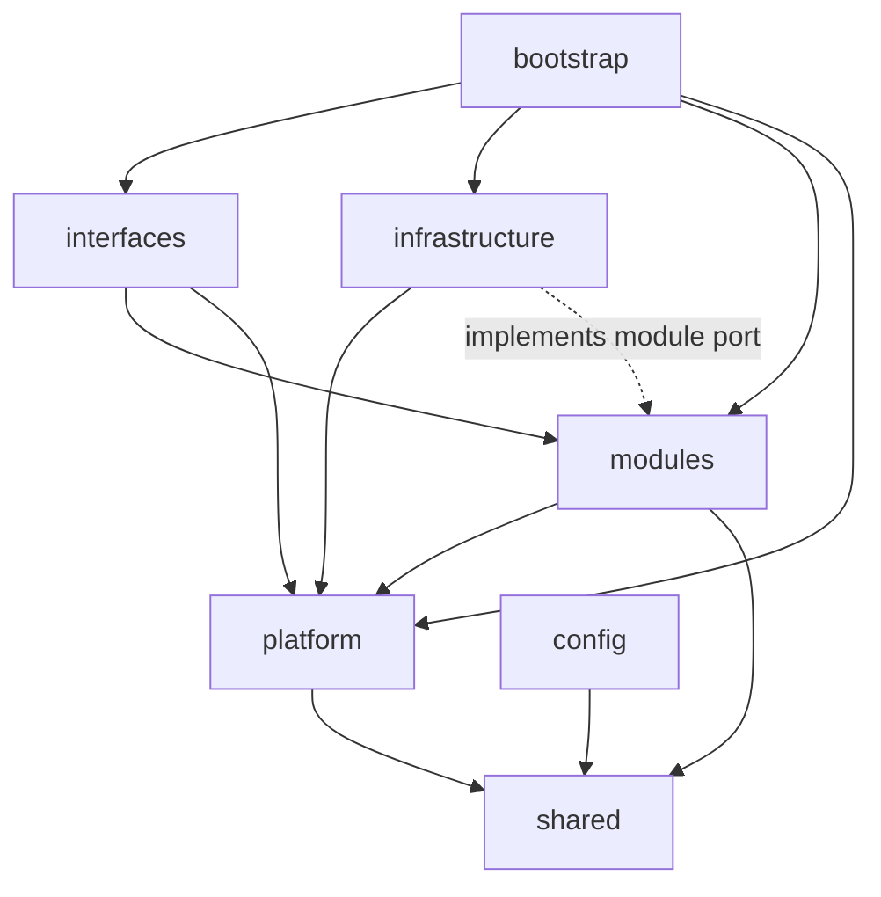

# Nexus Backend Architecture

本文描述当前 Backend 的分层、owner 与运行时边界，不重复维护功能需求。实际产品需求见 [USAGE](../USAGE.md)，Agent 关键边界与开发规则见 [AGENTS.md](../AGENTS.md)。owner、contract、事务或调用关系变化时，在同一提交更新对应章节。

## 技术基线

Runner PackInstaller.runProcess复用registerManagedProcess(kind pack)覆盖mise/工具版本检查，opaque invocation ID不含command payload，登记失败kill/close收敛，exit清派生group、close后完成Promise；shutdown/startup仍由共享managed-process registry负责，无新增pack registry。

Provider baseUrl保持HTTP(S)及loopback/private模型用途，OpenAI adapter/SDK transport不新增MCP-style地址policy、redirect逐跳验证或DNS pinning；discovery已有timeout/body约束，可信管理员egress与部署隔离分开。

HTTP application在session/routes前应用mutationOriginSecurity，安全方法跳过，非安全方法按Express可信host/protocol比对Origin并拒绝same-site/cross-site metadata；无Origin浏览器仅same-origin可用，非浏览器仍须各route认证。Agent额外HMAC owner不变，无第二token协议。

Appearance local/remote content route统一text/plain+document CSP sandbox/default-src none，全局nosniff保留；Frontend获取字符串后既有opaque-origin iframe/srcdoc负责展示隔离，API不再提供同源HTML document execution surface。

FileHttpSessionAdapter拥有sessions目录0700及文件0600权限收紧，启动lstat拒绝symlink目录/非普通entry，save成功后chmod，错误传给调用者；write-file-atomic继承已有文件mode，初始临时写依靠0700目录隔离。保留明文与既有session decode，不引入加密双轨。

Backup import沿用authenticated HTTP boundary与codec envelope验证、instance/password wrapped key及exclusive restore；同实例免密码不表示任意session可构造合法包。无新增recent-auth/confirmation/audit owner，auth表不参与restore。

Webhook secret header分类共用模块规则及case-insensitive secretHeaderNames；HTTP DTO redacts为null，更新解析只允许null引用已存在secret，持久/网络owner仅收到string map，Frontend支持标记与保留。secret marker不可通过null保留同时撤销，无旧包迁移或普通header整体隐藏。

SSH Key HTTP mutation接入共享AuditLogService，SSH_KEY_CREATED/UPDATED/DELETED只记录标识和字段名，不将credential内容送入audit；业务与audit非原子，内部service调用不自动产生HTTP审计。

Initial admin setup保留空users bootstrap Web流程，createInitialAdmin原子空库条件负责并发互斥，不引入deployment token；受控首次初始化属于部署安全前提，不是session授权或公网抢占防护。

HTTP Express与WS proxy-addr共享RuntimeConfig.trustProxy CIDR配置，默认loopback；WS按可信链右向左找首个不可信hop，Host/Proto仅trusted TCP peer可转发。Auth requestOrigin fallback使用Express protocol/host，独立X-Real-IP和private-range trust已移除。

接口共享compileProxyTrust，支持CIDR/IP及数字hop；standalone默认loopback，Compose动态网络使用1-hop并不发布Backend端口，Frontend保持所有网卡发布，可信转发路径由部署防火墙保护。Frontend可信宿主/私网peer real_ip取XFF最后地址（非递归），协议只接受http/https再传给Backend；部署要求宿主/容器网络可信。Auth共享isInternalIp策略，内网跳过whitelist/blacklist，公网仍使用现有计数；来源trust与用户内网豁免是不同owner。

Passkey/TOTP enrollment采用完整authenticated session授权与新factor verification，无recent-auth timestamp/统一step-up owner；改密与disable 2FA既有密码检查不变，不将新factor proof视为旧credential proof。

ProxyService.update在写repository前合并current/credential patch，校验最终encryptedPassword/encryptedPrivateKey不变量；create/切换需新credential，未修改credential保留，passphrase仍optional，无旧非法row自动迁移。

Notification配置／unsaved test由完整认证route保护，NetworkNotificationChannelAdapter保留SMTP及axios HTTP出站与timeout；不新增address-class deny/每跳allowlist，管理员egress权限与部署网络策略分开。

pending 2FA由auth route写绝对deadline/cookie5分钟，FileHttpSessionAdapter set串行检查64 live pending及deadline，store TTL按剩余时间保存；middleware过期destroy，成功regenerate退出partial owner。session-file-store reaper负责expired物理文件，未建立跨进程lease或完整session quota。

TwoFactorService失败分支复用AuthService.recordLoginFailure（audit+notification），静态second-factor reason区分密码失败；HTTP adapter仍持有blacklist计数与401响应，不建立第二审计owner。

Passkey discovery保留匿名配置查询及username-based allowCredentials公开标识，authentication仍由WebAuthn challenge/signature owner验证；不是账号存在性oracle的完整保证，不新增privacy masking／专用discovery limiter。

TwoFactorService.activate更新secret及审计／通知，不触发session撤销；Auth credentialRevision来自hashedPassword，2FA配置变化不使旧完整认证session失效。

PluginPackageInstallCoordinator.withStageAdmission统一串行local/remote/official stage创建，await retention cleanup后按retained rows检查8槽，gate覆盖source open/verifier/createStage/failure cleanup；每Stage已有50/200MiB界限形成保守payload预算。无跨进程lease或orphan accounting。

Publisher repository按user/key保存当前trust row，revoke只标记revokedAt，put显式retrust清marker，不构成永久revocation tombstone；list全量，未实现pagination/自动purge。保留当前记录不代替独立audit历史。

HttpRemotePluginRepositoryAdapter保留undici redirect=follow、HTTP(S)及可信管理员private endpoint访问；fetch有大小/调用signal约束，无每跳地址policy或DNS pinning。签名trust归Package verifier，不替代部署egress边界。

Plugin frontend static handler独立公开GET/HEAD code surface，路径/marker/realpath校验与CSP、CORS、public immutable缓存不提供身份授权；descriptor/Host RPC另行授权，静态代码保密不在当前contract。

Plugin version owner使用全局appId/version immutable key，packageHash冲突拒绝，publisherKeyId用于签名trust而非namespace；Stage/installation仍保持既有scope授权。verify登记version不等于installed source，verified-only metadata无常规GC。

Memory repository按created_at/id keyset枚举，service有界limit+1，HTTP返回items/nextCursor，Frontend管理及import source手动翻页；Recall过滤与历史retention不变。分页cursor不作为授权，scope/status仍每页校验；无自动purge或aggregate quota。

单用户Scheduler满runtime预算requeueFront并结束pump；Root/Child共享user runtime count，换App不能绕过预算。App轮转是选队策略，不是优先级或多用户公平调度contract。

RunnerJournal 唯一持有 Runner command/job/workspace 持久化：Node.js 内建 `node:sqlite`，`journal_records(kind,id,payload)` 按记录 UPSERT、`DELETE`，SQLite DELETE rollback journal + synchronous FULL，提交后发布内存变更。普通transition不复制／序列化全历史；compact仅事务删除裁剪记录。恢复校验SQLite及逐记录decode，格式／损坏fail closed保留原库；无旧JSON导入或双轨写入。同步单记录commit仍可能等待磁盘，未承诺event loop完全无阻塞或commit严格O(1)。

剩余生产 Runner 的 Workspace Job 执行期限与并发边界仍由 `protocol/runner.ts` 的 `WORKSPACE_JOB_LIMITS` 持有；RunnerCommandExecutor 在 Journal 接纳边界统计同 generation 的 pending/running Job，满额拒绝、不排队。**Backend Agent Shell 工具已移除 WorkspaceShellTargetAdapter/port 及 Workspace Job 控制和容量投影**，不能再调用此路径；尚存 Runner 自身 Journal/控制 API 将在 P6 物理退出。旧持久设置随 Workspace Runtime 设置清理阶段退出。

Model stream cardinality fence：OpenAI adapter indexFor先检查64再分配，多组状态只在admission后写入；Root/Child model owner分别在toolCalls Map新增前检查64/32；Responses collector新part前检查512、tools64，终态batch校验保留。

McpAdapter按integration/version拥有session，配置owner负责disable/remove/closeAll；无aggregate session quota，单连接schema/transport deadline不构成总连接预算。

Backend Plugin instances registry拥有按scope/package的进程生命周期，不承担aggregate process admission；受信管理员enable与部署资源预算是当前总量策略，单实例writer/ready/drain限制不替代总进程配额。

GuacamoleRuntimeAdapter 在票据消费前检查共享16槽，activeSockets覆盖建连与连接，newConnection settle+socket CLOSED释放；bridge settings持socket以拒绝晚到的失效配置，shutdown终止受管socket，guacamole-lite继续持有guacd teardown。

WorkspaceRuntimeTerminalService 持有 terminal admission（每 Workspace 8、合计64），在Runner open前reserve；managed持有幂等release，detach保留，reattach复用，自然close或显式close完成释放，pending open失败释放。

WorkspaceService owns cap64：pendingConnections在connect/attach前同步reserve，registry+pending admission，finally释放准备名额；同ID禁止并发，resume复用，detach转移owner。不设per-user双层配额。

AppIntent operationId 的 durable replay 生命周期与 receipt 相同，无独立永久 tombstone；10 分钟到期清理后不能保证该 ID 不再次创建。SDK requestId 与 operationId 分离，当前授权仍在 replay 前重检。

Backend Plugin AppIntent create 的 UUID operationId 经 SDK/worker/有界 IPC decode 传给 AppIntentService.createConfirmed，receipt repository 持有 durable 幂等；requestId 只负责单进程响应关联，不代替业务身份。

Backend Plugin Host→child 协议 writer 对 callback/drain 持有硬 deadline；超时销毁 stdin writer 并触发 protocol failure。关闭 runtime 时 active Host RPC 只做有界 drain，随后仍进入 SIGTERM→SIGKILL 收敛，不能让不消费 stdin 的 Plugin 永久阻塞 uninstall／upgrade。

PluginPackageInstallCoordinator 在 package verify 得到规范 appId 后，对同一 `userId + appId` 的首次 install 串行执行；进入串行区后重新读取并校验 stage，再读取 App state／Installation，并把 package install、Version 注册、App/Installation 提交与 stage finalization 保持在同一 install 生命周期内。不同版本的并发首次安装只能有一个进入提交路径，后到请求基于最新 installation 收敛为 upgrade-required，不能制造持久 activeVersion/version 分叉。

Terminal Theme 删除由 SQLite repository 在单一事务中删除 user theme，并仅在删除实际成功时清理值等于该 theme id 的 `appearance_settings.activeTerminalThemeId`；不存在／preset 删除不会清理引用。Theme 生命周期和 Appearance 当前引用因此不会提交为悬挂状态。

Workspace deleted 成功投影在同一 status CAS 清 retained，Runner journal 同步释放；persistent root 仍属 preview/confirm runtimeCleanup，legacy deleted+retained 不阻止候选，cleanup projection 清 retention。

Plugin installation 与 Backend 子进程 lifecycle 分离，App uninstall/drain 仅作用于所属 App Run 和 Plugin Backend；不再向 Workspace generation 提供 Plugin Runner 执行入口。

Plugin package cleanup 对无 installation 引用的版本进行受控回收；版本记录和备份校验仅包含 Frontend、Backend 入口和 Skills，不为旧 Runner Plugin 源码提供保留例外。SQLite 的增量迁移 #55 删除 `agent_plugin_versions.runner_entry`；旧带 Runner target 的 Manifest 在解析阶段拒绝。

BackgroundAssetService 单 mutationTail 串行 upload/remove 的读引用、save、setReference、旧文件 cleanup；失败 tail 转 fulfilled 保证后续继续，settings.get(false) 不启动额外引用修复；不是多进程锁或 crash reconciliation。

Agent dispose 与 restore 共用 Plugin resetRuntime owner；closeAll allSettled 等待全部 child，退出成功按实例身份移除，失败保留实例并 AggregateError，不依赖 builtin lifecycle.dispose 枚举 Plugin。

Backend Plugin ready timer 复用 CONTROL_TIMEOUT_MS；超时经 protocolFailure/failAll 拒绝并 kill，晚到 ready 不复活失败实例，ready/error/exit 解除 timer，close 仍负责退出证据。

用户初始化先 reconcile Plugin runtime，再对 builtin 与用户安装的 Plugin App 去重执行 MCP syncEnabled；工具 contribution 仍由 refresh 的配置版本／schema CAS 发布，registry.list 保持 builtin-only。

Feature patch lifecycle枚举builtin registry.list+user Plugin installations dedup IDs，disable/enable对称scope调用；保留list builtin-only API，不以新Run feature gate替代旧execution quiesce，不声称跨runtime原子commit。

Integration refreshEpoch仅存于存在refreshTail期间，invalidate无tail delete，有tail increment；final tail identity match后清所有对应UUID scope epochs，避免active epoch重置ABA。

ExecutionManager transport-close subscription identity-fenced close，detach/close/byOwner/all unsubscribe；Workspace shell-close同实例closeSession，避免旧close按复用ID误删，非远端process退出证明。

Resource status collector unique sampleKey/finally clear，bootstrap仅同次采样；host cache/inFlight按current connection keys惰性prune，全局reset丢弃inFlight identity避免旧publish，非取消底层I/O。

RunnerPluginProcess constructor ready timer30s，timeout protocolFailure/failAll+managed SIGKILL，ready/error/exit clear；批激活补偿复用既有owner，不将其描述为所有command总deadline。

BrowserGateway.closeRun由StateCommit提交终态后的Bootstrap回调触发，Root scheduler finally按最新durable status补查；wait/input supersede不释放，terminal释放整个Run owned sessions（含Child）。Child单独结束不closeRun，run/runtime authority保留，Workspace/global cleanup仍有效；提交与外部资源关闭非原子，不把disconnect等同远端browser process退出。

Jump connector总deadline remaining覆盖handshake/forward；forward single-settle timer/abort/close/error和late destroy，catch route owner统一close，不以readyTimeout覆盖channel-open。

Artifact cleanupPreview SQL LIMIT1000按created_at/id；confirm保留历史10000 decoder兼容，selection为批次快照且重检保护，不全量加载候选。

Tag setConnections事务前bounded/positive/dedup，事务内先查tag和connections再delete/insert；HTTP非法400、不存在404，空数组不绕过target存在校验。

Blacklist repository lazy single-flight sweep5min，inactive7d AND ban expired/null，page<=200；不引入timer，不将retention误称cardinality admission。

BackendPluginProcess close single-flight，dispose/activeHostOperations drain后TERM2s->KILL5s，以exit/exitCode/signalCode为证据，无证据reject保持上层owner，非process-tree kill；kill()或child.killed不等同OS exit。

SshSuspendService takeOver pre-await Registry reservation/user32/global64，既有sweep availableSince24h terminate，attached排除TTL，releaseToAvailable重置时间；不等同普通Workspace admission或OS即时退出证明。

QuickCommandTagRepository bulk admission事务前原length<=1000、安全正整数，再Set去重；有界串行SQL同事务，不先去重后接纳任意大输入。

Backup V1 snapshot admission64MiB：tables逐行UTF8 JSON计量，inventory按base64长度+路径开销预算后read；codec逐条二次计量再全量stringify。不是streaming/任意合法quota roundtrip，单行DB物化与全量表heap仍存在。

Workspace readBinary required maxBytes<=64MiB/cap4，requestId owner在open前注册，cancelRead/close销毁read stream，send循环累计限量；Preview透传类型maxBytes和signal，client pending累计限量/timeout取消，不仅stat检查。

FileHttpSessionAdapter HTTP/WS共用 middleware 对userId逐请求验证credentialRevision=SHA256(persistent password hash)，无revision fail-closed。密码认证冻结验证时revision，2FA继承，Passkey新认证绑定当前revision；改密interface revokeUser sockets/destroy current session，不扫描session文件，不回滚已接受操作。

Transfer Registry global active cap32（含 FINAL但controller未释放），settled history100 按updatedAt/id裁剪，create/list/release驱动；不裁剪仍owned记录，不新增timer。

TransferTaskRegistry.create 在 UUID/subtask 分配前校验64 targets/256 sources/1024 product，拒绝重复 target/path，维持 sourceItemIndex；非 HTTP 消费者同样受 admission。

Backup capture 先 transaction capture tables，释放 scheduler barrier 后 captureStableFiles/validateFileReferences；captured table view 为引用权威，不加 live-table recapture 或 writer freeze，不承诺 physical point-in-time。DB barrier 仍覆盖表读取/解密，不覆盖整树文件读取/重试/hash 校验。

Full Backup MAX_FULL_BACKUP_BYTES=100MiB 共享 export envelope post-encode admission/import pre-decode/multer；解决 successful-export/import-limit mismatch，不是 streaming 或 pre-capture heap admission。

Theme ensurePresets 同事务遵守全局 UNIQUE(name)，冲突 user 更名且保留 ID/data/references，候选排除已存在及全部待装 preset 名；existing preset 幂等，不 overwrite user，也不跳过必需 preset。

Passkey HTTP session 为单 ceremony currentChallenge/passkeyOrigin owner，register/auth 共享 slot；新 challenge 使旧验证 fail-closed，不提供多 Tab 并行 ceremony contract，不将失效拒绝视作认证绕过。

Command/Path history upsert+prune 同排他事务（10000/2000，timestamp DESC/touched/id），list recent bounded window 再按升序返回；兼容旧重复/超额导入，不加 UNIQUE，超额物理收缩发生在 next write。

NotificationService publish 为 bounded in-memory admission（4 active/128 pending），event 顺序投递最多64个匹配 setting，test 共用同一 owner；repository create 排他 cap64，legacy 不删除。认证不 await 网络；无 durable replay/退出交付承诺，SMTP timeout 为阶段/空闲边界而非总 deadline。

Audit repository add 在排他事务内 insert/count/prune 至 50,000，以 timestamp/id 选最旧；事务失败整体 rollback，service 继续持有审计失败不逆转业务的 best-effort 契约。

Remote Archive extraction 为直接输出、可部分成功契约，不是 staged-tree transaction；known failed/cancelled 不表示零副作用，unknown 维持 mutation quarantine。只有数值 exit evidence 证明 command 退出，不新增 partial inventory／自动 rollback。

SshExecutionTransportAdapter 的 exec/shell callback 在发布 session 前重检 open，晚到 channel destroy/reject；teardown 后不加入 owned sets。此为本地 lifecycle fence，不等同已复现 ssh2 OS 泄漏或远端退出证明。

WebSocket allowedOrigin 的 forwarded host/proto 共用 isTrustedProxyAddress peer gate，与 client IP 边界一致；非受信直连用 Host/TLS，静态 origin/originless 保留。既有 private-range proxy trust 不是专用代理 allowlist。

WebSocket owner track sessionId 并提供 revokeSession，HTTP logout destroySession 后通过 Bootstrap port 撤销对应 socket/protocol。revocation epoch 防异步 auth admission 跨 logout 发布，所有 transport kind 共用身份绑定；不是全用户 revoke 或副作用 rollback。

SshResourceStatus freshness 为 startedAt + refresh，inFlight 按 host/config fingerprint 合并，批量最多两 worker；慢完成可以立即过期，不延长旧采样 freshness。未建立基准测试结论。

SSH jump transport 消费显式有序 ResolvedJumpHost（host/credential），不递归执行引用 Connection 独立 route；Resolver 仍保留现有缺失/type/cycle fail-closed。完整路由递归不是当前公开契约。

ServerTransferExecutor.commandPath 透传任务 signal，probe 前后与 catch 重检取消，普通缺失命令可 fallback，abort 不转成 null 后继续串行探测。

Server Transfer 的 source executor 使用目标 credential 从源端认证目标，信任源 OS 管理员是公开前提；UI 提交确认不构成源端隔离机制。临时 key finally cleanup 保留，不将直传等同 Backend relay。

Bounded SSH close 缺少有限数值 exit status 时保留 result(-1) 并 reject CommandExecutionError；exit signal 同样禁止 success，只有证据明确的零退出成功。

Runner applyWorkspacePatch 的集合契约为完整 prevalidation + per-file replacement，并非多文件事务；applied=true 仅全量成功，错误不证明零副作用。重新读取目标 hash 才能重新规划，不新增平行文件 journal 或崩溃 rollback 声明。

PluginRunnerRuntime.activateWorkspace 的批级失败补偿由 runtime owner disposeWorkspace 持有，统一覆盖 start/restart/reconciler；失败时不遗留前序激活实例。

Runner lifecycle drain 与 checkpointCaptures 双向同步 admission 互斥；capture/restore 持有期间不能新增 lifecycle drain，既有 lifecycle drain 也阻止 checkpoint，不改变主动 job drain。

Root NativeAgentBackend 循环 safe-boundary 按 abort reason 区分 recoverable interruption 与 durable cancel；NEW_INPUT/GOAL_UPDATED/AGENT_QUIESCE 不写 run.cancelled，已结算 step 不重开。

SSH/Workspace Suspend reset 清理会话与待恢复资源，不清除长期 sweep/subscription；Backup restore 和 resetForE2E 使用 reset，shutdown dispose 才 teardown 长期 owner。

Workspace setup/uninstall 使用 confirmationId 作为稳定 admin attempt identity；先等 Runner succeeded，再 CAS settings、删除 confirmation。非成功保留配置/确认，重复确认命令 replay 不重放副作用。远端与 settings 不构成原子事务，CAS 冲突需用户检查/re-preview；不实施盲目补偿。

Workspace admin dispatch 使用 attemptId 派生命令 hash，repository transaction 对相同 request JSON 的 pending/running/unknown 做 active-only replay，终态允许新的主动请求。Workspace lifecycle hash 去重仍保持，不修改历史命令或将 unknown 自动重试。

Workspace repository create transaction 在 replay 后检查 run/runtime 与 user-wide active quota，再写 command/Workspace；CreateWorkspaceRecord 携带 effective maxActiveWorkspaces，Service 不保留事务外 count admission。配额不按 App 分裂，配置快照未新增 settings CAS。

Workspace create 在授权/hash 后、admission/profile 解析前执行 repository replay；SQLite create transaction 再使用同一 replay helper 防并发，既有 command retention/hash/pending/unknown 契约不变。成功后重试不重新提交 Runner provision。

BackgroundAssetService.remove 先持久化空引用，再清理旧文件；后置 cleanup 异常只写安全诊断。Appearance missing-reference 自愈仍保留，不将数据库失败窗口描述成永久悬挂。

PasskeyRepository.commitAuthentication 用 expectedCounter CAS 同一 statement 更新 counter/last-used；Service 验证成功后必须成功 commit 才发登录成功。非零计数保持递增，0→0 允许，不保留分离 touch/updateCounter。

RemoteTextWriter.write 以随机同目录 wx temporary file 写入，finished 后 replaceFile，失败 destroy/drain 后 cleanup；不直接 openWrite 最终路径。保存前读取原文件 mode；write 返回 void，不额外 STAT 最终文件或构造无人消费的文件条目，WebSocket 保存成功响应仍为 null。create 仍返回文件条目。编码/mode 保持原契约，transport 决定 strongest available replacement atomicity。`tests/e2e/specs/ssh/editor-save-profile.spec.ts` 经真实 WebSocket/SSH 保存检查精确 UTF-8 字节和临时文件清理；不覆盖故障注入或完整编辑器 UI 延迟。

Operational secret storage 复用 SecretCipher，版本前缀 envelope 持有 TOTP/captchaConfig/notification config；repository 边界解密／加密，启动前以事务迁移 Legacy plaintext 并验证 ciphertext。Backup adapter 对配置解密 capture、目标密钥加密 restore；不将源部署 ciphertext 带到目标部署，不迁移 auth 表进入 Full Backup。

Command/Path History repository 的 upsert 在排他事务内读取最小 ID、合并同值重复项和更新时间或插入；避免异步 UPDATE/INSERT 交错，不添加破坏旧备份导入的 UNIQUE 约束。

Server Transfer subtask 的源身份由 payload 内 sourceItemIndex 持有，sourceItemName 仅供显示，不参与源对象解析；wire DTO 不暴露内部索引。

UserRepository.createInitialAdmin 持有一次性 bootstrap 的空表检查与插入事务；AuthService 在事务外做密码校验/hash，needsSetup 仅为 UI 查询，不作为 admission authority。

Connection repository 在 create/update/delete 的排他事务内维护 jumpChain 引用 invariant：hop 必须存在且为 SSH、不能引用自身；被引用 hop 禁止删除或改型。JSON 引用仍按原格式存储，反向检查使用 json_each，不在 service 的异步预检查上建立并发保证。

Transfer/Archive 的 fulfilled operation 表示 known settlement，不表示业务成功。Transfer allSettled drains positioned workers，关闭句柄共享一个 Promise，close/cleanup 失败拒绝并隔离；Archive channel error 后 best-effort terminate，仅数值 exit status 作为 remote exit 证据，无证据保留 temporary file 并 reject。WorkspaceOperationsService 透传 mutation guard AbortSignal，终态事件在 guard settlement 后发布。

QuickCommandRepository 持有 command row 与 tag association 的统一 create/update transaction；Tag repository 保留标签管理和批量追加，不再提供独立替换关联的写入口。

IpBlacklistRepository.recordFailure 持有失败计数与封禁 transition 的排他事务，返回 entry/newlyBlocked；Service 仅解析 settings 与发布通知，不在多个独立请求间读改写状态。

AuditLogService.logAction 是共享非阻断审计边界：持久化异常只输出 actionType/safe errorCode，不传播为业务失败，不输出 details。业务事务成功与审计可用性分离；无可靠 outbox 或必达声明。

ConnectionImportService 仅规范化当前／Legacy record，交给 ConnectionImportCommitPort。SQLite adapter 持有每条 record 的事务，scope-bound repositories 的 aggregate work 加入已有事务，复用领域校验和 cipher，不在 HTTP 边界写 SQL或用删除补偿模拟原子性。

Proxy/SSH Key repository 删除在排他事务内检查 Connection 外键引用，存在引用即拒绝删除；不依赖 ON DELETE SET NULL 修复业务 invariant，不让引用检查与删除分为两个异步请求。

Backup restore lifecycle 由 composition-root hooks 接入 compose-agent.prepareRestore：stop sweeps、quiesce dispatchers、close external runtime handles、reset dynamic Plugin/definition registry、deferred recovery 和 model registry。BackupService 在 restore 返回或 rollback 抛错后执行 afterRestore initialize，避免长期 owner 继续使用恢复前内存状态；prepare 失败不允许替换 durable state。

Backup snapshot adapter 在数据库排他 capture transaction 中读取表，释放事务后读取稳定文件 inventory，并校验 ready Artifact size/hash、active Plugin marker/entry/file-list 内容。跨存储发布／删除窗口产生缺失引用时 fail closed，而不是将 inventory 稳定等同于引用完整；staging/deleting 仍由 Artifact 两阶段 reconcile 处理。表集合包含 `agent_runtime_context_checkpoints`。

Child Model executor 将 `AGENT_QUIESCE` 与业务取消分离：在执行入口、模型返回／异常及摘要、工具 proposal、terminal settlement 边界检查生命周期信号，退出后保留遗留 durable attempt/work 供 StateCommit recovery 关闭，不创建 completion mailbox 或 retry。重启仍遵循旧 Run interrupted → 安全 checkpoint 新执行的契约，不恢复旧 Child stack。

### Agent SSH 会话和任务 owner

SSH 项目目录由 `AgentProjectDirectories` 与 `agent_project_directories` 持有 user/App/Thread/connection-scoped durable binding，`project_directory_bind/read/clear` 经工具治理管理，不改变 shell cwd 或用户终端。绑定目录及连接配置 hash 冻结远端规则读取边界；每次模型调用通过统一 `ProjectInstructionSourcePort` 合并 Workspace 与 SSH transient rules，SSH 使用既有文件 capability adapter 并再次授权 file.read，子 Agent 仅加载 delegation grants 允许的连接。对话删除和应用停用清理 binding；规则读取不可用不生成虚假规则，不写入长期 Memory。

`AgentSshSessionPort` 暴露会话 open/list/close 和后台 Job start/control；`AgentSshSessions` Infrastructure 组合 `ExecutionSessionManager`，唯一持有 Agent 专用 SSH transport、活动借用、任务 channel、限额和清理计时器。命令和文件 adapter 共用 withSession，不复用 Workspace 用户终端。

会话按 user/App/Thread 隔离，Root/Subagent 工具上下文由 Run 注入可信 threadId。文件工具的 sessionId composition 将会话绑定进入规范化参数和 operation hash，检查与执行共享同一选择。后台 Job 使用独立 exec channel，SQLite `agent_ssh_jobs` 保存作用域、operation identity、有界输出和状态；启动时将遗留 running 收敛为 unknown，不保存 live handle 或重放命令。Runner 继续独立持有 Workspace Job Journal，不承担 SSH 连接。

- Node.js Current，ES2025，TypeScript 7；构建与 CI 跟随最新 Current，项目不声明 Node 24 最低版本。
- Express 5 HTTP application 与单一 WebSocket upgrade owner。
- SQLite 持久化，数据库访问由 Infrastructure adapter 实现。
- SSH/SFTP、Guacamole、通知、认证和 Agent Runner 通过明确 port/adapter 接入。
- 对外 HTTP contract 使用 camelCase；数据库列名只存在于 repository/infrastructure 边界。
- `packages/protocol/src` 持有跨 Frontend、Backend 与 Runner 的公共 wire DTO；输入在 Interface decode/validation，输出在边界映射，不在网络 adapter 复制协议类型。

## 源码布局

```text
packages/backend/src/
├── bootstrap/        composition root、启动、关闭和生命周期任务
├── config/           环境变量与 runtime config
├── infrastructure/   数据库、网络、密码学和第三方技术 adapter
├── interfaces/       HTTP/WebSocket 输入输出协议
├── locales/          Backend 用户可见文案
├── modules/          Nexus 产品用例、领域服务和 module-owned ports
├── platform/         可复用的机器能力与技术无关服务
└── shared/           错误、事件、日志、观测与安全基础 contract
```

## 层级职责

### `shared/`

Shared 提供无产品模块依赖的基础 contract，例如结构化日志、受控事件分发、运行时性能观测和密码学 port。它只依赖自身。

### `config/`

Config 解析和验证环境变量，输出稳定 runtime configuration。业务模块不直接读取 `process.env`。

### `platform/`

Platform 表达可复用的机器能力：远程连接、执行 session、POSIX shell、远程文件系统、路径、搜索、删除、Docker、系统状态和 mutation guard。Platform 不认识 HTTP、SQLite 或具体页面。

### `modules/`

Modules 持有 Nexus 产品行为和用例，例如认证、连接、设置、Workspace、传输、备份、通知、Remote Desktop session、SSH suspend 与 Agent。

Module 可以定义自己需要的 repository/adapter port。它依赖 `platform` 和 `shared`，不依赖 Infrastructure 或 Interfaces。跨模块调用必须通过明确服务或公开 contract，不能直接读取另一个模块的数据库实现。

### `infrastructure/`

Infrastructure 实现具体技术：

- SQLite schema、migration、worker 与 repositories；
- SSH transport、SFTP 和 suspend checkpoint/log；
- Guacamole runtime；
- WebAuthn、TOTP、captcha、密码散列与 secret cipher；
- 通知渠道、HTML theme catalog、备份 codec；
- Agent provider、plugin、Runner 和外部集成 adapter。

Infrastructure 可以实现 Module-owned port，但不拥有产品流程。

### `interfaces/`

Interfaces 是外部协议边界：

- HTTP route/controller 负责认证、输入 decode/validation、调用 use case 和响应映射；
- WebSocket server 统一处理 upgrade、Origin/IP/session/2FA 校验与协议分发；
- terminal/upload/workspace/agent/remote desktop session 负责 frame decode、backpressure、关闭和错误映射。

Interface 不直接访问数据库，不把 transport DTO 作为 Module domain model，也不在 route 中实现业务事务。

### `bootstrap/`

Bootstrap 是唯一 composition root。它创建 config、database、repositories、adapters、services、HTTP/WebSocket interfaces、Agent/Plugin/Runner wiring 和 lifecycle sweeps，并控制启动失败与有序关闭。

Agent root `bootstrap/agent/compose-agent.ts` 通过 `compose-providers.ts`、`compose-ssh-capabilities.ts` 及 Plugin／Workspace 工厂组装独立子图。Provider 工厂保留 adapter→service 延迟引用；SSH 工厂注入原 conversation repository、capability broker 和 target denylist，创建单份 session/file/shell/project-directory 实例。工厂只构造对象，initialize、Host quiesce、跨子图回调及 dispose 顺序仍由 root 持有，不引入 service locator 或第二生命周期 owner。

## Child Context 持续历史

Completion evidence 复用 `contextHistory` 全量 durable Child tool batches，只接受 ok／confirmed／verified，去重引用；64 refs 上限超出显式失败，16 条有界工具事实只作 handoff 摘要。Model executor 不再把证据读取异常当作成功的空证据；不新增 evidence ledger 或存储 owner。沿用成熟 Agent 的 bounded handoff 原则，完整来源与传输上限分离。

`ToolExecutor.executeAuthorized` 在 await authorize 前比较 descriptor.version／inspection.toolVersion，await 后再 require 并检查 implementation identity 与版本，立即进入 execute；统一覆盖 Root／Child read、control 与 mutation，动态 contribution 替换 fail closed，不将名称当版本 authority。

Input／Goal／pending-input transition 的 streaming 检测以 `agent_runtimes.participant_id=root` 限定真实 Root，与 composition 的 Root scheduler.signalInput owner 一致；不因 Child-only streaming 错发 Root abort，不隐式调用 Child cancel。

Root／Child 共用 `model-retry-policy` 的瞬态分类、次数与退避。Child 失败 Model attempt settle 同事务计 usage、结束旧 work、保持 delegation runnable 并 enqueue versioned retry work（notBefore／原 deadline／retryAttemptIndex）；下一次调用仍冻结模型、limiter 与预算。StateCommit 验证 retry 次数、错误与剩余预算，取消优先，失败 partial output 不提交 proposal／checkpoint、不消费 inbox。重启沿用 interrupted 收敛，不重放遗留请求。

Root Tool model surface 以 `ToolCatalog` 为唯一 authoritative catalog，并复用既有 `modelExposure=deferred` 机制做 progressive disclosure。execute 时低频原生 Tool 与 MCP Tool 从直接 schema 集移除，Host `tool_search` 对当前 scope/availability 搜索 deferred descriptors，并生成绑定 name/version 的 `tool1.*` handle；`tool_invoke` 只负责解析该 handle，解析出的实际 descriptor 随后继续进入 `ToolCallRunner` 的 capability、policy、approval、stale/version 检查，不建立第二执行或授权 owner。Root plan 不开放 discovery mutation router，而是直接保留当前可用的原生 read/control deferred Tool，避免工具面优化削弱非变更调查路径。

Child tool surface 复用 `modelFacingToolSchemas`，以 grants／risk 过滤 direct 与 deferred router；模型 proposal 在 `SubagentContextBuilder.resolveProposal` 复用 `resolveDeferredToolProposal`，随后按解析出的实际 Tool 校验 delegation grants 再 inspect。没有第二 handle、catalog 或授权 owner，MCP mutation 不因 router 开放而越过 Workspace-only Child mutation policy。

Child plan-mode guard 分布在 schema（只读／control）、model proposal inspection（mutation 拒绝结果）、Tool executor 与 StateCommit mutation begin（副作用和审批消费前 fail closed）；Run executionMode 不因 delegation grants 或 full_access 被放宽。

Child governed mutation 与 Root 共用 `GovernedMutationExecutor` 和 durable Approval。`ask` request 在审批事务将该 Tool work 转 waiting；resolve approved 将 work 重新入队，denied／expired／input superseded 通过 `child-approval-work` 调用已有 Child tool settle owner，同事务保存自身失败结果并恢复 batch continuation。内部结算平衡 execution slot，不递减其他正在执行 runtime 的计数；无外部 mutation、无第二审批 owner。`full_access` 保持 claimed work 的即时自动批准流程。

Root `ModelStepRunner` 的 project target discovery 优先消费 authoritative input projection、当前 Goal 与活动 Plan 的显式 Workspace 路径，再补 recent Tool 参数；路径归一化限定 `/workspace/work`，最多 8 个 target，沿用 `ProjectInstructionSourcePort` 的授权／字节边界。参考 [OpenCode V2 按目标 scope 发现](https://opencode.ai/v2/docs/instructions/)，不移植代码、不全仓扫描、不将文本路径解析作为授权机制。

Root Ledger 与 Child 工具 projection 在截断时写入 durable Tool Call id／sha256；`tool_result_read` 经 `ToolResultReaderPort` 由 `SqliteRunRepository` 按 user／App／Run／Runtime 查询终态 captured result，保留原始 JSON 顺序并排除 UI userSummary，使 hash 与 projection 一致。Host Tool 返回当前 output budget 内的 Unicode 字符分页；不新增文件存储、执行重放或 evidence authority。参考 OpenCode V2 的有界输出／read 分页 contract，未移植其代码。

`SubagentContextBuilder` 经 runtime repository port 读取当前 Child 的完整工具批次、已消费 mailbox 和派生 checkpoint，不读 Root Ledger／Recall。原始历史始终持久化；按时间及 step index／recipient sequence 稳定排序，hash 校验摘要覆盖前缀，失效时重新使用原历史。项目规则仍独立按 delegation grants 读取，不写入摘要。容量压力复用冻结 context policy 和 tool projection；摘要规划复用结构化交接章节，按完整历史单位顺序分批合并并保留近期原始交互。

`SubagentModelStepExecutor` 在原 scheduler claim 内迭代执行独立摘要步骤，再刷新 Context；冻结模型、limiter、取消、deadline、Run active time 与 Run／delegation step/usage 治理不建立第二 owner。摘要禁止 Tools、不发布回复 delta、不消费新 inbox，异常仍走 Child 的既有失败策略，不新增自动重试。`StateCommit` 原子提交 `agent_runtime_context_checkpoints`、attempt、usage、事件和 runtime projection，校验 owner epoch、完整结束及来源 hash；失败或取消保留旧摘要和全部原历史。SQLite schema 与迁移 #52 持有摘要表定义；摘要是低权威 derived state，不授予权限，也不取代 delegation 或 Tool evidence。

## 依赖方向


```mermaid
flowchart TD
  Bootstrap[bootstrap] --> Interfaces[interfaces]
  Bootstrap --> Infrastructure[infrastructure]
  Bootstrap --> Modules[modules]
  Bootstrap --> Platform[platform]
  Interfaces --> Modules
  Interfaces --> Platform
  Infrastructure --> Platform
  Infrastructure -. implements module port .-> Modules
  Modules --> Platform
  Modules --> Shared[shared]
  Platform --> Shared
  Config[config] --> Shared
```

允许的静态依赖以 [AGENTS.md](../AGENTS.md) 为准。Infrastructure 对 Module 的依赖只允许用于实现 Module-owned `*.port` / `*.types` contract，并优先使用 type-only import。

## Workspace 与远程能力

`workspace.ping` 在已绑定的 Workspace 协议 session 上返回空响应，已关闭或所有权撤销的协议 session 不处理请求；不调用 SSH 命令、不创建新会话，也不执行挂起接管。浏览器存活探测失败使用异常 transport close，继续遵循既有普通续接和挂起保留边界。

`modules/workspace` 持有 Workspace session registry、session 生命周期、事件 hub 和用户可见用例。`platform/execution`、`platform/filesystem` 与 SSH Infrastructure 提供执行和文件能力。

关键 owner：

- Workspace registry：活动 session 与生命周期；
- SSH transport：连接、channel 和 SFTP 技术状态；
- execution session：命令执行与 shell 语义；
- filesystem：路径和文件操作；
- transfer module：跨 session 传输、任务状态与取消；
- upload operation：批量上传目录 prepare cache 的 admission、TTL、复用与 Workspace teardown 回收；单 Workspace 最多 64 个 batch、合计 100,000 个目录，batch 采用 30 分钟滑动 TTL；active upload 由同一 owner 持有 5 分钟 idle/stall timer，合法 chunk 刷新，terminal/cancel 清理，超时销毁 stream、等待 append queue 并删除临时文件；
- Workspace operations：上传 prepare／active upload／copy-move／archive 共用每 Workspace 16 个 file-operation admission slot；从等待 mutation lease 开始计数，到 terminal/cancel/failure/cleanup 释放；
- SSH suspend module：挂起 catalog 与恢复事务；
- Interfaces：HTTP/WebSocket streaming、认证和 backpressure。

Workspace WebSocket control session 最多同时处理 64 个 request；超过容量返回 `WORKSPACE_REQUEST_CAPACITY_EXCEEDED`，防止 socket message callback 的并发 dispatch 绕过 Module 层资源边界。

SFTP HTTP 下载的 workload 由 `interfaces/http/sftp/download-admission.registry.ts` 统一 admission：单用户部署的 ticket GET、认证 GET 和目录 ZIP 共用 8 个槽，不建立额外按用户配额 Map。handler finally 归还名额，HTTP 提前关闭不提前释放等待中的 open；晚到 stream 销毁，HEAD 不创建 read/ZIP。ticket registry 继续负责 capability、owner lock 与 retention。远端 I/O 不收敛时保守占槽，不承诺 OS 资源即时退出。下载 E2E 的累计句柄基线必须在远端 CLOSE 收敛后记录；收到 Content-Length 对应 body 不代表句柄已关闭，也不代表 admission 已归还。

终端 shell 的暂停由 `WorkspaceTerminalService` 统一根据消费者背压与恢复暂停两个原因计算；任何原因仍存在时不得 resume。输入队列不提供未接通的 sequence/ACK 机制，网络提交不等于远端命令执行确认。

SSH `TerminalStreamTransport` 支持 `terminal.flow` 消费窗口；客户端在连接后用 consumedBytes=0 启用，随后只允许安全整数、单调且不超过已发送字节的确认。计数属于当前 WebSocket，不是 journal offset。窗口为 1 MiB，单帧最多 256 KiB；窗口耗尽暂停实时 shell 和发送，确认释放容量后继续。恢复日志按帧等待窗口容量，不把整个 replay 一次塞入发送队列。未启用窗口的协议客户端保留网络背压。

挂起标记不关闭活动 Workspace。`workspace-suspend-coordinator.service.ts` 管理标记、终端输出日志与 checkpoint；标签关闭或连接断开后由 Backend 接管原 SSH/PTY。普通弱网续接校验原发起端恢复凭据，挂起会话恢复或确认接管则校验会话访问权限，不要求原设备凭据。恢复时 Backend 负责 prepare、有限尾部回放、transport 交接、commit/rollback 与更早历史分页；Frontend 只负责 Runtime tab 的创建、替换与展示。终端恢复响应等待基线发送与 ownership commit，但不等待可选 SFTP 初始化；filesystem owner 独立发布 ready/error，异步初始化结束时重检 registry 中的 session identity，忽略已关闭或替换 session 的晚到结果。取消标记涉及输出队列排空与存储清理，请求超时不能作为确定取消失败的证据。

挂起原始日志由 `local-suspended-session-log.adapter.ts` 串行写入。可读取历史、分页 offset 和导出最多覆盖最近 100MiB；物理文件允许额外 32MiB 压缩缓冲，超过阈值才裁剪回 100MiB，不按每个 PTY chunk 重写完整保留文件。压缩通过临时文件和 rename 提交；恢复先暂停 shell、解绑输出 listener，再排空既有输出队列，不能用延长 owner lease 掩盖日志写入积压。
SshSuspend catalog 只存在于进程内，因此日志文件不能跨重启成为可恢复状态：service initialize 清理上次异常退出遗留目录，reset/dispose 在 transport/output drain 后删除当前日志，再做目录级 orphan cleanup。

## Remote Desktop

`RemoteDesktopSessionService` 读取连接并签发一次性 opaque ticket。`GuacamoleRuntimeAdapter` 在 Backend 内存中持有短生命周期的具体连接请求。浏览器经 `/ws/remote-desktop` 连接 Backend，Backend 再连接独立 `guacd` 服务；凭据不返回浏览器。详见 [Remote Desktop Architecture](REMOTE_DESKTOP.md)。

## Agent 与 Plugin Platform

Agent Core 位于 `modules/agent`，具体 provider、plugin、Runner、browser 与存储实现位于 `infrastructure/agent`，HTTP/WebSocket surface 位于 `interfaces`，composition 位于 `bootstrap/agent`。

Backend 持有用户、App、Thread、Run、Ledger、Plan、approval、lease、artifact、memory、checkpoint、policy 与 durable mutation authority。Runner 只执行已冻结的 Workspace generation 和 execution input；它不成为 Backend durable state 的第二 owner。

Context checkpoint 由 `modules/agent/ai/context-checkpoint.service.ts` 规划可见 Ledger prefix 和模型输入，采用 `context-checkpoint-v2`／`semantic-handoff-v1`。已验证旧摘要与新增历史按窗口分批合并，历史序列以 JSON 数据送入模型，不投影为可执行 Tool call，不按关键词、首尾样本或固定字符截断。Context 保留有界近期完整 causal groups，并以低权威 user 历史交接数据投影有效摘要；content 和 generator 纳入 context lineage。

`NativeAgentBackend` 在正式推理前执行独立 compaction model step，`ModelStepRunner` 复用冻结 route、ModelCallLimiter、取消、重试和 Run model-request/time 预算；摘要没有 Tool、普通回复 delta 或助手 Ledger。`state-commit/compaction-transitions.ts` 在 Adapter 事务内重新校验 source hash、visibility、输入／Goal revision，原子更新 checkpoint、attempt、usage、执行时间与事件，不消费输入，不覆盖主推理 context usage。每批重新 compose 后继续压缩；空／截断／超预算／来源变化与取消不发布摘要。若模型生成的摘要没有实际缩小历史，或既有 checkpoint 与必须保留的最新完整 causal group 无法同时落入规划后的摘要预留，Root 只允许重新 compose 一次完整原始 Ledger：完整历史能落入当前硬 context budget 时直接继续，放不下时仍明确失败，不允许以 drop-only 历史掩盖压缩失败。超过单批窗口的单条记录明确报错；原始 Ledger 保留。迁移 #51 清理旧策略派生摘要，不改原始历史。

`SqliteStateCommitAdapter` 持有事务入口与提交后观察；恢复／App 禁用的 durable 转换位于 `infrastructure/agent/runtime/state-commit/recovery-transitions.ts`，与其他 transition 一样接收当前事务。Quarantine、子状态、审批、Run、事件与 Host summary 必须同事务收敛，不将 SQL 拆到事务外的 Recovery service。历史 restart 候选查询保持在提交和通知之后，不复用旧执行 stack。

SQLite schema authority 位于 `infrastructure/database/`：`schema/` 按 core 与 Agent host/AI/execution/collaboration/plugins/workspace 分组定义当前 SQL，`sqlite-schema.registry.ts` 唯一持有初始化及 post-migration 定义顺序。`migrations/` 按 core/runtime/capabilities/host 分组保存升级定义与共用 schema inspection，`migrations/registry.ts` 汇总全局 ID，`sqlite-migrations.ts` 唯一执行事务、检查及版本记录。分组不建立独立版本号，不调整已发布 SQL 或全局执行顺序；Worker 和迁移直接消费真实定义模块。

Backend 到 Runner 的所有 HTTP/WebSocket 调用集中在 Runner adapter，使用 Bearer token 与 `X-Nexus-Agent-Protocol: 2026-09-13`。Provision 发送冻结 profile；后续 lifecycle/job 调用使用 Workspace id、generation 与必要执行输入。

Runner `controller/server.ts` 持有 HTTP/WebSocket transport、认证、输入读取与 route/response 映射；每个 Server 实例创建一个 `RunnerCommandExecutor`，统一编排 command/job acceptance、Journal transition、后台执行、工具链互斥及 Workspace provision/lifecycle。Executor 复用原 Journal 和具体 runtime，不创建第二份 workspace/job 状态；文件 mutation 的 active-job 检查也查询同一 Executor/Journal。无状态的 record/key/browser/binding 校验位于 `runner-request-validation.ts`，路由专用校验保留在 transport 边界；Server close 仍关闭原 ACP、Terminal、Browser runtime。

`packages/protocol/src/runner.ts` 唯一声明 Runner command、generation projection、job、文件读写／搜索／patch、代码导航及项目规则 wire DTO；可用性、Catalog 与 Storage 复用已有 `agent-workspace-runtime` DTO。双方直接消费这些规范类型，不保留旧 Runner 前缀类型或 port 的转导出别名。版本值由 `runner-version.json` 持有，供两端 CommonJS runtime 直接读取；Runner Docker build/deploy 包含 protocol workspace dependency。Runner durable journal record 与 Backend 授权／领域结果仍由本地 owner 持有，输入与响应的有界运行时校验仍分别留在各 transport 边界。

Workspace 工具链引用仅包含 familyId/versionId，架构由 Runner 决定；支持版本与架构来自 Runner catalog JSON。Node/Python/Go 共用 mise materializer，检查可执行文件和实际版本，不维护预编译来源 lock、预设安装树摘要或选择指纹。安装缓存按类型、版本、架构组织，保留不可变共享与使用中卸载保护；Backend 只消费 catalog 和生命周期 contract，不复制安装状态。内置 base-tools 的仓库随附 archive 仍做完整性校验，不属于语言版本来源锁定。

当前可安装的 Plugin manifest 只支持 `frontend` 和 `backend` target，声明 `targets.runner` 会在 Host manifest 验证时直接拒绝（不执行旧字段转换）。Frontend target 在隔离 surface 中运行；Backend target 通过受控子进程和版本化 SDK/IPC 运行。Plugin package、immutable installed version、AppStorage、Artifact 分别维护生命周期，Plugin 不能把 Host authority function 注入 Tool catalog。Agent Workspace/生产 Runner 的其余内部消费者在统一移除阶段退出。

Agent Model Tool Catalog 不再注册 Workspace 生命周期工具 `workspace_create`、`workspace_control` 和 `workspace_toolchain_switch`。这些旧模型工具的生产实现及专属 Runner 场景均已移除；SSH 文件、Shell、Job、ACP 和现行仍待拆除的用户 Workspace 管理 API 是独立 owner，不因此改变它们的授权或生命周期语义。完成门禁只将不强制的 SSH session close 视为已验证资源回收，不再特殊认可已删除的 `workspace_control` 操作。

Agent 文件工具已收敛为 **SSH-only**：`file-tools.ts` 的工具 schema、`FileCapabilityService` 与 `compose-agent.ts` 不再提供 Workspace 文件 adapter/port；冻结的 SSH connection ID/configuration hash、SFTP 结果 SHA 和元数据 preconditions 仍由原 owner 复核。旧 `target:'workspace'` 被 schema/运行时拒绝，不自动映射到本地或任一 SSH Connection。Shell、ACP、Browser 和用户 Workspace 管理 API 仍处于独立迁移阶段；不能把当前 File 切口当作完整 P3。

Agent Shell/Job 工具也已收敛为 **SSH-only**：`shell-tools.ts` 与 `ShellCapabilityService` 仅连接 `SshShellTargetPort`、`AgentSshSessionPort` 和目标解析器，不再消费 Workspace Shell adapter/port 或产出 Runner Job 投影。Foreground 逐参数安全引用，Background 按 Thread/connection 和带 configurationHash 的持久 SSH session 执行。Job inspect/execute 间及 listActiveJobs 再核实 SSH 配置 fingerprint，拒绝旧 Snapshot 后自动重绑。剩余 Workspace ACL、目标解析器、Browser/ACP 和用户 API 仍待逐步退出，不能冒称最终 SSH-only Host contract 已完成。

File/Shell 的授权 contract 也已收敛：`CapabilityRegistry` 四个目标 capability 只声明 `supportedTargets=['ssh']`，默认和 ID 范围授权仅能指向 SSH connection；`parseScope/parseGrant` 拒绝包含 `workspace` 的旧范围，`allows` 对旧 Workspace 目标明确返回 false。HTTP grant 解码和 `@nexus-terminal/protocol/agent-host` 的 `AgentTargetKindDto` 只接受 `ssh`；Agent App 授权 UI 只显示 SSH 配置，旧 Workspace grant UI 翻译项退出。此更改不创建兼容分支，也不扩大老 Workspace grant 的网络能力。通用目标解析器及旧 Workspace HTTP API 仍等待独立迁移。

## 数据、事务与并发

- SQLite schema 描述新数据库结构，migration 负责已发布结构升级。
- 写操作由真实状态 owner 建立事务和幂等边界。
- 外部副作用使用 operation identity、lease、outcome 与 reconcile 处理未知结果。
- destructive operation 先 preview/freeze/confirm，再在提交前重检前置条件。
- async callback 和 event listener 必须隔离单个消费者失败，且在 owner 关闭时解除注册。
- 日志使用结构化 logger，过滤凭据、token、cookie、私钥、文件正文和模型敏感内容。

## 诊断与关闭

Bootstrap 注册 process、database、Runner、provider、plugin 和 transport 诊断。诊断是可观测证据，不替代真实 API/UI 行为验证。

关闭顺序由 composition root 控制：停止接收新请求，停止 scheduler/sweeps，drain 或终止受管工作，关闭 WebSocket/HTTP，再关闭数据库和底层资源。各 adapter 的临时进程、listener、timer 和文件句柄由创建它们的 owner 清理。

## 放置指南

| 新代码                                 | 放置位置                       |
| -------------------------------------- | ------------------------------ |
| 新产品用例或业务规则                   | `modules/<capability>/`        |
| 新机器能力抽象                         | `platform/<capability>/`       |
| 数据库或第三方实现                     | `infrastructure/<capability>/` |
| HTTP/WebSocket decode 与响应映射       | `interfaces/`                  |
| 环境变量解析                           | `config/`                      |
| service/adapter wiring 与 lifecycle    | `bootstrap/`                   |
| 无领域依赖的日志、事件、安全 primitive | `shared/`                      |

## 验证

- `pnpm run check` 执行 Frontend/Agent ESLint 与 Frontend type check。
- 架构和生命周期规则由 [AGENTS.md](../AGENTS.md) 约束 AI 开发与审查，不使用源码文本扫描测试。
- `pnpm run build:backend` 执行 Backend TypeScript build 并复制 locale/Plugin SDK runtime asset。
- 根 `pnpm run build` 覆盖 Backend、Frontend、Agent Runner；根 `check` 覆盖 Frontend／Agent ESLint 和三个生产包类型检查。CI 消费该完整入口，不在同一步重复构建 Runner；独立 Runner 作业仍使用包级入口。
- Agent deterministic scenarios 位于 `tests/backend/agent-scenarios/`。
- 用户可达 HTTP/WebSocket/SSH/Agent 行为由 `tests/e2e/` 验证。
- Canonical workflow 保留 production-style Docker smoke。

### 自适应执行预算与当前进度

`runtime/execution/runtime-progress.ts` 从最新 Run／Delegation 构造必需控制上下文，投影 Goal／Plan revision、项目状态／证据、验证与 reconciliation、计数和剩余额度，数据不提升为授权。Root prepare 与 Child context 每次重建都注入；有限窗口仍由 Context owner 规划，不能用可选历史截断悄悄丢失资源指令。

`state-commit/execution-budget-transitions.ts` 在同一 SQLite transaction 内校验并预留全 Run 模型请求和工具执行。每个新 attempt（包括摘要、retry、route fallback）在开始时计数，settle 只累加 token；实际开始的工具计独立 `toolExecutions`。Child 保留本地请求上限，并为 Root 留最多两个请求。各模型／工具 deadline 按尚在进行的活动时间扣减，不等待 settle 才发现时间耗尽。

Native 在既有工具 proposal batch 结算后、下次模型 admission 前评估额度；Child model work 在请求前刷新同一预算。进展读取上次扩展 event cursor 后最多 32 条工具终态，要求新成功数据或证据，排除相同 operation／data／verification 的旧记录、连续三次失败及 loop warning。仅增长受压维度，1.5 倍且冻结 ceiling 截断，revision／cursor／事件／Host projection 同事务提交；该有界启发式不是成功证明，hard ceiling 是最终资源边界。

finishing 禁止新工具／委派。安全 checkpoint callback 使用 `execution_limit` 强制保存；最终 model summary 或确定性 partial report 与终态持久化，子 work 取消、活动 attempt 收敛，未确认 mutation／lease 隔离继续保留。Post-commit observer 中止 Child scheduler 与回收 Run-owned Browser。CheckpointService 拒绝 finishing／耗尽源，合法 continuation 在 createRun transaction 继承父级 usage 和 active seconds，不能重置保险丝。

迁移 #53 将设置、应用策略、委派和旧 Run 数据一次性转换为当前字段；模型请求数从持久 attempt 重建，工具数从实际 started Tool 重建。历史 Run 的旧限额作为保守冻结 ceiling，启动恢复仍由既有 recovery owner 收敛非终态，不在 migration 伪造完成事件或重放工作。公开 API 和 decoder 不接受旧字段。

工具预检查失败由 Root 与子 Agent 的合成 forbidden inspection 保存 rejectionCode，持久 decoder 校验其只能用于未执行的拒绝项。PolicyService 保持 deny 并传递该码，使回放后的 ledger 与模型结果仍能区分参数、授权和资源错误。

Agent mutation execution 使用 durable ToolCall 而非 approval operation hash 区分一次执行。GovernedMutationExecutor 只负责复核、审批、lease、执行和结算，不查询相同参数的历史调用来拒绝新调用。ShellCapabilityService 以 Run／Runtime／ToolCall／冻结 target 派生 Workspace executionId，RunnerHttpAdapter 映射为稳定 Job ID；重放相同调用复用 Journal，独立调用允许相同 argv 再次执行。StateCommit 的进度循环检测与共享 RunBudget 负责无进展和绝对上限，unknown outcome 仍须 reconciliation。
