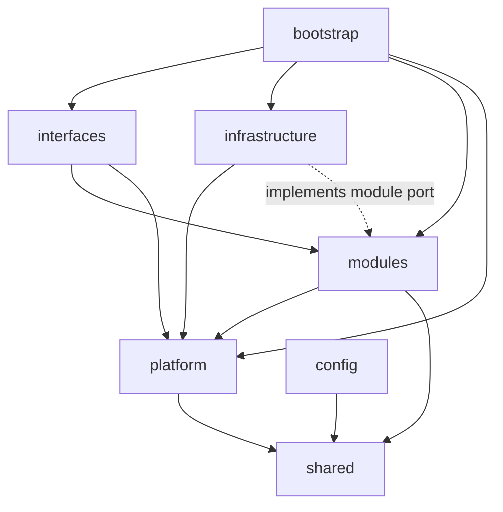

# Nexus Backend Architecture

本文描述当前 Backend 的分层、owner 与运行时边界，不重复维护功能需求。实际产品需求见 [USAGE](../USAGE.md)，Agent 关键边界与开发规则见 [AGENTS.md](../AGENTS.md)。owner、contract、事务或调用关系变化时，在同一提交更新对应章节。

## 技术基线

BackgroundAssetService.remove 先持久化空引用，再清理旧文件；后置 cleanup 异常只写安全诊断。Appearance missing-reference 自愈仍保留，不将数据库失败窗口描述成永久悬挂。

PasskeyRepository.commitAuthentication 用 expectedCounter CAS 同一 statement 更新 counter/last-used；Service 验证成功后必须成功 commit 才发登录成功。非零计数保持递增，0→0 允许，不保留分离 touch/updateCounter。

RemoteTextWriter.write 以随机同目录 wx temporary file 写入，finished 后 replaceFile，失败 destroy/drain 后 cleanup；不直接 openWrite 最终路径。编码/mode 保持原契约，transport 决定 strongest available replacement atomicity。

Operational secret storage 复用 SecretCipher，版本前缀 envelope 持有 TOTP/captchaConfig/notification config；repository 边界解密／加密，启动前以事务迁移 Legacy plaintext 并验证 ciphertext。Backup adapter 对配置解密 capture、目标密钥加密 restore；不将源部署 ciphertext 带到目标部署，不迁移 auth 表进入 Full Backup。

Command/Path History repository 的 upsert 在排他事务内读取最小 ID、合并同值重复项和更新时间或插入；避免异步 UPDATE/INSERT 交错，不添加破坏旧备份导入的 UNIQUE 约束。

Server Transfer subtask 的源身份由 payload 内 sourceItemIndex 持有，sourceItemName 仅供显示，不参与源对象解析；wire DTO 不暴露内部索引。

UserRepository.createInitialAdmin 持有一次性 bootstrap 的空表检查与插入事务；AuthService 在事务外做密码校验/hash，needsSetup 仅为 UI 查询，不作为 admission authority。

Connection repository 在 create/update/delete 的排他事务内维护 jumpChain 引用 invariant：hop 必须存在且为 SSH、不能引用自身；被引用 hop 禁止删除或改型。JSON 引用仍按原格式存储，反向检查使用 json_each，不在 service 的异步预检查上建立并发保证。

Transfer/Archive 的 fulfilled operation 表示 known settlement，不表示业务成功。Transfer allSettled drains positioned workers，关闭句柄共享一个 Promise，close/cleanup 失败拒绝并隔离；Archive channel error 后 best-effort terminate，仅数值 exit status 作为 remote exit 证据，无证据保留 temporary file 并 reject。WorkspaceOperationsService 透传 mutation guard AbortSignal，终态事件在 guard settlement 后发布。

QuickCommandRepository 持有 command row 与 tag association 的统一 create/update transaction；Tag repository 保留标签管理和批量追加，不再提供独立替换关联的写入口。

IpBlacklistRepository.recordFailure 持有失败计数与封禁 transition 的排他事务，返回 entry/newlyBlocked；Service 仅解析 settings 与发布通知，不在多个独立请求间读改写状态。

AuditLogService.logAction 是共享非阻断审计边界：持久化异常只输出 actionType/safe errorCode，不传播为业务失败，不输出 details。业务事务成功与审计可用性分离；无可靠 outbox 或必达声明。

ConnectionImportService 仅规范化当前／Legacy record，交给 ConnectionImportCommitPort。SQLite adapter 持有每条 record 的事务，scope-bound repositories 的 aggregate work 加入已有事务，复用领域校验和 cipher，不在 HTTP 边界写 SQL或用删除补偿模拟原子性。

Proxy/SSH Key repository 删除在排他事务内检查 Connection 外键引用，存在引用即拒绝删除；不依赖 ON DELETE SET NULL 修复业务 invariant，不让引用检查与删除分为两个异步请求。

Backup restore lifecycle 由 composition-root hooks 接入 compose-agent.prepareRestore：stop sweeps、quiesce dispatchers、close external runtime handles、reset dynamic Plugin/definition registry、deferred recovery 和 model registry。BackupService 在 restore 返回或 rollback 抛错后执行 afterRestore initialize，避免长期 owner 继续使用恢复前内存状态；prepare 失败不允许替换 durable state。

Backup snapshot adapter 在数据库排他 capture transaction 中读取表与稳定文件 inventory，并校验 ready Artifact size/hash、active Plugin marker/entry/file-list 内容。跨存储发布／删除窗口产生缺失引用时 fail closed，而不是将 inventory 稳定等同于引用完整；staging/deleting 仍由 Artifact 两阶段 reconcile 处理。表集合包含 `agent_runtime_context_checkpoints`。

Child Model executor 将 `AGENT_QUIESCE` 与业务取消分离：在执行入口、模型返回／异常及摘要、工具 proposal、terminal settlement 边界检查生命周期信号，退出后保留遗留 durable attempt/work 供 StateCommit recovery 关闭，不创建 completion mailbox 或 retry。重启仍遵循旧 Run interrupted → 安全 checkpoint 新执行的契约，不恢复旧 Child stack。

### Agent SSH 会话和任务 owner

SSH 项目目录由 `AgentProjectDirectories` 与 `agent_project_directories` 持有 user/App/Thread/connection-scoped durable binding，`project_directory_bind/read/clear` 经工具治理管理，不改变 shell cwd 或用户终端。绑定目录及连接配置 hash 冻结远端规则读取边界；每次模型调用通过统一 `ProjectInstructionSourcePort` 合并 Workspace 与 SSH transient rules，SSH 使用既有文件 capability adapter 并再次授权 file.read，子 Agent 仅加载 delegation grants 允许的连接。对话删除和应用停用清理 binding；规则读取不可用不生成虚假规则，不写入长期 Memory。

`AgentSshSessionPort` 暴露会话 open/list/close 和后台 Job start/control；`AgentSshSessions` Infrastructure 组合 `ExecutionSessionManager`，唯一持有 Agent 专用 SSH transport、活动借用、任务 channel、限额和清理计时器。命令和文件 adapter 共用 withSession，不复用 Workspace 用户终端。

会话按 user/App/Thread 隔离，Root/Subagent 工具上下文由 Run 注入可信 threadId。文件工具的 sessionId composition 将会话绑定进入规范化参数和 operation hash，检查与执行共享同一选择。后台 Job 使用独立 exec channel，SQLite `agent_ssh_jobs` 保存作用域、operation identity、有界输出和状态；启动时将遗留 running 收敛为 unknown，不保存 live handle 或重放命令。Runner 继续独立持有 Workspace Job Journal，不承担 SSH 连接。

- Node.js 24，ES2025，TypeScript 7。
- Express 5 HTTP application 与单一 WebSocket upgrade owner。
- SQLite 持久化，数据库访问由 Infrastructure adapter 实现。
- SSH/SFTP、Guacamole、通知、认证和 Agent Runner 通过明确 port/adapter 接入。
- 对外 HTTP contract 使用 camelCase；数据库列名只存在于 repository/infrastructure 边界。
- `packages/protocol/src` 持有跨 Frontend、Backend 与 Runner 的公共 wire DTO；输入在 Interface decode/validation，输出在边界映射，不在网络 adapter 复制协议类型。

## 源码布局

```text
packages/backend/src/
├── bootstrap/        composition root、启动、关闭和生命周期任务
├── config/           环境变量与 runtime config
├── infrastructure/   数据库、网络、密码学和第三方技术 adapter
├── interfaces/       HTTP/WebSocket 输入输出协议
├── locales/          Backend 用户可见文案
├── modules/          Nexus 产品用例、领域服务和 module-owned ports
├── platform/         可复用的机器能力与技术无关服务
└── shared/           错误、事件、日志、观测与安全基础 contract
```

## 层级职责

### `shared/`

Shared 提供无产品模块依赖的基础 contract，例如结构化日志、受控事件分发、运行时性能观测和密码学 port。它只依赖自身。

### `config/`

Config 解析和验证环境变量，输出稳定 runtime configuration。业务模块不直接读取 `process.env`。

### `platform/`

Platform 表达可复用的机器能力：远程连接、执行 session、POSIX shell、远程文件系统、路径、搜索、删除、Docker、系统状态和 mutation guard。Platform 不认识 HTTP、SQLite 或具体页面。

### `modules/`

Modules 持有 Nexus 产品行为和用例，例如认证、连接、设置、Workspace、传输、备份、通知、Remote Desktop session、SSH suspend 与 Agent。

Module 可以定义自己需要的 repository/adapter port。它依赖 `platform` 和 `shared`，不依赖 Infrastructure 或 Interfaces。跨模块调用必须通过明确服务或公开 contract，不能直接读取另一个模块的数据库实现。

### `infrastructure/`

Infrastructure 实现具体技术：

- SQLite schema、migration、worker 与 repositories；
- SSH transport、SFTP 和 suspend checkpoint/log；
- Guacamole runtime；
- WebAuthn、TOTP、captcha、密码散列与 secret cipher；
- 通知渠道、HTML theme catalog、备份 codec；
- Agent provider、plugin、Runner 和外部集成 adapter。

Infrastructure 可以实现 Module-owned port，但不拥有产品流程。

### `interfaces/`

Interfaces 是外部协议边界：

- HTTP route/controller 负责认证、输入 decode/validation、调用 use case 和响应映射；
- WebSocket server 统一处理 upgrade、Origin/IP/session/2FA 校验与协议分发；
- terminal/upload/workspace/agent/remote desktop session 负责 frame decode、backpressure、关闭和错误映射。

Interface 不直接访问数据库，不把 transport DTO 作为 Module domain model，也不在 route 中实现业务事务。

### `bootstrap/`

Bootstrap 是唯一 composition root。它创建 config、database、repositories、adapters、services、HTTP/WebSocket interfaces、Agent/Plugin/Runner wiring 和 lifecycle sweeps，并控制启动失败与有序关闭。

Agent root `bootstrap/agent/compose-agent.ts` 通过 `compose-providers.ts`、`compose-ssh-capabilities.ts` 及 Plugin／Workspace 工厂组装独立子图。Provider 工厂保留 adapter→service 延迟引用；SSH 工厂注入原 conversation repository、capability broker 和 target denylist，创建单份 session/file/shell/project-directory 实例。工厂只构造对象，initialize、Host quiesce、跨子图回调及 dispose 顺序仍由 root 持有，不引入 service locator 或第二生命周期 owner。

## Child Context 持续历史

Completion evidence 复用 `contextHistory` 全量 durable Child tool batches，只接受 ok／confirmed／verified，去重引用；64 refs 上限超出显式失败，16 条有界工具事实只作 handoff 摘要。Model executor 不再把证据读取异常当作成功的空证据；不新增 evidence ledger 或存储 owner。沿用成熟 Agent 的 bounded handoff 原则，完整来源与传输上限分离。

`ToolExecutor.executeAuthorized` 在 await authorize 前比较 descriptor.version／inspection.toolVersion，await 后再 require 并检查 implementation identity 与版本，立即进入 execute；统一覆盖 Root／Child read、control 与 mutation，动态 contribution 替换 fail closed，不将名称当版本 authority。

Input／Goal／pending-input transition 的 streaming 检测以 `agent_runtimes.participant_id=root` 限定真实 Root，与 composition 的 Root scheduler.signalInput owner 一致；不因 Child-only streaming 错发 Root abort，不隐式调用 Child cancel。

Root／Child 共用 `model-retry-policy` 的瞬态分类、次数与退避。Child 失败 Model attempt settle 同事务计 usage、结束旧 work、保持 delegation runnable 并 enqueue versioned retry work（notBefore／原 deadline／retryAttemptIndex）；下一次调用仍冻结模型、limiter 与预算。StateCommit 验证 retry 次数、错误与剩余预算，取消优先，失败 partial output 不提交 proposal／checkpoint、不消费 inbox。重启沿用 interrupted 收敛，不重放遗留请求。

Child tool surface 复用 `modelFacingToolSchemas`，以 grants／risk 过滤 direct 与 deferred router；模型 proposal 在 `SubagentContextBuilder.resolveProposal` 复用 `resolveDeferredToolProposal`，随后按解析出的实际 Tool 校验 delegation grants 再 inspect。没有第二 handle、catalog 或授权 owner，MCP mutation 不因 router 开放而越过 Workspace-only Child mutation policy。

Child plan-mode guard 分布在 schema（只读／control）、model proposal inspection（mutation 拒绝结果）、Tool executor 与 StateCommit mutation begin（副作用和审批消费前 fail closed）；Run executionMode 不因 delegation grants 或 full_access 被放宽。

Child governed mutation 与 Root 共用 `GovernedMutationExecutor` 和 durable Approval。`ask` request 在审批事务将该 Tool work 转 waiting；resolve approved 将 work 重新入队，denied／expired／input superseded 通过 `child-approval-work` 调用已有 Child tool settle owner，同事务保存自身失败结果并恢复 batch continuation。内部结算平衡 execution slot，不递减其他正在执行 runtime 的计数；无外部 mutation、无第二审批 owner。`full_access` 保持 claimed work 的即时自动批准流程。

Root `ModelStepRunner` 的 project target discovery 优先消费 authoritative input projection、当前 Goal 与活动 Plan 的显式 Workspace 路径，再补 recent Tool 参数；路径归一化限定 `/workspace/work`，最多 8 个 target，沿用 `ProjectInstructionSourcePort` 的授权／字节边界。参考 [OpenCode V2 按目标 scope 发现](https://opencode.ai/v2/docs/instructions/)，不移植代码、不全仓扫描、不将文本路径解析作为授权机制。

Root Ledger 与 Child 工具 projection 在截断时写入 durable Tool Call id／sha256；`tool_result_read` 经 `ToolResultReaderPort` 由 `SqliteRunRepository` 按 user／App／Run／Runtime 查询终态 captured result，保留原始 JSON 顺序并排除 UI userSummary，使 hash 与 projection 一致。Host Tool 返回当前 output budget 内的 Unicode 字符分页；不新增文件存储、执行重放或 evidence authority。参考 OpenCode V2 的有界输出／read 分页 contract，未移植其代码。

`SubagentContextBuilder` 经 runtime repository port 读取当前 Child 的完整工具批次、已消费 mailbox 和派生 checkpoint，不读 Root Ledger／Recall。原始历史始终持久化；按时间及 step index／recipient sequence 稳定排序，hash 校验摘要覆盖前缀，失效时重新使用原历史。项目规则仍独立按 delegation grants 读取，不写入摘要。容量压力复用冻结 context policy 和 tool projection；摘要规划复用结构化交接章节，按完整历史单位顺序分批合并并保留近期原始交互。

`SubagentModelStepExecutor` 在原 scheduler claim 内迭代执行独立摘要步骤，再刷新 Context；冻结模型、limiter、取消、deadline、Run active time 与 Run／delegation step/usage 治理不建立第二 owner。摘要禁止 Tools、不发布回复 delta、不消费新 inbox，异常仍走 Child 的既有失败策略，不新增自动重试。`StateCommit` 原子提交 `agent_runtime_context_checkpoints`、attempt、usage、事件和 runtime projection，校验 owner epoch、完整结束及来源 hash；失败或取消保留旧摘要和全部原历史。SQLite schema 与迁移 #52 持有摘要表定义；摘要是低权威 derived state，不授予权限，也不取代 delegation 或 Tool evidence。

## 依赖方向


```mermaid
flowchart TD
  Bootstrap[bootstrap] --> Interfaces[interfaces]
  Bootstrap --> Infrastructure[infrastructure]
  Bootstrap --> Modules[modules]
  Bootstrap --> Platform[platform]
  Interfaces --> Modules
  Interfaces --> Platform
  Infrastructure --> Platform
  Infrastructure -. implements module port .-> Modules
  Modules --> Platform
  Modules --> Shared[shared]
  Platform --> Shared
  Config[config] --> Shared
```

允许的静态依赖以 [AGENTS.md](../AGENTS.md) 为准。Infrastructure 对 Module 的依赖只允许用于实现 Module-owned `*.port` / `*.types` contract，并优先使用 type-only import。

## Workspace 与远程能力

`workspace.ping` 在已绑定的 Workspace 协议 session 上返回空响应，已关闭或所有权撤销的协议 session 不处理请求；不调用 SSH 命令、不创建新会话，也不执行挂起接管。浏览器存活探测失败使用异常 transport close，继续遵循既有普通续接和挂起保留边界。

`modules/workspace` 持有 Workspace session registry、session 生命周期、事件 hub 和用户可见用例。`platform/execution`、`platform/filesystem` 与 SSH Infrastructure 提供执行和文件能力。

关键 owner：

- Workspace registry：活动 session 与生命周期；
- SSH transport：连接、channel 和 SFTP 技术状态；
- execution session：命令执行与 shell 语义；
- filesystem：路径和文件操作；
- transfer module：跨 session 传输、任务状态与取消；
- SSH suspend module：挂起 catalog 与恢复事务；
- Interfaces：HTTP/WebSocket streaming、认证和 backpressure。

终端 shell 的暂停由 `WorkspaceTerminalService` 统一根据消费者背压与恢复暂停两个原因计算；任何原因仍存在时不得 resume。输入队列不提供未接通的 sequence/ACK 机制，网络提交不等于远端命令执行确认。

SSH `TerminalStreamTransport` 支持 `terminal.flow` 消费窗口；客户端在连接后用 consumedBytes=0 启用，随后只允许安全整数、单调且不超过已发送字节的确认。计数属于当前 WebSocket，不是 journal offset。窗口为 1 MiB，单帧最多 256 KiB；窗口耗尽暂停实时 shell 和发送，确认释放容量后继续。恢复日志按帧等待窗口容量，不把整个 replay 一次塞入发送队列。未启用窗口的协议客户端保留网络背压。

挂起标记不关闭活动 Workspace。`workspace-suspend-coordinator.service.ts` 管理标记、终端输出日志与 checkpoint；标签关闭或连接断开后由 Backend 接管原 SSH/PTY。普通弱网续接校验原发起端恢复凭据，挂起会话恢复或确认接管则校验会话访问权限，不要求原设备凭据。恢复时 Backend 负责 prepare、有限尾部回放、transport 交接、commit/rollback 与更早历史分页；Frontend 只负责 Runtime tab 的创建、替换与展示。取消标记涉及输出队列排空与存储清理，请求超时不能作为确定取消失败的证据。

挂起原始日志由 `local-suspended-session-log.adapter.ts` 串行写入。可读取历史、分页 offset 和导出最多覆盖最近 100MiB；物理文件允许额外 32MiB 压缩缓冲，超过阈值才裁剪回 100MiB，不按每个 PTY chunk 重写完整保留文件。压缩通过临时文件和 rename 提交；恢复先暂停 shell、解绑输出 listener，再排空既有输出队列，不能用延长 owner lease 掩盖日志写入积压。

## Remote Desktop

`RemoteDesktopSessionService` 读取连接并签发一次性 opaque ticket。`GuacamoleRuntimeAdapter` 在 Backend 内存中持有短生命周期的具体连接请求。浏览器经 `/ws/remote-desktop` 连接 Backend，Backend 再连接独立 `guacd` 服务；凭据不返回浏览器。详见 [Remote Desktop Architecture](REMOTE_DESKTOP.md)。

## Agent 与 Plugin Platform

Agent Core 位于 `modules/agent`，具体 provider、plugin、Runner、browser 与存储实现位于 `infrastructure/agent`，HTTP/WebSocket surface 位于 `interfaces`，composition 位于 `bootstrap/agent`。

Backend 持有用户、App、Thread、Run、Ledger、Plan、approval、lease、artifact、memory、checkpoint、policy 与 durable mutation authority。Runner 只执行已冻结的 Workspace generation 和 execution input；它不成为 Backend durable state 的第二 owner。

Context checkpoint 由 `modules/agent/ai/context-checkpoint.service.ts` 规划可见 Ledger prefix 和模型输入，采用 `context-checkpoint-v2`／`semantic-handoff-v1`。已验证旧摘要与新增历史按窗口分批合并，历史序列以 JSON 数据送入模型，不投影为可执行 Tool call，不按关键词、首尾样本或固定字符截断。Context 保留有界近期完整 causal groups，并以低权威 user 历史交接数据投影有效摘要；content 和 generator 纳入 context lineage。

`NativeAgentBackend` 在正式推理前执行独立 compaction model step，`ModelStepRunner` 复用冻结 route、ModelCallLimiter、取消、重试和 Run step/time 预算；摘要没有 Tool、普通回复 delta 或助手 Ledger。`state-commit/compaction-transitions.ts` 在 Adapter 事务内重新校验 source hash、visibility、输入／Goal revision，原子更新 checkpoint、attempt、usage、执行时间与事件，不消费输入，不覆盖主推理 context usage。每批重新 compose 后继续压缩；空／截断／超预算／不缩小结果、来源变化与取消不发布摘要，失败不静默降级为只删历史。超过单批窗口的单条记录明确报错；原始 Ledger 保留。迁移 #51 清理旧策略派生摘要，不改原始历史。

`SqliteStateCommitAdapter` 持有事务入口与提交后观察；恢复／App 禁用的 durable 转换位于 `infrastructure/agent/runtime/state-commit/recovery-transitions.ts`，与其他 transition 一样接收当前事务。Quarantine、子状态、审批、Run、事件与 Host summary 必须同事务收敛，不将 SQL 拆到事务外的 Recovery service。历史 restart 候选查询保持在提交和通知之后，不复用旧执行 stack。

SQLite schema authority 位于 `infrastructure/database/`：`schema/` 按 core 与 Agent host/AI/execution/collaboration/plugins/workspace 分组定义当前 SQL，`sqlite-schema.registry.ts` 唯一持有初始化及 post-migration 定义顺序。`migrations/` 按 core/runtime/capabilities/host 分组保存升级定义与共用 schema inspection，`migrations/registry.ts` 汇总全局 ID，`sqlite-migrations.ts` 唯一执行事务、检查及版本记录。分组不建立独立版本号，不调整已发布 SQL 或全局执行顺序；Worker 和迁移直接消费真实定义模块。

Backend 到 Runner 的所有 HTTP/WebSocket 调用集中在 Runner adapter，使用 Bearer token 与 `X-Nexus-Agent-Protocol: 2026-09-13`。Provision 发送冻结 profile；后续 lifecycle/job 调用使用 Workspace id、generation 与必要执行输入。

Runner `controller/server.ts` 持有 HTTP/WebSocket transport、认证、输入读取与 route/response 映射；每个 Server 实例创建一个 `RunnerCommandExecutor`，统一编排 command/job acceptance、Journal transition、后台执行、工具链互斥及 Workspace provision/lifecycle。Executor 复用原 Journal 和具体 runtime，不创建第二份 workspace/job 状态；文件 mutation 的 active-job 检查也查询同一 Executor/Journal。无状态的 record/key/browser/binding 校验位于 `runner-request-validation.ts`，路由专用校验保留在 transport 边界；Server close 仍关闭原 ACP、Terminal、Browser runtime。

`packages/protocol/src/runner.ts` 唯一声明 Runner command、generation projection、job、文件读写／搜索／patch、代码导航及项目规则 wire DTO；可用性、Catalog 与 Storage 复用已有 `agent-workspace-runtime` DTO。双方直接消费这些规范类型，不保留旧 Runner 前缀类型或 port 的转导出别名。版本值由 `runner-version.json` 持有，供两端 CommonJS runtime 直接读取；Runner Docker build/deploy 包含 protocol workspace dependency。Runner durable journal record 与 Backend 授权／领域结果仍由本地 owner 持有，输入与响应的有界运行时校验仍分别留在各 transport 边界。

Workspace 工具链引用仅包含 familyId/versionId，架构由 Runner 决定；支持版本与架构来自 Runner catalog JSON。Node/Python/Go 共用 mise materializer，检查可执行文件和实际版本，不维护预编译来源 lock、预设安装树摘要或选择指纹。安装缓存按类型、版本、架构组织，保留不可变共享与使用中卸载保护；Backend 只消费 catalog 和生命周期 contract，不复制安装状态。内置 base-tools 的仓库随附 archive 仍做完整性校验，不属于语言版本来源锁定。

Plugin package、immutable installed version、AppStorage、Workspace 和 Artifact 分别维护生命周期。Frontend target 在隔离 surface 中运行；backend/runner target 通过受控进程和版本化 SDK/IPC 运行。Plugin 不能把 Host authority function 注入 Tool catalog。

## 数据、事务与并发

- SQLite schema 描述新数据库结构，migration 负责已发布结构升级。
- 写操作由真实状态 owner 建立事务和幂等边界。
- 外部副作用使用 operation identity、lease、outcome 与 reconcile 处理未知结果。
- destructive operation 先 preview/freeze/confirm，再在提交前重检前置条件。
- async callback 和 event listener 必须隔离单个消费者失败，且在 owner 关闭时解除注册。
- 日志使用结构化 logger，过滤凭据、token、cookie、私钥、文件正文和模型敏感内容。

## 诊断与关闭

Bootstrap 注册 process、database、Runner、provider、plugin 和 transport 诊断。诊断是可观测证据，不替代真实 API/UI 行为验证。

关闭顺序由 composition root 控制：停止接收新请求，停止 scheduler/sweeps，drain 或终止受管工作，关闭 WebSocket/HTTP，再关闭数据库和底层资源。各 adapter 的临时进程、listener、timer 和文件句柄由创建它们的 owner 清理。

## 放置指南

| 新代码                                 | 放置位置                       |
| -------------------------------------- | ------------------------------ |
| 新产品用例或业务规则                   | `modules/<capability>/`        |
| 新机器能力抽象                         | `platform/<capability>/`       |
| 数据库或第三方实现                     | `infrastructure/<capability>/` |
| HTTP/WebSocket decode 与响应映射       | `interfaces/`                  |
| 环境变量解析                           | `config/`                      |
| service/adapter wiring 与 lifecycle    | `bootstrap/`                   |
| 无领域依赖的日志、事件、安全 primitive | `shared/`                      |

## 验证

- `pnpm run check` 执行 Frontend/Agent ESLint 与 Frontend type check。
- 架构和生命周期规则由 [AGENTS.md](../AGENTS.md) 约束 AI 开发与审查，不使用源码文本扫描测试。
- `pnpm run build:backend` 执行 Backend TypeScript build 并复制 locale/Plugin SDK runtime asset。
- 根 `pnpm run build` 覆盖 Backend、Frontend、Agent Runner；根 `check` 覆盖 Frontend／Agent ESLint 和三个生产包类型检查。CI 消费该完整入口，不在同一步重复构建 Runner；独立 Runner 作业仍使用包级入口。
- Agent deterministic scenarios 位于 `tests/backend/agent-scenarios/`。
- 用户可达 HTTP/WebSocket/SSH/Agent 行为由 `tests/e2e/` 验证。
- Canonical workflow 保留 production-style Docker smoke。
