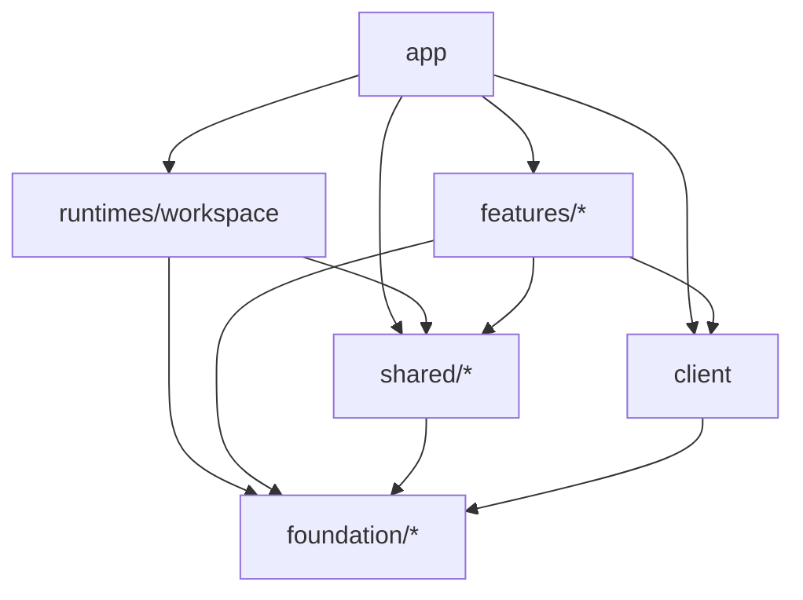

# Nexus Terminal Frontend Architecture

本文描述当前 Frontend 的目录、状态 owner、依赖方向和运行时边界。产品需求见 [软件需求](../software-requirements/README.md)，强制工程规则见 [Engineering Constraints](../software-requirements/engineering-constraints.md)。

## 技术基线

- Vue 3、Vue Router、Vue I18n 和 Vite。
- TypeScript `strict` 与 `noUncheckedIndexedAccess`。
- HTTP 数据通过 `client/` 进入应用，业务代码使用 camelCase contract。
- 终端、上传和 Workspace 使用明确的 WebSocket protocol/session owner。
- Foundation UI 统一使用 `Ui*` 组件；自定义窗口表面使用 `OverlayPanel` 组合。

## 源码布局

```text
packages/frontend/src/
├── app/                         application composition root
│   ├── bootstrap/               PWA 与运行时诊断启动
│   ├── config/                  release 信息
│   ├── i18n/                    应用 locale 聚合
│   ├── pages/                   dashboard/login/settings/ui gallery
│   ├── router/                  route composition
│   ├── shell/                   全局 shell
│   ├── styles/                  token 与全局样式
│   ├── App.vue
│   └── main.ts
├── client/                      HTTP client、DTO decode 与资源 API
├── foundation/                  无产品语义的基础能力
│   ├── async/
│   ├── browser/
│   ├── data/
│   ├── interaction/
│   └── ui/
├── shared/                      少量跨域共享能力
│   ├── capabilities/            app 注入的跨 feature capability contract
│   ├── feedback/                toast、confirm 与全局反馈
│   ├── focus/                   focus 协调
│   └── session/                 认证会话生命周期协调
├── features/                    独立产品能力
│   ├── agent/
│   ├── appearance/
│   ├── audit/
│   ├── auth/
│   ├── backup/
│   ├── command-history/
│   ├── connections/
│   ├── docker/
│   ├── file-editor/
│   ├── file-preview/
│   ├── filesystem/
│   ├── notifications/
│   ├── preferences/
│   ├── proxies/
│   ├── quick-commands/
│   ├── remote-desktop/
│   ├── security/
│   ├── ssh-keys/
│   ├── ssh-suspend/
│   ├── status-monitor/
│   ├── system-overview/
│   ├── tags/
│   ├── terminal/
│   └── transfers/
└── runtimes/
    └── workspace/
        ├── adapters/
        ├── components/
        ├── focus/
        ├── layout/
        ├── model/
        ├── ports/
        ├── protocol/
        ├── session/
        ├── state/
        ├── views/
        └── public.ts
```

## 层级职责

### `foundation/`

Foundation 提供无产品领域含义、可独立复用的能力：异步控制、浏览器 API、数据工具、交互 primitive 和 UI primitive。它不能依赖 `shared`、`features`、`runtimes` 或 `app`。

`foundation/ui` 是统一设计系统。表单、反馈、表格和弹层优先使用 `UiButton`、`UiInput`、`UiTextarea`、`UiSelect`、`UiNativeSelect`、`UiCombobox`、`UiCheckbox`、`UiFormField`、`UiModal`、`UiSpinner`、`UiBadge`、`UiTable`、`UiContextMenu`。需要自有标题栏、拖动、缩放或全屏语义的窗口以 `OverlayPanel` 为表面组合自己的 chrome。

### `shared/`

Shared 只放确有多个 owner 使用的窄 contract。它不承载连接、文件、终端或 Agent 业务状态。

- `capabilities` 定义 Workspace Runtime 需要的认证、连接、标签、代理、SSH key、远程桌面和终端加载能力。
- `feedback` 统一全局反馈交互。
- `focus` 协调跨 surface focus。
- `session` 协调认证状态建立与清理。

### `client/`

Client 是浏览器到 Backend HTTP contract 的唯一普通入口。它负责请求、响应 decode、错误归一和资源 API，不持有页面状态，也不决定用户流程。Workspace 内的 HTTP 使用位于 `runtimes/workspace/adapters` 的 adapter，Workspace 组件和状态 owner 不直接 import HTTP client。

### `features/`

每个 feature 持有自己的 model、controller、service、组件和公开入口。外部代码只通过该目录的 `public.ts` 使用它。一个 feature 不能直接 import 另一个 feature；跨 feature 组合由 `app/App.vue` 完成，并以 `shared/capabilities/public.ts` 中的窄接口注入 Runtime。

### `runtimes/workspace/`

Workspace Runtime 组合长生命周期的交互会话，包括 SSH terminal、文件系统、编辑器、预览、传输、状态监控、Docker、布局、sidebars 和远程桌面入口。

每个 Workspace session 持有自己的 transport、controllers 和 presentation state。Registry 持有 session 顺序、激活状态和生命周期。Feature 通过 adapter/capability 接入 Runtime，不读取 Runtime 私有目录。

### `app/`

App 是 composition root，负责：

- 初始化 router、i18n、PWA 和诊断；
- 建立认证后的应用生命周期；
- 创建 feature owner；
- 把跨 feature capability 注入 Workspace Runtime；
- 组合 Dashboard、Settings、Workspace 和全局 Agent surface；
- 在登出、用户切换和应用销毁时按 owner 清理状态。

## 依赖方向



具体规则：

1. 跨 owner import 只能使用 `public.ts`；Foundation 使用各子目录 `index.ts`。
2. Feature 之间没有横向 import。
3. Agent 与 Workspace 内部分区遵守各自单向依赖表。
4. Workspace transport 只出现在 adapter。
5. `app` 负责组合，不成为业务状态仓库。

## 状态与生命周期

状态放在最小且真实的 owner 中：

| 状态                                   | Owner                                 |
| -------------------------------------- | ------------------------------------- |
| 登录用户、认证建立/退出                | `features/auth` + `shared/session`    |
| 连接、标签、代理、SSH key catalog      | 对应 feature                          |
| Workspace tabs、活动 session、布局     | `runtimes/workspace`                  |
| 单个终端、文件系统、编辑器、预览、传输 | 对应 session controller/feature owner |
| 用户偏好                               | `features/preferences`                |
| Agent Host、Thread/Run UI              | `features/agent`                      |
| 页面组合和跨 feature wiring            | `app`                                 |

异步 owner 必须防止旧响应覆盖新状态。可取消工作在 owner 销毁或身份切换时取消；不可取消工作使用 generation、request identity 或 latest-value guard。浏览器持久化通过版本化 storage contract 读取，解析失败回到安全默认值。

## HTTP 与 WebSocket

普通资源请求走 `client/`。组件不拼接 endpoint，不解释持久化字段，也不直接保存 transport DTO。

Workspace WebSocket 由 runtime protocol/session owner 处理：

- terminal stream 处理输入、输出、resize、close 和 error；
- upload stream 处理二进制上传和进度；
- remote desktop 使用一次性 ticket 连接 `/ws/remote-desktop`；
- Agent 与 Workspace local terminal 使用各自的 protocol session。

组件只消费已解码事件和 domain model。二进制 frame、重连、心跳、backpressure 和 teardown 留在 transport/session 层。

## Agent frontend

`features/agent` 提供全局悬浮 Host、设置、历史、运行详情、approval、artifact、plugin App surface 与 onboarding。Agent 不属于 Workspace Runtime；需要 Workspace、terminal 或文件能力时使用 Backend contract 或 app 提供的 capability，不读取 Workspace 私有 state。

Plugin frontend 运行在隔离 iframe/origin 中，通过版本化 SDK 与 MessagePort 通信。它不能获得主应用 session cookie、HTTP client 或 Vue owner 实例。完整 Agent 设计见 [Agent 架构](../AGENT.md)。

## 验证

仓库根命令 `pnpm run check` 串行执行：

- Frontend/Agent ESLint；
- Frontend TypeScript check。

模块公开入口、跨 feature 依赖、状态 owner、组件拆分和国际化规则由根目录 [`AGENTS.md`](../../AGENTS.md) 约束 AI 开发与审查。仓库不再用读取源码文本、匹配 import 或统计文件形状的脚本和测试充当架构门禁；用户可见行为通过真实 E2E 路径验证。
