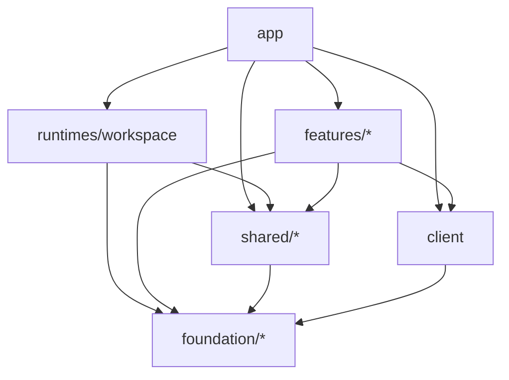

# Nexus Terminal Frontend Architecture

本文描述当前 Frontend 的目录、状态 owner、依赖方向和运行时边界，不重复维护功能需求。实际产品需求见 [USAGE](../USAGE.md)，开发前必读 [AGENTS.md](../AGENTS.md)。owner、公开入口或调用关系变化时，在同一提交更新对应章节。

## 技术基线

PluginAgentSdkDispatcher 是 iframe Run subscription admission owner：单实例2、页面合计4、同Run去重，abort到generator finally间仍占预算；close拒绝新订阅，Backend共享16槽不变。

FilesystemChannel.readBinary required maxBytes，FileDocumentPort load固定16MiB并复用server/client累计fence；reload/encoding走同一port，decode仅在限量成功后执行，不以large-file character threshold替代网络/heap admission。

QuickCommands createTagForCommands 的assigned:false为显式部分成功，Panel显示assignFailedAfterCreate；tag合法独立保留，不补偿删除，不承诺两HTTP请求事务原子。

FileManager remove catch 保留原因并提示 partial/unknown，再 best-effort browser.load；无集合 rollback/逐项 report/自动 retry，不将成功刷新视作 writer 收敛证明。

Connections/Proxies/Tags/Notifications 的异步 mutation（含 Connection refresh）捕获现有 cache generation，await 后重检再写 items/loadedAt；session reset 是 store 回填边界，不取消后端副作用，也不声称所有调用方局部状态已受 fence。

Plugin Agent dispatcher operationId 按 endpoint contract 透传：createThread/createRun/appendInput/cancelRun/resolveApproval；renameThread/cancelSubagent 使用 expectedVersion CAS，后端不消费 replay key。不能以单纯 header 透传声称 durable replay。

SSH Key/Command History/Quick Commands/Server Transfers store 注册 authenticated-session reset，实例 generation 隔离异步 load/mutation 与排队 history write；transfer reset 停止 poll，旧 refresh finally 不清除新 in-flight owner。服务端副作用仍由后端负责。

Editor open 持有 scope generation + close epoch，load/异步 decoding 后重检发布；closeScope/invalidatePaths bump scope generation，closeAll bump epoch。失效结果 AbortError，不注册旧 port，不声称取消无 signal contract 的底层 I/O。

FileManager 的 beforeFileMutation port 由 Workspace surface/renderer 组合到同 scope Editor invalidatePaths；rename/delete 前失效目标及后代保存 port，saving gate 阻止交错。草稿保留，部分失败不猜路径身份，需重新打开。

Editor session 持有异步批量关闭 gate，由 FileEditor 提供本地化 discard confirmation；Popup 等待 closeAll 结果。强制 scope teardown 保留 dirty/saving 草稿并移除 port，后续 save fail-closed，不静默删除草稿；状态仅进程内。

### 加载与静态资源

- 登录、初始化和应用页头使用 `logo-small.png`，原始高分辨率 Logo 不进入这些页面的资源请求。
- 登录后在空闲时仅预加载连接管理和 Workspace；设置、通知、代理和审计路由保持按需加载，节省流量模式和 2G 网络不主动预加载。
- 生产 Nginx 对 JS、CSS、JSON、WASM 和 SVG 启用 gzip，响应包含 `Vary: Accept-Encoding`；哈希资源长期缓存，入口 HTML 和 Service Worker 不长期缓存。

- Vue 3、Vue Router、Vue I18n 和 Vite。
- TypeScript `strict` 与 `noUncheckedIndexedAccess`。
- HTTP 数据通过 `client/` 进入应用，业务代码使用 camelCase contract。
- 终端、上传和 Workspace 使用明确的 WebSocket protocol/session owner。
- Foundation UI 统一使用 `Ui*` 组件；自定义窗口表面使用 `UiOverlayPanel` 组合。
- `packages/protocol/src` 是 HTTP、WebSocket 与 Runner wire DTO 的唯一公共 owner，网络 adapter 直接使用规范 DTO，不在 Frontend 重复声明兼容类型。

## 源码布局

```text
packages/frontend/src/
├── app/                         application composition root
│   ├── bootstrap/               PWA 与运行时诊断启动
│   ├── config/                  release 信息
│   ├── i18n/                    应用 locale 聚合
│   ├── pages/                   dashboard/login/settings/ui gallery
│   ├── router/                  route composition
│   ├── shell/                   全局 shell
│   ├── styles/                  token 与全局样式
│   ├── App.vue
│   └── main.ts
├── client/                      HTTP client、DTO decode 与资源 API
├── foundation/                  无产品语义的基础能力
│   ├── async/
│   ├── browser/
│   ├── data/
│   ├── interaction/
│   └── ui/
├── shared/                      少量跨域共享能力
│   ├── capabilities/            app 注入的跨 feature capability contract
│   ├── feedback/                toast、confirm 与全局反馈
│   ├── focus/                   focus 协调
│   └── session/                 认证会话生命周期协调
├── features/                    独立产品能力
│   ├── agent/
│   ├── appearance/
│   ├── audit/
│   ├── auth/
│   ├── backup/
│   ├── command-history/
│   ├── connections/
│   ├── docker/
│   ├── file-editor/
│   ├── file-preview/
│   ├── filesystem/
│   ├── notifications/
│   ├── preferences/
│   ├── proxies/
│   ├── quick-commands/
│   ├── remote-desktop/
│   ├── security/
│   ├── ssh-keys/
│   ├── ssh-suspend/
│   ├── status-monitor/
│   ├── system-overview/
│   ├── tags/
│   ├── terminal/
│   └── transfers/
└── runtimes/
    └── workspace/
        ├── adapters/
        ├── components/
        ├── focus/
        ├── layout/
        ├── model/
        ├── ports/
        ├── protocol/
        ├── session/
        ├── state/
         ├── presentation/             public page-composition entry
        └── public.ts
```

## 层级职责

### `foundation/`

Foundation 提供无产品领域含义、可独立复用的能力：异步控制、浏览器 API、数据工具、交互 primitive 和 UI primitive。它不能依赖 `shared`、`features`、`runtimes` 或 `app`。

`foundation/ui` 是统一设计系统。表单、反馈、表格和弹层优先使用 `UiButton`、`UiInput`、`UiTextarea`、`UiSelect`、`UiTokenInput`、`UiCheckbox`、`UiFormField`、`UiModal`、`UiSpinner`、`UiBadge`、`UiTable`、`UiContextMenu`。产品下拉选择统一由 `UiSelect` 渲染，不使用浏览器原生 `<select>`。需要自有标题栏、拖动、缩放或全屏语义的窗口以 `UiOverlayPanel` 为表面组合自己的 chrome。

### `shared/`

Shared 只放确有多个 owner 使用的窄 contract。它不承载连接、文件、终端或 Agent 业务状态。

- `capabilities` 定义 Workspace Runtime 需要的认证、连接、标签、代理、SSH key、远程桌面和终端加载能力。
- `feedback` 统一全局反馈交互。
- `focus` 协调跨 surface focus。
- `session` 协调认证状态建立与清理。

### `client/`

Client 是浏览器到 Backend HTTP contract 的唯一普通入口。它负责请求、响应 decode、错误归一和资源 API，不持有页面状态，也不决定用户流程。Workspace 内的 HTTP 使用位于 `runtimes/workspace/adapters` 的 adapter，Workspace 组件和状态 owner 不直接 import HTTP client。

### `features/`

每个 feature 持有自己的 model、controller、service、组件和公开入口。外部代码只通过该目录的 `public.ts` 使用它。一个 feature 不能直接 import 另一个 feature；跨 feature 组合由 `app/App.vue` 完成，并以 `shared/capabilities/public.ts` 中的窄接口注入 Runtime。

Agent App 的 `host/useAgentAppController.ts` 是实例级 application controller，持有 Thread/Run/Ledger projection、配置选择、缓存、错误域、facade 与事件订阅，并在组件生命周期内初始化和清理。`AgentAppSurface.vue` 只组合展示组件、绑定 controller 提供的响应式状态／动作及观察自身尺寸；Host window manager 与 surface session 仍为原有唯一 owner。提取不新增共享 mutable state，不取消现有 generation fence 或缓存容量限制。

### `runtimes/workspace/`

Workspace Runtime 组合长生命周期的交互会话，包括 SSH terminal、文件系统、编辑器、预览、传输、状态监控、Docker、布局、sidebars 和远程桌面入口。

`app/pages/workspace/WorkspacePage.vue` 持有路由页面的跨 Feature 组合，通过各 Feature 的 `public.ts` 消费偏好、外观、历史、传输与挂起目录。Runtime 的 `presentation/public.ts` 只暴露页面所需的组件、延迟加载器、UI state provider 和唯一 session registry；布局、transport 与会话生命周期仍由 Runtime 原 owner 持有，App 不复制这些状态。`/workspace` 路由及认证后空闲预加载均加载该 App 页面，Runtime 不持有该页面的反向加载入口。

每个 Workspace session 持有自己的 transport、controllers 和 presentation state。Registry 持有 session 顺序、激活状态和生命周期。Feature 通过 adapter/capability 接入 Runtime，不读取 Runtime 私有目录。

WorkspaceSocket 在发送前限制浏览器发送缓冲，并按请求限制二进制响应累计大小；Terminal adapter 将输入拒绝和服务端输入错误转交 channel 的错误消费者，不自动重放被拒绝的输入。SSH 输出携带本地 consumed 回调，TerminalView 在 xterm write 完成后调用；WorkspaceSocket 按当前 WebSocket 累计确认并合并发送 `terminal.flow`，旧连接回调不能确认新连接。历史浏览暂存的实时输出在恢复实时画面并解析后才确认。恢复 offset 仍记录浏览器已接收字节，不丢弃待解析数据或用消费计数替代恢复 offset。

### `app/`

App 是 composition root，负责：

- 初始化 router、i18n、PWA 和诊断；
- 建立认证后的应用生命周期；
- 创建 feature owner；
- 把跨 feature capability 注入 Workspace Runtime；
- 组合 Dashboard、Settings、Workspace 和全局 Agent surface；
- 在登出、用户切换和应用销毁时按 owner 清理状态。

## 依赖方向


```mermaid
flowchart TD
  App[app] --> Runtime[runtimes/workspace]
  App --> Features[features/*]
  App --> Shared[shared/*]
  App --> Client[client]
  Runtime --> Shared
  Runtime --> Foundation[foundation/*]
  Features --> Client
  Features --> Shared
  Features --> Foundation
  Shared --> Foundation
  Client --> Foundation
```

具体规则：

1. 跨 owner import 只能使用 `public.ts`；Foundation 使用各子目录 `index.ts`。
2. Feature 之间没有横向 import。
3. Agent 与 Workspace 内部分区遵守各自单向依赖表。
4. Workspace transport 只出现在 adapter。
5. `app` 负责组合，不成为业务状态仓库。

## 状态与生命周期

`UiOverlayPanel` 的 standard-modal preset 使用公共 `ui-form-surface` 不透明主题材质，`UiModal` 及其他标准弹窗统一生效；默认浮层仍可使用玻璃材质，避免遮罩穿透标准模态面板降低对比度。

Dashboard 的快速连接和 SSH 资源共用 `foundation/ui/UiScrollArea`，公共组件持有内部滚动与回顶按钮，不拦截纵向触摸；手机搜索栏为普通流布局。`features/system-overview/useSystemOverview` 持有去重后的 SSH 资源采集队列和取消生命周期，以最多四个并发 worker 独立更新主机结果，worker 在后续探测间保留 200ms 间隔；单次刷新仍保持单飞，API adapter 传递 AbortSignal。

### 全局导航与会话展示

公共确认与提示由 `shared/feedback/DialogHost` 持有交互，通过 `foundation/ui/UiConfirmationPanel.vue` 统一面板、标题、状态图标、正文和操作区；上传冲突复用该组件及 `UiCheckbox`，策略仍由 transfers feature 持有。弹窗关闭、确认和业务执行边界保持不变。

`UiActionGroup` 持有确认、管理、批量及卡片操作区的通用展示 contract，通过注入布局语义由 `UiButton` 自身选择尺寸配方，不从使用处深入覆盖子按钮。输入框与下拉框通过公共 density 选择密度，`touch` 提供 44px 控件；全局 CSS 仅提供基础元素、主题及可访问性基线，组件 focus 与结构由自身 owner 处理。UI 生产代码不提供测试专用标记或 props；`data-ui`、ARIA 和产品状态属性保留真实语义与行为用途。

代理与通知管理的响应式卡片布局由 `foundation/ui/UiManagementCard.vue` 提供，通过默认插槽和 actions 插槽承载内容与操作；业务字段、文案与编辑删除行为仍由各 feature 持有。Workspace 偏好由 preferences feature 使用扁平分组展示，保存边界仍按分组划分。

顶部导航与窄屏设置功能栏共用 `foundation/interaction/useHorizontalDragScroll`，仅为鼠标提供阈值拖动和拖后点击抑制；触摸与触控板保留原生滚动，不拦截纵向触摸手势。Pointer capture 由该 interaction owner 释放。

重新挂载 Workspace 页面也执行前台存活核对。Session 的即时重连请求可在续接期间合并，成功进入 connected 后消耗待处理请求而不重复 resume；失败时仍允许即时重试。

前台恢复事件（visibility、pageshow、online）由 View 转交 session owner。Session 通过 `WorkspaceSocket` 的单飞、有界 `workspace.ping` 检查当前 attachment，正常链路不替换；失效时仅以异常 close 分离 transport，不发送产品 `workspace.close`，再沿用普通续接或挂起目录核对。旧探测不能关闭新 socket，后台期间探测超时不触发主动断链；挂起静默恢复只接受 available owner，不自动 takeover。

`app/shell/AppHeader.vue` 持有导航展示，公共悬浮材质与 `--app-header-height` 由 `foundation/ui` 提供。设置页和 Workspace 使用同一高度变量；根页面预留滚动条空间，避免路由切换引起导航横移。窄屏导航使用横向滚动的 RouterLink 标签，路由切换只调整标签容器的滚动位置，不滚动文档或终端，不引入独立 transport 或页面事实源。

Workspace 无会话和新建连接入口共用 `WorkspaceStartPage`。显示启动页仅隐藏已有 session region，不卸载后台终端；发起 SSH 连接时立即进入等待界面，旧连接完成不关闭用户后来打开的启动页。挂起 catalog 由 `features/ssh-suspend` 持有，成功取消标记后刷新目录，不在 view 复制服务端列表。

状态放在最小且真实的 owner 中：

| 状态                                   | Owner                                 |
| -------------------------------------- | ------------------------------------- |
| 登录用户、认证建立/退出                | `features/auth` + `shared/session`    |
| 连接、标签、代理、SSH key catalog      | 对应 feature                          |
| Workspace tabs、活动 session、布局     | `runtimes/workspace`                  |
| 单个终端、文件系统、编辑器、预览、传输 | 对应 session controller/feature owner |
| 用户偏好                               | `features/preferences`                |
| Agent Host、Thread/Run UI              | `features/agent`                      |
| 页面组合和跨 feature wiring            | `app`                                 |

异步 owner 必须防止旧响应覆盖新状态。可取消工作在 owner 销毁或身份切换时取消；不可取消工作使用 generation、request identity 或 latest-value guard。浏览器持久化通过版本化 storage contract 读取，解析失败回到安全默认值。

## HTTP 与 WebSocket

普通资源请求走 `client/`。组件不拼接 endpoint，不解释持久化字段，也不直接保存 transport DTO。

Workspace WebSocket 由 runtime protocol/session owner 处理：

- terminal stream 处理输入、输出、resize、close 和 error；
- upload stream 处理二进制上传和进度；
- remote desktop 使用一次性 ticket 连接 `/ws/remote-desktop`；
- Agent 与 Workspace local terminal 使用各自的 protocol session。

组件只消费已解码事件和 domain model。二进制 frame、重连、心跳、backpressure 和 teardown 留在 transport/session 层。

## Agent frontend

`features/agent` 提供全局悬浮 Host、设置、历史、运行详情、approval、artifact、plugin App surface 与 onboarding。Agent 不属于 Workspace Runtime；需要 Workspace、terminal 或文件能力时使用 Backend contract 或 app 提供的 capability，不读取 Workspace 私有 state。

Agent launcher 的位置与左右贴边状态由 `host/window-manager.ts` 统一持有和持久化，视口变化按贴边侧重新定位；`AgentLauncher.vue` 只负责拖动、边缘吸附触发和半隐藏展示，悬停/聚焦展开不改写保存的位置。

Plugin frontend 运行在隔离 iframe/origin 中，通过版本化 SDK 与 MessagePort 通信。它不能获得主应用 session cookie、HTTP client 或 Vue owner 实例。完整 Agent 设计见 [Agent 架构](../AGENTS.md)。

## 验证

仓库根命令 `pnpm run check` 串行执行：

- Frontend/Agent ESLint；
- Frontend TypeScript check。

模块公开入口、跨 feature 依赖、状态 owner、组件拆分和国际化规则由 [AGENTS.md](../AGENTS.md) 约束 AI 开发与审查。仓库不再用读取源码文本、匹配 import 或统计文件形状的脚本和测试充当架构门禁；用户可见行为通过真实 E2E 路径验证。

Agent `api/agent-events` 的 Run 持久事件投影直接消费 Protocol 的 `AGENT_DURABLE_EVENT_TYPES`，专用事件先执行字段校验，其余规范事件统一产生 snapshot.changed。事件名称只由 Protocol 持有，Frontend 不维护会遗漏新事件的部分白名单；未知类型／版本和非法 payload 仍 fail closed，不前移消费 cursor。
