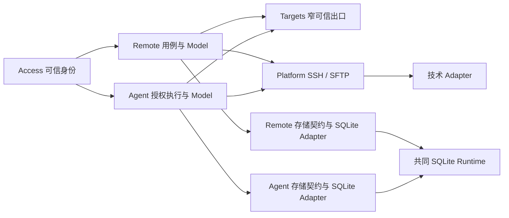

# 架构重构

本文记录前后端共享类型及 Backend 基础组件的整体重构设计。Access/Targets、通用 SSH 技术适配器、Remote 受认证最小 HTTP/WS 终端与 Agent 首个持久 Run 状态切片已有实现。最初审核的六项基础问题已完成源码修正，WebSocket 积压、SSH 正常 EOF 尾帧和释放错误等**部分专项验收通过**；异常 SSH 断线、主动关闭及重连回调的后续竞态也按模块边界修正，但仍需扩展真实故障和浏览器验收，不能宣称 A–D 全量通过。证据见[验收文档](testing/E2E.md)，剩余架构验收要求见本文末节，当前施工见[后端重构下一阶段实施方案](后端重构下一阶段实施方案.md)。新后端采用独立包、应用实例作用域的 SQLite Runtime 与业务模块装配，不承诺兼容旧数据或旧导入格式。现行产品职责以 [Frontend 架构](architecture/FRONTEND.md) 和 [Backend 架构](architecture/BACKEND.md) 为准；实施时同步更新正式架构文档及适用的开发规则。

## 类型归属与安全失败

类型及转换的强制约束以 [Backend 人工规则 4–7](architecture/BACKEND.md#人工规则区域)为唯一入口。内部复用应用类型已从 Service/Model 实现归入 Model 类型文件，双端 Remote 限额与错误取值由 Shared values 持有；SQLite 图约束引用 Targets 模块独立 owner。错误映射使用具名失败类别，Remote public 与 HTTP 均使用安全失败契约，技术 cause 保持私有。HTTP 技术职责拆分及关闭结果/失败证据的有界保留以 [Backend 架构](architecture/BACKEND.md)为准。

## 全局编码约定

后端及本轮重构的长期编码规范统一维护于 [Backend 架构与开发约束](architecture/BACKEND.md#全局编码约定)。职责、命名、类型、控制流、错误、异步资源、注释及格式均以该入口为准，不在迁移方案复制另一套规范。本文保留迁移设计及样板说明；Backend 的人工规则优先，冲突按该文档的规则维护方式处理。

## 全局模块出口约束

长期出口边界统一见 [Backend 类型与模块出口](architecture/BACKEND.md#类型与模块出口)及[职责与依赖边界](architecture/BACKEND.md#职责与依赖边界)。所有对象出入均采用逐字段允许清单，应用/存储转换与模块/协议出口转换分别保护不同边界；不因为当前字段一致合并转换，不因引用 Shared 类型直接透传内部对象。具体迁移任务在后续章节制定，不另立相反的出口规则。

## 基础组件整体重构（待实施）

本次调整覆盖 Backend 所有基础能力及其消费者，SQL 只是第一个样板。逐个能力迁移，最终让同一类调用遵循一致的依赖方向；不保留新旧入口长期并行。先盘点所有模块对数据库、SSH、文件系统、加密、网络与外部运行时的直接依赖，再按下表逐项替换。

重构以正常运行的产品结果和 `doc/USAGE.md` 的现行需求为验收基准；旧实现偶然形成的错误文案、异常处理和未发布兼容分支不机械保留。历史提交或现行需求明确指定的语义须保留，具体实现手段可以替换。

### 统一职责与依赖方向

```text
业务 Service → 本模块 Model → 本模块存储契约 → 本模块 SQLite Adapter
业务 Model ──────────→ Platform 通用机器能力契约 → 技术 Adapter
                                 ↑                    ↑
                           Bootstrap 安装实例并管理生命周期
```

- **Bootstrap** 读取配置、创建需要共享的运行时与具体 Adapter、安装能力入口、控制初始化和关闭顺序。它不做业务格式转换、SQL、SSH 或网络操作，也不集中构造所有业务模块的存储依赖。全局调整不表示所有对象都是全局单例：连接、会话、事务、Run 和操作句柄仍由各自 owner 创建与关闭。
- **业务模块 Model** 是该模块到存储或通用技术能力的入口，负责把应用对象与任务转换为所属契约所需的命令，并把结果校验、转换回应用对象；可薄封装一次能力调用。授权、业务规则与用例顺序仍由 Service 或其领域 owner 负责。模块之间调用业务能力应走所属模块的公开入口，不借基础组件跨越业务边界。
- **Platform** 只按通用机器能力定义接口、内部命令与结果、错误语义和生命周期约束，既不导入业务模块，也不依赖具体实现。它只能从 `packages/shared` 各域的 `values.ts` 精确子路径引入确需共用的基础业务取值及取值常量，不引入 DTO、完整业务对象或业务规则。避免把全部能力汇成万能接口或退化为 `unknown`、任意字符串的无类型调用。
- **技术 Adapter** 实现 Platform 的 SSH/SFTP、远端执行、文件、加密、SQLite Runtime、Guacamole、网络等契约，不反向导入业务对象；**业务模块 SQLite Adapter** 实现所属模块内的存储契约，负责本模块 SQL、行解码、引用约束及语义化事务，不放入 Platform。只有确实存在具体技术边界的能力才需要独立 Adapter，不增加空转层。

有多步原子性、资源所有权或重试语义的任务由对应业务模块的存储契约或通用 Platform 能力契约表达为一次完整操作，具体 Adapter 持有事务、连接或句柄；Model 不靠连续调用普通方法拼接原子操作。外部通知和其他不可回滚副作用在成功提交后由原业务 owner 处理。能力入口在安装前、关闭后明确失败；是否采用全局入口由生命周期决定，不能把请求级或 Run 级可变状态放进进程全局变量。

凭据加解密是当前明确的职责例外：Service 持有业务凭据保护规则并调用 Platform SecretBox，Model 只转换已保护的命令与密文快照。通用加解密实现不获得 Targets 类型，也不新增集中式业务凭据组件。

这里的 Backend 业务模块 Model 是应用到基础能力的转换入口；下文 `packages/shared` 中的 `model.ts` 只表示前后端共用的业务对象与纯规则，两者职责不同。

### 逐模块迁移范围

| 顺序 | 基础能力                                 | 首要边界与需要保留的 owner                                                                                                                      |
| ---- | ---------------------------------------- | ----------------------------------------------------------------------------------------------------------------------------------------------- |
| 1    | SQL 存储、迁移与事务                     | 所有现有 Repository 和 SQL 消费者迁至模块 Model → 本模块存储契约 → SQLite Adapter；多表提交由存储 Adapter 原子执行。细节见下文。                |
| 2    | SSH 连接、命令执行与远程文件系统         | 连接/Workspace/Agent 各自将目标与凭据转换成 Platform 的连接请求；SSH Adapter 持有底层连接和 channel，使用方持有会话或文件句柄的关闭责任。       |
| 3    | 加密、密码散列、Passkey、双因素与验证码  | 各业务模块保留凭据规则和授权；Platform 定义密码学或外部验证能力，Adapter 持有 Node/第三方实现及密钥运行时。明文与密钥不进入公共日志或共享 DTO。 |
| 4    | 通知与外部通信                           | 通知模块决定收件人与发送时机，Model 转换发送任务；Platform 定义投递结果与失败语义，渠道 Adapter 实现 SMTP、Webhook 等网络调用。                 |
| 5    | 传输、归档、Docker、浏览器与远程桌面     | 保留现有任务/会话 owner；Model 转换应用任务，Platform 约束流、取消、背压和资源释放，Adapter 隔离具体协议与库。                                  |
| 6    | Agent Provider、MCP、Plugin 与执行集成   | 保留 Run、授权、审批、lease、Plugin 生命周期 owner；只把外部 Provider/协议/进程能力放入 Platform 契约，不把 Agent 状态机下沉为通用基础组件。    |
| 7    | 系统信息、诊断、会话文件、备份与外部资源 | 按实际调用链补齐 Model 与 Platform 边界；进程采集、文件、远端服务由 Adapter 实现，诊断与备份的业务编排仍归原 owner。                            |

每处理一项，先列出当前调用方和生命周期，再确定该能力的 Model 输入/输出、Platform 契约、具体 Adapter 与 Bootstrap 安装点；同时迁移该项全部消费者，验证其公开行为、错误、取消、恢复及资源清理，最后移除旧端口、重复格式转换与装配代码。已有正确边界可保留，不为四层形式增加空转代码。下文的共享类型与 SQL 设计适用于全局；连接和 Agent 只是第一项的示例，不限定迁移范围。

## Backend 顶层业务模块划分（Access / Targets / Remote / Agent 首批切片已施工）

顶层模块依据**业务数据 owner、运行生命周期和跨模块消费者**划分，不按旧包目录、路由数量、独立 Service 个数或注册粒度拆分。未来新后端业务模块固定为以下八个方向（尚未实施的目录不创建空占位）：

| 顶层模块        | 内部功能与边界                                                                                                                                                                                | 数据及生命周期 owner                                                                           |
| --------------- | --------------------------------------------------------------------------------------------------------------------------------------------------------------------------------------------- | ---------------------------------------------------------------------------------------------- |
| `access`        | 用户、登录/会话、密码、Passkey、2FA、验证码、IP 黑白名单                                                                                                                                      | 谁可以进入系统；Auth/Session 的唯一 owner                                                      |
| `targets`       | SSH/RDP/VNC 连接配置、凭据、Proxy、SSH Key、标签、导入、目标解析、配置指纹、连接测试                                                                                                          | 连接到哪里和使用什么配置；内部 Proxy/SSH Key/Tag 可以独立管理、独立注册，但不是顶层模块        |
| `remote`        | `sessions /` SSH 终端、挂起/恢复、RDP/VNC 会话；`files /` 浏览/编辑/上传/下载；`transfers /` 跨服务器任务；`operations /` 远端命令/Docker/状态监控；`history /` 快捷命令、路径/命令历史与收藏 | 对远端做什么；Session、Transfer 与 RDP/VNC ticket 分别持有自己的生命周期，互不作为附属 Service |
| `agent`         | 对话、Provider、Run/StateCommit、审批/协作/Subagent、Memory、工具/策略、Plugin/MCP/ACP、Artifact、Agent SSH 与后台任务                                                                        | Agent 授权、durable 状态、执行、恢复的唯一 owner                                               |
| `preferences`   | 通用设置、Workspace 布局/显示偏好、外观、背景、HTML/终端主题                                                                                                                                  | 用户界面配置；运行中的 Workspace 会话不归这里                                                  |
| `notifications` | 通知配置、事件格式化、邮件/Telegram 等渠道投递                                                                                                                                                | 多业务事件的投递策略、队列与消费生命周期                                                       |
| `audit`         | 审计记录和查询                                                                                                                                                                                | 跨模块写入，独立数据与读取入口                                                                 |
| `system`        | 健康诊断、备份恢复、数据库管理编排                                                                                                                                                            | 管理性操作与全系统停机协调；恢复前协调 Agent、Transfer 和 SSH 会话                             |

`remote` 是产品功能容器，**不是共享巨型 Service**。SSH 终端 Session、Transfer Orchestrator、Remote Desktop Session 分别管理连接和任务的创建、取消、恢复与关闭，目录相邻不合并生命周期。前端现有 `filesystem`、`file-editor`、`file-preview`、`terminal`、`docker`、`status-monitor` 可继续按 UI/功能消费组织，不机械复制后端结构。

`targets` 为 Agent/Remote 提供目标配置、引用和指纹的公开能力；Agent 持有自己的授权和 Agent SSH 会话，`remote` 持有远程任务与终端/文件会话；真正的 SSH、SFTP、远程执行、SQLite、加密、Guacamole 和网络投递为 `platform` / 技术 Adapter，不定义 Connection、Agent 或 Workspace 的业务对象。Shared 按两端确实一致的取值、业务和协议语义分域，不按技术目录组织。

模块的内部 `register.ts` 可以细分 Proxy、密钥和 Tag 子功能；只有 `bootstrap/module-manifest.ts` 中的一级条目才代表独立业务模块。后续审查迁移时同时检查 Backend Service、HTTP/WebSocket、Frontend Feature 和 Bootstrap 消费者；不要根据旧命名反推 owner。

## 前后端共享类型重构（按大模块与子功能组织，目录与契约迁移待收口）

### 包与依赖边界

前后端共同消费且语义、表示一致的字段、有限取值、业务对象、业务结果及 HTTP/WebSocket 契约统一由 `packages/shared` 持有唯一定义。Frontend、Backend public 与 HTTP 不再各自声明同义对象或 wire 字段；不同表示的内部应用对象、存储记录和 UI 状态仍分别持有并显式映射。按语义对象组织，不为每个基础字段建立空别名，也不使用全局大对象派生全部契约。

当前结构按 Backend 大业务模块 owner 分目录，模块内再按实际子功能拆分；Connections、Proxies、SSH Keys、Tags、Host Keys 同属 Targets。普通 SSH 与 Agent 共同使用的目标对象只在 Targets 定义，不按调用者复制。已迁移的双端契约布局如下：

```text
packages/shared/src/
  access/{values,model,http}.ts
  targets/
    values.ts
    http.ts
    connections/{values,model,http,http-codec}.ts
    proxies/{values,model,http,http-codec}.ts
    ssh-keys/{model,http,http-codec}.ts
    tags/{model,http,http-codec}.ts
    host-keys/{model,http,http-codec}.ts
  remote/
    sessions/{values,model,http,events}.ts
```

Agent Runs/Approvals、Remote Files/Transfers 等随真实功能和新双端消费者迁移才创建子域。没有实际内容不创建空 values/model/http/events。下一批 Remote 文件契约及消费方迁移步骤见[下一阶段实施方案](后端重构下一阶段实施方案.md)的 N3。

- **values.ts** 只定义有限取值与取值常量，不依赖业务对象、HTTP、事件、数据库或应用模块。Platform 和业务 SQLite Adapter 仍只能精确引用确需共用的基础取值，不引入 Shared model/DTO。
- **model.ts** 定义双端同义同表示的业务对象和业务结果；共同字段由所属业务对象统一提供。只引用所属基础取值或确有组合需要的其他 owner 业务对象，不导入 HTTP/事件契约或构成域间循环。
- **http.ts** 代替含义宽泛的 api.ts，定义完整请求/响应、参数/公开错误语义和纯边界校验。HTTP 专用输入及 `{version,changes}`、`{items}`、删除/释放等外壳均在 Shared，不能仅共享内部 payload。响应对象与 model 相同时直接引用 model，不重新复制字段。纯解码确需拆分时采用所属 http-codec 精确出口，依赖单向指向 http/model/values，不再被 http 反向重导出。
- **events.ts** 定义所属协议消息、事件载荷与解码，引用基础取值和业务对象，不依赖具体 WebSocket 实现。HTTP 与事件相同的业务字段共用所属 model/values；不同语义分别定义，不汇成全局状态枚举。

Targets 域共同业务错误取值可归 targets/values.ts，HTTP 错误响应归 targets/http.ts；子功能引用它们，父文件不汇总所有子功能 DTO，避免父子循环。跨域公共能力只提升已证明有多个真实消费者且语义一致的内容，不建立收纳杂项的 common。

包 exports 显式列出实际存在的精确子路径，如 `@nexus-terminal/shared/targets/connections/values`、`…/model`、`…/http`。Frontend/Backend 不深层引用 Shared src，不设根 barrel、通配符或旧路径兼容别名。Shared 不依赖 Node、Backend、Frontend、数据库、HTTP 框架或 Vue，只包含同构安全类型、常量、纯函数及必要校验。

### 类型归属与转换

Shared 已有 Connections/Proxies/SSH Keys/Tags/Host Keys、Access 与 Remote Sessions 的真实双端契约；完整 HTTP 外壳、公开错误取值、容量和独立开发消费者已同步。ConnectionType 位于 targets/connections/values.ts，连接视图归同子域 model，HTTP 创建/更新/导入等专用输入归 http。应用结果与 HTTP 结果按实际语义归属，不以现有文件名代替判断；正式旧前端及其不同表示的协议仍待逐功能迁移。

Frontend 与 Backend 共同消费同一契约时直接引用或在自身公开入口转导 Shared 唯一定义，不再手写第二份。`Dto` 后缀可表达网络表示，但是否共享取决于真实双端语义，不取决于名称。前端 UI 草稿/展示状态留在前端，后端密文、存储命令、事务状态与 SQLite 行留在后端；内部格式不同继续执行 Model 转换，不能为了字段统一让 Shared 依赖 storage 或从带秘密的大对象自动派生全部 DTO。

模块对象进出继续逐字段白名单，HTTP/WS 继续按共享契约校验与序列化；引用相同 Shared 类型不等于可以直接返回内部对象，运行时解码也不能替代公开字段投影。必要的明文凭据仅作为写入请求进入模块，不回填公开视图、事件、错误或日志。业务权限、引用、Host Key 核对、事务和持久数据校验不迁 Shared。

Agent 的 App/Thread/Root Run 目前没有同表示的新前端消费者，契约暂留后端模块；旧正式 Agent wire 不自动成为新 Shared 契约。新前端真实接入后按子域迁移同义公开字段，冻结执行输入、可信秘密和授权上下文不因此公开。普通 Remote Session 与 Agent Run/审批/Tool 结果的状态和生命周期不同，分别归所属 owner，不复用彼此的授权或传输状态。

### 迁移顺序

先盘点旧 Backend、新 Backend、Frontend、Shared、Protocol 中每种字段的语义、表示及消费者，再按基础 values → Access → Targets 子功能 → Remote Sessions 递进。每个子功能同时完成 Shared 定义、完整 HTTP 契约、纯解码、后端公开映射、前端消费与精确 exports，不只移动现有文件或留下 HTTP 外壳/错误联合的本地重复定义。全部路径消费者还包括旧生产包中使用相同基础取值的代码及实际脚本/测试引用。

旧 API route:null、jumpChain 等与新表示不同，不强行合并为一个类型；保留有明确 owner 的不同表示与必要映射。旧生产入口、Store/Workspace 与双包在正式迁移前保留，新 Backend 不运行时导入旧 Backend/Protocol。已迁移 Shared 的平铺/api 路径、旧文件、失效导出和引用已清除，不保留兼容重导出。Protocol 中其它尚未迁移的正式契约继续按真实消费者迁移，所有正式消费者完成切换后才删除旧包。

## SQL 存储架构设计（Targets 存储已实现，后续模块沿用）

### 总体结构与归属

Bootstrap 按应用实例创建 SQLite Runtime、初始化 schema version，再通过模块 manifest 注册各业务模块。Platform 只拥有 SQLite Worker、排他事务队列、参数绑定和数据库生命周期等**通用机器能力**，不拥有 Connection/Proxy/Tag/Agent 等业务存储数据、契约或注册槽位。业务存储契约与记录位于所属模块。

```text
Bootstrap → Platform SQLite Runtime → v1 Targets+Access / v2 Host Keys / v3 Agent
Targets 管理 HTTP → Targets public API → Service → Model → Storage → SQLite Adapter
Targets Import Service → Import Model → 单条显式 tx → Connection/Proxy/Tag SQL
Remote HTTP/WS → RemoteSessionOwner → Remote Sessions → Targets 可信 SSH 能力 + Platform SSH
Agent 状态 HTTP → Agent public API → Scope/Run Service → Model → Storage → SQLite Adapter
                                                   └→ Run + Event + 幂等同一事务
```

### 当前 Targets 代码目录

```text
packages/backend-next/src/
  bootstrap/
    create-app.ts             实例初始化、密钥配置与关闭
    module-manifest.ts        顶层 Access/Targets/Remote/Agent 装配
    schema.ts                 唯一 v1/v2/v3 应用迁移顺序
  platform/
    storage/sqlite/
      sqlite-runtime.ts       Worker、排他队列、显式 tx、drain
      worker.ts               node:sqlite 与参数绑定
      schema.ts               通用迁移、签名与版本 marker
      worker-types.ts         Worker 请求、结果与未知数据解码
    security/secret-box.ts    通用 AES-256-GCM，不持有业务类型
    ssh/ssh-port.ts           通用 Machine/Shell/Command/SFTP 契约
    ssh/adapters/ssh2/        连接路由、Channel、Command 与 SFTP 实现
  modules/targets/
    migrations.ts             唯一 v1 初始 Schema 的业务 DDL 清单
    schema.ts                 Bootstrap 使用的迁移清单出口
    public.ts                 独立管理与可信能力契约
    public-mappers.ts         模块出入口逐字段转换
    register.ts               子功能和事务参与者装配，不执行 SQL
    interfaces/http/          管理请求解码、Access 鉴权、响应白名单
    host-keys/                SSH Host Key 公钥指纹信任、v2 DDL 与 SQL
    connections/
      service/                元数据用例、凭据校验与加密
      model/                  应用类型、存储命令和结果转换
      storage/                连接及密文存储契约
      adapters/sqlite/         DDL、CRUD、CAS、关系与凭据事务
    proxies/
      service/                代理管理与凭据加密
      model/                  应用类型、存储命令和结果转换
      storage/                代理存储与导入事务参与者契约
      adapters/sqlite/         管理 SQL、导入查找/插入与 DDL
    tags/
      service/                标签管理
      model/                  应用快照与存储结果转换
      storage/                标签存储与导入事务参与者契约
      adapters/sqlite/         管理 SQL、导入查找/插入与 DDL
    ssh-keys/
      service/                密钥管理与凭据加密
      model/                  应用类型、存储命令和摘要转换
      storage/                密文存储契约
      adapters/sqlite/         密钥 SQL 与 DDL
    import/
      service/                单条校验、逐条导入
      model/                  应用导入计划与存储命令转换
      storage/                单条导入和显式 tx 参与者契约
      adapters/sqlite/         Proxy/Tag/Connection 单条事务 owner
    resolver/
      service/                解密、组装可信机器连接参数
      model/                  密文快照转换与配置指纹
      storage/                密文目标快照契约
      adapters/sqlite/         同一事务读取目标及所有依赖
  modules/remote/
    public.ts                 最小 Shell 会话公开契约
    register.ts               Remote 业务生命周期装配
    sessions/model/           目标转换、机器能力调用与应用资源封装
    sessions/service/         会话准入、订阅、背压和关闭 owner
    sessions/service/session-owner.ts  Access token 绑定与独占 PTY
    interfaces/http/          受认证会话 HTTP 与 WebSocket 流
  modules/access/
    accounts/                管理员账号与密码摘要
    authentication/          登录校验及来源失败策略
    sessions/                持久 Session、撤销和登录计数
    interfaces/http/         登录、初始化、注销及改密 HTTP
  modules/agent/
    scope/                   App/Thread 归属的 Service/Model/Storage/SQL
    runs/                    Root Run 创建、取消、事件、幂等事务
    interfaces/http/         受认证的有限 Run 状态 HTTP
    migrations.ts            v3 Agent 业务表与索引
```

上述子功能均属于 Targets，不成为 `module-manifest.ts` 的平级业务模块。当前 Targets 管理 HTTP 已装配，可信 SSH 解析仍是单独的后端内部能力；Remote 已装配最小 SSH PTY HTTP/WS，Agent 仅有持久 App/Thread/Root Run 状态 HTTP，执行、审批与其它产品能力仍待独立施工。

### 当前 Targets 凭据与迁移

Platform 的 `schema.ts` 现在接收按编号的 `SchemaMigration[]`：其职责是验证版本历史、在每号独立事务中执行模块迁移并写入同一事务版本 marker。Targets 的 `migrations.ts` 负责完整 v1 Targets 初始结构；连接/代理/标签、Proxy/Tag `version`、加密 SSH Key、连接认证关联和 Proxy 密文表均由所属子功能的一版建表 SQL 创建。之前的未发布 v1→v2 字段合并迁移只是迁移/回滚试验，已撤回；**当前全库 v2 与其无关**，专用于 Targets Host Key 信任表。全库 v3 则安装 Agent App/Thread/Run/事件/幂等表。Bootstrap `schema.ts` 是全库唯一版本清单，模块只提供自身 DDL。`schema_version` 带签名，旧原型 v1 数据库将明确拒绝启动，避免同版本不同表结构被误认成兼容数据。SQL Runtime/Worker 不获得 Connection 或 SSH Key 业务类型；应用实例的加密能力由 `platform/security/secret-box.ts` 提供 AES-256-GCM，启动方必须显式传入 32 字节主密钥，代码不内置默认密钥。

Targets 的 Proxy、Tag、SSH Key 均已有真实的管理 Service/Model/存储契约与 SQLite Adapter；按实际业务复核后没有把旧 Proxy 私钥、旧路由 JSON 或旧认证字段无差别带入新表，RemoteApp 仅允许 RDP 配置；连接密码与 SSH Key 选择通过独立 ConnectionCredentialService 以 CAS 在 SQLite 事务内写入。Proxy/SSH Key 的数据库存储只含密文、公开列表和详情不返回凭据。引用与修改的保护由 SQLite 外键和写事务检查承担；代理、密钥的机器配置修改影响被引用 SSH 目标指纹，展示名称、备注、标签以及普通 CAS 版本不改变指纹；跳板链禁止环路和过深引用，克隆连接应同时克隆认证配置。

`targets/resolver` 的 SQLite 查询在单个事务快照中读取主连接、Proxy、SSH Key、凭据与全部跳板，Model 将密文快照转换为独立应用类型，并根据同一次读取中的机器配置、引用身份、密文及有序跳板生成 SHA-256 指纹，不包含普通 CAS 版本。Resolver Service 调用通用 SecretBox 解密并组装机器 SSH 连接参数；各写入 Service 负责加密。Model 不接收 SecretBox，不负责加解密，也不把存储类型作为 Service 的入参或返回类型。**解密结果只能在受信 Backend 内部的 `trustedSshTargets` 能力中传递**，绝不作为管理 HTTP 响应。普通 Targets HTTP 已经由 Access 会话授权，并逐字段返回非敏感连接、代理、标签、密钥摘要和已确认的 Host Key 指纹；新 API 使用 `direct/proxy/jump`，并不包装旧协议的 `route:null`。Shared 的管理契约已由新前端开发入口消费，旧 Frontend Store、旧 Protocol 和正式 Workspace 保持原样。通用 SSH 建连位于 Platform，Remote 提供受认证的最小 PTY；Agent 已有持久状态切片，执行调度、完整 Transfer 和远程桌面尚未迁移。

### 存储契约、模块装配与事务

`modules/targets/connections/storage/connection-storage.ts` 持有连接 CRUD、CAS 与元数据存储记录；`modules/targets/import/storage/import-storage.ts` 持有单条导入语义化存储契约；`modules/targets/proxies/storage/proxy-storage.ts` 持有导入所需代理数据。Connection Model 与 Import Model 分别接收本实例的只读 `ConnectionStorage` 和 `ConnectionImportStorage`，而不是 SQLite Runtime、Platform 注册表、完整业务数据库或通用 SQL 接口。Service 使用各子功能 `model/*-types.ts` 的应用类型，Model 输入和返回值独立于存储契约；字段表示相同时也逐字段构造存储命令和应用快照，列表、补丁、联合状态和嵌套对象同样转换。SQLite Adapter 做物理行解码，Model 按用例需要校验应用不变量。连接凭据的明文输入不放入 `storage/`，存储契约只接收密文或 Key 引用。

`modules/targets/register.ts` 负责装配 Connection SQL Adapter、Import SQL Adapter、Connection Model、Connection Service 与 Import Service，返回经过显式投影的管理 `publicApi` 及独立的可信解析能力；不会在注册文件中执行 SQL。普通 CRUD SQL 在 `connections/adapters/sqlite`，Proxy/Tag 的 SQL 与建表语句也各自在自己的 `adapters/sqlite` 下。Targets 的 `migrations.ts` 将 Proxy、Tag、SSH Key、Connection 和认证关系依外键顺序装配为单一 v1 Schema；`schema.ts` 只对 Bootstrap 转导清单。唯一单条导入事务 owner 是 `import/adapters/sqlite/import-sql.ts`：使用 Platform Runtime 的 `transaction(work)`，向 `ImportTransactionParticipants` 中连接、Proxy、Tag 的函数传递**同一个显式 `tx`**。注册文件把具体实现注入该端口，Import Adapter 不直接深层导入其他子功能的 SQL，也不通过 Service/默认连接重新开启事务。外键/关系失败回滚整条导入，多条按记录分别提交；审计后续在提交后执行。

应用关闭由 Bootstrap 同步停止业务准入，先关闭 HTTP/WS 并等待已接纳请求与传输任务收敛，再取消并等待 Remote 建连及已有会话，最后由 SQLite Runtime drain、终止 Worker 和释放路径；完整关闭 Promise 可被并发调用共享。Worker 退出、提交结果未知或回滚失败令数据库实例不可继续执行，进程内不同 DB 路径的实例彼此独立，禁止重复打开同一规范化路径。字段、SQL、表名仍只在业务 SQLite Adapter 和 schema 中；动态更新只采用固定白名单及绑定参数。当前同时包含密文凭据、可信目标解析、已确认的 SSH Host Key 持久信任（全库 v2）、真实 SSH Adapter、受认证 Targets 管理 HTTP、最小 Remote PTY HTTP/WS，以及 Agent 的 App/Thread/Root Run 持久状态 HTTP（全库 v3）；Remote Desktop ticket、Agent 执行和完整授权体系尚未实现。

### 技术 SSH 与 Remote 内部会话

通用机器契约位于 `platform/ssh/ssh-port.ts`，只描述主机、认证、代理/跳板路由、Host Key 验证回调、Shell/Command/SFTP 句柄、取消与关闭，不接收 Connection ID、Agent/Workspace 身份或业务指纹。具体 `platform/ssh/adapters/ssh2` 使用实际 ssh2 协议实现：直连、HTTP CONNECT、SOCKS5、有序跳板及每个跳板自身的 Proxy/Jump 路由，通过全局 deadline 与同一 AbortSignal 收敛每个转发 Socket 与 Client；所有资源从创建起持续监控错误/关闭，完整连接安装运行期监听后才解除建连监听。无 Host Key 验证策略不会静默接受连接。命令派发前拒绝已取消信号，原始及持续命令打开后继续监听取消；结果区分正常 0 退出、非零退出与取消/超时/断连未知。SFTP 回调请求默认 30 秒期限，请求和流均支持独立取消与期限；Lease 关闭拒绝待完成请求、销毁流并等待通道关闭。未派发失败为 `not_started`，已派发后取消或期限失败为 `unknown`，不把本地取消当作远端副作用回滚的证明。

`modules/remote/sessions` 是首次 SSH 机器能力消费者：Service 只接收 RemoteSessionModel，Model 持有 Targets 可信解析与 Platform SSH 工厂，逐字段构造与业务身份无关的 MachineEndpoint，并执行建连、Shell 打开和失败清理。Model 返回本模块独立定义的 RemoteSessionResource，封装输入输出、resize、背压、订阅与共享关闭 Promise，不向 Service 暴露 MachineConnection、MachineShell 或 Node Stream。Service 拥有开会话准入、不可变目标 ID/指纹绑定、订阅、取消晚到建连和关闭顺序；按 ID 保存关闭 Promise，即使活动会话已删除，并发关闭仍等待完整资源清理。输出在没有消费者时暂停，写入的布尔返回值表示背压，`onDrain` 可恢复生产。Bootstrap 当前装配 Access、Targets、Remote 与 Agent；开放受认证的管理、最小 Shell HTTP/WS 和 Agent 有限 Run 状态 HTTP 入口；关机先停止 HTTP/WS 并等待已接纳业务任务，再关闭 Remote PTY，最后关闭 SQLite。`app.remote` 仍是后端内部能力；公开访问必须经过 RemoteSessionOwner 绑定用户与登录令牌。Access 的基础认证与会话已实现；Agent 的状态创建/取消不等于实际执行，目标 grant/审批、Transfer 和远程桌面仍待施工。真实 SSH 服务器、Proxy、SFTP、断线与异常退出尚待单独协议验证，本批仅用静态检查/构建验收源码，不把编译通过视作 SSH 实机验收。

Targets 的安全模块错误 `TargetOperationError` 只携带稳定 `TargetErrorCode`。公共管理、可信解析和逐条导入均在模块出口映射，原始 SQL/Worker 消息不透出；Platform 的 `SqliteFailure` 保留技术错误类别及 `node:sqlite` 数值 `errcode`，按低 8 位分类并保留扩展码供模块识别外键错误，不使用通用 `ERR_SQLITE_ERROR` 字符串判定 SQL 类别。SSH 跳板图在写入时对变更节点和所有上游祖先验证环路、最多 16 引用边和最多 256 展开节点，Resolver 使用相同上限，主目标为深度零。

### Access 首批身份与会话

`modules/access` 拥有 `accounts/authentication/sessions`；账号与会话各有内部 Model、语义化 Storage 契约与真实 SQLite Adapter。`bootstrap/schema.ts` 是整个新包唯一迁移清单，尚未发布的 v1 在同一事务中组装 Targets 和 Access 的建表语句。账号初始管理员通过排他事务确认用户表为空才创建；密码使用 Platform 的版本化 scrypt 加盐散列，认证失败由 Access 管控，哈希和会话 token 不进入公共账号视图或日志。Accounts Storage 的初始化账号命令与 Model 应用命令为独立类型，即使字段一致也逐字段构造。登录失败封禁由 Access 业务策略决定：默认关闭，明确启用后对公网执行可配置阈值与时长，内网（包含 IPv4 映射）不受封禁；SQLite 只负责事务化计数。会话标识由 Node 密码学随机源生成，仅存摘要，登录签发新令牌并在同事务撤销旧令牌；验证同时复查期限与密码散列修订，修改密码在同一事务更新散列并撤销全部该用户会话。

`platform/http/http-server.ts` 提供有界 JSON 请求及保留 400/413/415 的传输错误、监听及已接纳业务请求 Promise drain、固定 external origin、受信代理源 IP/转发 host/proto、来源/Fetch Metadata 校验和 HttpOnly/SameSite cookie 的技术能力。Platform 传递 query 参数，由模块路由白名单验证；目前 Access 路由拒绝全部 query。关闭时停止接纳并断开 HTTP 客户端，不会把已经开始的密码散列/事务当作取消完成，必须等待所有已接纳任务后才释放 SQLite。Access 自己的 `interfaces/http` 安装 `needs-setup/setup/login/status/logout/password` 路由，严格从 `unknown` 验证输入；HTTP 不接 SQL。Access、Targets、Remote 与 Agent 的有限状态 HTTP 已注册；未认证访问受保护入口会被拒绝，Agent 执行路由尚未实现。首次管理员无部署 token，必须在受控网络完成初始化；独立入口需显式提供外部 Origin、数据库及 32 字节应用密钥，默认只监听 loopback。已启用却尚不支持的 TOTP/Passkey 因素会拒绝新的密码登录，不生成部分认证视为完全认证；余下 Passkey/TOTP/CAPTCHA、可配置 IP 黑白名单属于 Access 后续扩展，不能宣称完整认证迁移。

`app.access` 仅提供是否需要初始化及令牌→完整身份只读契约，原始登录会话令牌只在 Access HTTP 安装器中作为 `Set-Cookie` 使用。Bootstrap 停机先关闭 HTTP 接纳及等待已接纳请求（即使客户端已断开、业务尚未完成），随后关闭 Remote 和 SQLite；各阶段失败保留并聚合。新系统独立监听不替换正式 Backend，不在未经授权的 Targets API 上接受身份自报。身份、来源安全、会话撤销及停机竞争仍需完整行为验收，已有专项证据不能代表整个 Access 已通过。

### 后续模块边界

Targets 负责安全连接/标签/代理/SSH Key 管理、目标解析、配置指纹、连接测试及 RDP/VNC **连接定义**，但不持有 SSH 会话、远程桌面票据、跨服务器传输任务或 Agent grant/审批。Remote 负责独立的 sessions/files/transfers/operations/history 子能力与各自资源生命周期；Agent 保留 Run、权限及恢复。Preferences 管布局和外观持久数据而非远程会话；Notifications/Audit/System 各自负责投递、审计、维护协调。共享有限取值如 `ConnectionType`、`ProxyType` 留在 Shared 的精确子路径。

### Agent 存储接口

Agent 模块在自身目录定义按职责划分的对话、Memory、配置、Plugin、Run 等存储契约；Agent Service 把要推进的状态交给本模块 Model，再调用模块内的语义化状态提交接口。一次提交在同一个显式 SQLite 事务中读取最新持久状态、执行 Agent 拥有的状态决策、检查版本及其他前置条件，并原子更新 Run、步骤、Tool、审批、事件及幂等记录中相关的部分。事务内存储参与者属于 Agent 模块；Platform 只提供通用 `transaction(tx)`，Model 不直接获取通用 SQL 执行器。

Run 快照和事件读取与状态提交分开。Agent Service 发起状态转换；Agent 模块拥有业务决策与应用映射，SQLite 实现负责事务内读写及持久化条件校验；提交成功后的调度、通知和外部资源清理由 Agent owner 根据转换后的提交结果处理。Agent 的运行时状态不能拆成多个独立的表级全局调用。预先生成提交计划再以多对象版本条件写入是可选方案，实施前须证明其并发条件完整，不作为当前默认前提。

### 初始化、事务与生命周期

Bootstrap 为每个应用实例创建并初始化 SQLite Runtime，完成模块 schema 初始化，并调用各业务模块 `register` 创建只读存储能力与公开用例，最后启动 HTTP、WebSocket 和 Agent 调度。关闭和数据库重置由同一实例生命周期 owner 管理；关闭后的存储调用明确失败。同一规范化数据库路径不得被同进程的两个应用实例同时打开。

普通操作由各域 Model 调用该模块构造时接收的只读存储契约；跨多表、跨子功能的原子操作由对应模块的语义化 `commit` 方法持有完整事务。事务内所有读写使用同一事务连接，不通过默认入口执行，也不依赖隐式异步上下文切换事务。数据库提交完成后才发布外部事件或执行通知。

### 实施边界

盘点全部现有 SQL 消费者，按业务域替换数据访问入口，避免 Repository、Model、Adapter 长期并存为重复调用链。SQL 方言及原始 SQL 字符串只留在 `sqliteAdapter`；应用对象与存储内部类型的双向转换归各域 `sqlModel`，数据库行与存储内部记录的物理映射归 `sqliteAdapter`。验证覆盖各域现有持久化行为、跨表事务和恢复；连接 CRUD 与导入回滚、Agent Run 与审批并发提交是重点样本，不代表全部迁移范围。设计落地前不将本节描述为现行架构。

### 旧生产 SQL 盘点与后续迁移要求

现行 Bootstrap 的 `composition-root.ts` 实例化大量 SQLite Repository，再逐个传给业务 Service；`compose-agent.ts` 继续接收底层 `RelationalDatabase`，自行构造 Agent Repository 与 StateCommit。`DatabaseAdapter` 通过一个 Worker 和排他队列保证事务内操作不被普通查询穿插；它拒绝嵌套事务。现有事务所有权和业务类型跨层情况如下，重构不能仅改类名或移动文件。

| 范围                           | 现行结构与风险                                                                                                                                                                                              | 新结构必须满足                                                                                                                                                                                                                                                                                    |
| ------------------------------ | ----------------------------------------------------------------------------------------------------------------------------------------------------------------------------------------------------------- | ------------------------------------------------------------------------------------------------------------------------------------------------------------------------------------------------------------------------------------------------------------------------------------------------- |
| Targets 连接、代理、密钥与导入 | `SqliteConnectionRepository` 直接使用连接模块类型；导入 Adapter 在事务内构造 `ProxyService`、`SshKeyService`、`ConnectionService`，并用可“加入”外层事务的包装数据库规避嵌套事务失败。                       | 业务 Service 完成规范化、凭据保护与导入计划；Connections 内部 Model 转换为存储命令；一次 `connections.import.commit` 用同一事务连接处理单条内联 Proxy、Connection 和标签，检查现有 SSH Key 引用，不在 Adapter 中重建业务 Service。保留逐条导入成功/失败语义；审计不作为使业务回滚的事务前置条件。 |
| 连接读取与补丁式容错           | 连接 Repository 在同一文件中映射 SQLite 行、存储记录和公开对象；`jump_chain`、`rdp_options` JSON 解析失败会退成 `null`。`list/get` 的连接与标签读取分开，可能观察到不同提交时刻。                           | SQLite 层返回存储记录，连接 Model 严格校验并构造应用对象，公开字段由业务/API 边界选择；明确历史损坏数据的处理策略。需要一致快照的多查询读取保持同一事务，不能靠默认值掩盖无效持久状态。                                                                                                           |
| Agent Run/状态提交             | `SqliteStateCommitAdapter` 和 `state-commit/*` 在事务内同时执行 SQL、读取应用命令、计算状态转换、更新事件/账本/审批/幂等记录，并向应用观察者返回 `RunView`。若直接替换成表级 CRUD，会丢失原子性和恢复语义。 | Agent Service/Model 持有状态决策与应用映射；存储契约保留按操作定义的原子提交、版本/CAS、幂等、事件序号、预算、审批、lease 与恢复前置条件。事务内全部读写和持久化校验由 SQLite 实现；提交结果经 Agent Model 映射后再通知 owner。                                                                   |
| Agent 其他存储                 | Run 查询、会话、Memory、Plugin、App Storage、Subagent 等 Repository 直接导入 Agent 模块类型，多个方法各自持有事务；App Storage 的配额和版本检查也在事务内。                                                 | 按真实 owner 拆分存储契约；只把应用类型映射移到各自 Model，保留配额、版本、授权范围及跨表条件在原子提交中的校验。不得把全部 Agent 数据归到一个巨型 Adapter。                                                                                                                                      |
| 数据库管理与备份               | Schema/migration 由数据库启动流程直接运行；备份 Adapter 按物理表、敏感列与文件目录做快照和恢复，恢复前后还需停用 Agent、终端及传输。                                                                        | 保持 Schema、迁移和备份/恢复为专门的数据库管理能力；物理表格式不伪装成普通业务对象。恢复前的 quiesce、数据库提交、文件切换与恢复后初始化顺序必须保留。                                                                                                                                            |

旧生产 Backend 的连接导入接受旧格式 JSON，部分新格式解析仍使用类型断言；这是旧包盘点结果，不是 backend-next 当前实现描述。第一版新后端不兼容旧导入格式，只在输入边界严格校验新版格式，生成应用导入计划；实施时同步更新正式需求和相关 E2E。备份和 Agent App Storage 等涉及任意持久化 JSON 的路径同样需要有界解码，不靠 TypeScript 行类型或 `JSON.parse() as T` 声称数据已验证。

### 当前实现与下一阶段

`packages/backend-next` 已施工 A–D 四批最小切片：Access 账号/会话及认证 HTTP；Targets 管理、凭据、可信 SSH 解析、Host Key 信任与 HTTP；Remote 最小 SSH PTY HTTP/WS；Agent 的 App/Thread、Root Run 幂等创建、取消、事件分页与全库 v3 持久事务。Shared 仅承载已经存在真实双端消费者的契约。部分真实 HTTP/WebSocket、SSH2 和存储专项已通过，完整并发、权限、故障及浏览器行为仍未全部验收；证据与验证入口见[验收文档](testing/E2E.md)。审计、结构化日志、Access 剩余因素/网络配置、正式前端切换、Transfer、远程桌面和 Agent Provider/执行/审批/恢复仍按各自 owner 实施。

旧实现仅供盘点正常产品语义，不能当成新代码的运行依赖；后续全部功能完成前不让新包承接正式流量。最后一次性切换入口、删除旧包并将新包归位。

### 后续施工必须保持的边界

- **Agent 的事务内状态决策。** 采用 Agent 模块拥有的状态规则和事务内存储参与者，在 Platform 的同一个显式 `tx` 中读取最新状态、决策并写入；应用 Model 不直接获取 SQL 执行器。事务回调不能等待外部资源。预生成计划是可选优化，使用前必须逐项证明 Run、App、Thread、Approval、Subagent 和幂等记录的并发约束。
- **数据库管理操作。** Schema/migration、E2E 重置和整库备份/恢复没有普通应用对象，也不适合通过每个业务模块的 `sqlModel`。建议由 Bootstrap/Backup owner 使用独立的 Platform 管理契约；只让普通业务读写遵循 Service → Model → `sqlAdapter`。这是基础管理能力的边界，不要求为没有应用对象的管理操作增加空转 Model；备份产品的完整恢复契约仍在 System 批次设计。
- **实例边界已定。** 新包 `createApp` 是可调用的工厂，恢复/E2E 重置也会改变数据库状态；采用应用实例作用域的能力入口，不使用进程级单例，业务模块仍不逐个注入具体 SQLite Repository。
- **损坏持久数据的处理。** 旧生产连接 JSON 失败时静默退为 `null`，旧 Agent durable decoder 多数失败即报错；新包坚持严格解码，不照搬这些容错分支。严格解码能暴露损坏但可能改变旧数据的读取结果；迁移时按已发布数据格式和恢复要求确定是否需要一次性修复，不能保留无期限的静默默认值。

## HTTP/WebSocket 接入与协议长期约束

### 模块安装与调用方向

```text
Platform HTTP/WS 监听 → 模块 interfaces → 模块公开输入转换 → Service
Frontend Feature/Runtime → 自己的 API/Transport → Shared 公开协议
Bootstrap → 模块 register 的路由安装入口与模块生命周期
```

入站接口是外部输入到业务用例的边界，不是 Service → Model → 存储链上的新增一层。模块 `interfaces/http` 持有路由、参数解码、身份与权限检查、公开响应和安全错误映射；不直接执行 SQL 或组装私有 Storage。模块内的 Service、Model、SessionOwner 及 HTTP/WS 工厂由自己的 `register.ts` 组装，Bootstrap 只连接 Access/Targets 等窄公开依赖并安装返回的通用路由。Platform 不持有业务路由清单、业务消息分发槽位或 DTO。

`interfaces` 表示接入适配，不表示 TypeScript interface 类型文件。目录只按实际存在的协议拆分，普通接口文件不机械增加 Model 或全局分发层。公开对象继续经过模块字段白名单；HTTP 协议层再次构造允许公开的响应，不借 Shared 类型直接返回内部对象。

### HTTP、Shared 与错误边界

完整 JSON 请求的 UTF-8 容量预算属于 Shared HTTP 契约，基础值放在所属 `values.ts`，两端共同消费；字段长度与完整 body 上限分别约束，预算包含外壳及转义。前端发送前校验实际编码字节数，模块 HTTP 路由将同一预算传给通用 Platform，Platform 只保留技术默认值、硬上限及执行。Targets 的 Connections/SSH Keys 为 128 KiB、Proxies 为 64 KiB、Tags/Host Keys 为 16 KiB；连接导入同时限制 50 项及 128 KiB 总量，超限先拆批。共享删除响应只在 targets/http.ts 定义，模块 HTTP 响应外壳用共享类型或 satisfies 约束，不能只定义无人使用的契约；同义基础错误码直接引用 targets/values.ts。

当前独立实例提供 `/api/v1/auth`、`/api/v1/targets`、`/api/v1/remote` 和 `/api/v1/agent` 的有限入口；正式服务仍由旧 Backend 提供。新前端开发入口 `/__targets-next` 通过显式配置的 Vite `/__next` 代理调用新实例，Public Origin 与浏览器来源一致，新记录和登录态不混入旧 Workspace/Store。API 版本与后续演进由协议 owner 明确维护，不用旧 wire 兼容壳掩盖表示差异。

Platform 拥有监听、固定 Origin、受信代理、来源/Fetch Metadata、JSON body 上限、cookie 读取及 HTTP/WS 生命周期等技术能力。非法 JSON、过大 body 和不支持的 Content-Type 分别保留 400/413/415；业务模块仅映射自己的错误，不能统一吞成 500/503。Path/query/header/body 从 `unknown` 或原始文本解码；每个路由明确必填、可选、重复参数和未知字段规则，分页与 cursor 的语义归业务模块。鉴权身份从 Access 服务端会话取得，不接受客户端自报 owner；当前管理切片只支持首次管理员，不能据此宣称完整角色体系已迁移。

Shared 仅持有同义同表示的双端基础取值、业务对象、请求/响应、事件和纯校验。HTTP/WS 公开响应与事件不包含密文、私钥、会话摘要、SQL 行、授权上下文或内部事务；密码、私钥等明文凭据仅作为必要的变更输入进入所属模块，不回填或记录到错误。模块公开契约与应用/存储契约按各自边界转换，基本状态取值无需额外包装；可辨识联合必须保留状态与载荷的对应关系。相同结构的两端解析规则应共用同构校验；只在一端存在的权限、业务不变量和存储校验不迁 Shared。当前 Agent 状态接口没有同表示前端消费者，其协议暂归后端模块；接入真实前端时才迁相应契约，不能用占位 UI 制造共享需求。

更新通过明确的 `{version, changes}` 保留 CAS，省略表示不修改，null 仅用于允许清除的字段。导入维持最多 50 条、按条事务与部分成功结果。公开错误只暴露稳定安全码，保留认证失败、无权限、未找到、版本/引用冲突与基础能力不可用的差别，不输出 Worker/SQL/SSH 原始异常。Frontend API/Transport 解码响应后再交给 Feature/Runtime；UI 将稳定错误码转为现有三语言 i18n，不展示技术异常正文。协议公共错误与业务状态不能混成一个大枚举。

### WebSocket、会话与关闭

Platform 提供有序、有界的通用文本消息通道、发送背压、正常关闭与强制终止；不解析 Remote/Agent frame。当前单帧 64 KiB、发送缓冲 1 MiB，每连接待处理及处理中消息累计最多 64 条/256 KiB，超限明确终止；队列、升级鉴权和已接纳任务纳入停机等待。限制单帧不等于限制累计积压。正常 `finish()` 有界等待 1000 Close 握手，强制关闭用于撤销、错误及停机；握手未确认不能当成成功。

Remote 拥有 PTY 消息语义、32 KiB 输入限制、128 KiB 未确认输出窗口及独立 128 KiB 待发队列。`consumed` 表示 terminal.write 已完成后的字节确认，不能以收到 WS 帧代替渲染完成；超额 ACK 拒绝。正常 EOF 停止输入，允许原有效 owner 收尾，最多等待 10 秒，再发送 closed 和执行最多 5 秒正常握手。退出期间已读输出的授权不依赖 PTY 仍在活动集合，但新输入必须有 live PTY，不能对已移除会话继续 pause/resume。

技术 SSH 通道和连接关闭原因由 Platform 提供；Remote Model/Service 映射为模块 `public.ts` 唯一定义的 `RemoteSessionCloseReason`（`normal/disconnected/cleanup_failed/closed_by_owner`），公开签名不导入私有 Model 类型。仅 normal 走 EOF drain，断线或清理失败返回安全 remote_unavailable，主动关闭不伪造正常 SSH 退出。正常、取消、撤销和停机是不同路径，不能靠多个无约束布尔值或统一 onClose 丢失原因。

SessionOwner 绑定用户和 Access token 摘要，每个 PTY 只允许一次 WS 接入，未接入 30 秒回收；当前不提供挂起、接管或恢复。重复释放共享同一次清理 Promise 和失败；相同 Access 会话的重复 DELETE 在限量 128 条、120 秒已释放结果窗口内确认原结果，未知 ID/其他 token 拒绝。读取只清理过期记录，新增后超过容量才淘汰最旧项，不能为了查询预留容量。该缓存是实例内关闭确认，不是持久幂等库，也不承担 Agent Run 的恢复。

Frontend Transport 持有 Socket、frame、ACK、AbortSignal 和共享关闭 Promise；组件只持有展示资源。Terminal、Observer、渲染任务与监听由所属连接 generation 创建及释放，迟到成功也清理，旧失败/关闭回调不能覆盖新连接。异常断开不等待已经无法推进的渲染；释放展示资源时解除 pending render。无法确认的 DELETE/关闭失败保留可见错误，不吞成成功。

### 数据库、HTTP 与资源生命周期

停止业务准入后，Bootstrap 先关闭 HTTP/WS 并等待已经接纳的业务任务，再取消/等待 Remote 建连及资源释放，最后关闭 SQLite；失败仍执行后续释放并聚合。客户端断开不能证明 scrypt 或已开始的事务已经取消。模块只拥有自己创建的资源，失败和晚到成功同样释放，所有关闭入口共享完成与失败结果。Agent 后续调度、Provider 和外部工具也必须在数据库关闭前停止准入并 drain。

Access 会话最长 30 天有效，不等于到期即物理删除；目前访问失效记录时删除，未安装全量扫除。登录失败策略归 Access，默认关闭，明确启用时对公网执行，内网跳过；SQLite 只负责原子计数。Host Key 信任归 Targets，必须由操作员通过独立可信渠道核对 SHA256 后确认，各级目标与跳板均验证；配置指纹与 Host Key 不混用，不采用默认信任。信任删除/轮换影响新建连接，当前不会自动关闭已有 SSH 会话。

## SSH 与 Agent 共用基础能力设计

本节将普通 SSH 应用与 Agent 放入同一套 Backend 架构，按实际代码和旧产品消费者梳理共同技术能力。属于待实施设计，不表示新 Agent 执行、文件能力或恢复已实现；具体施工仍由下一阶段方案安排。Agent 权限、预算和恢复规则以 [AGENTS.md](AGENTS.md) 为准，本节只补充跨模块的能力归属与接入边界。

### 共用范围与调用方向



Bootstrap 安装实例、连接公开依赖并编排生命周期；它不成为图中各业务调用的中转者。

这里的“普通 SSH”是 Remote 终端、文件与任务等应用能力，不是另一个 SSH 技术平台。Agent 遵循同样的 Service/Model/Platform/Adapter 边界；内部的 Run、执行、授权、审批、上下文和恢复仍按职责拆分，不要求复杂执行流程全部挤入一个 Service 或机械建立大量 Model。

共用的是技术实现及其契约，不默认共用活动连接、PTY、任务、会话状态或授权。共同基础类型由 Platform 自己定义，不接收 `ToolContext`、userId、App/Run/ToolCall ID、Connection DTO、审批对象或业务配置指纹。所属模块的 Model 将已授权的应用任务转换成技术参数，返回结果再映射为本模块语义。跨模块对象继续通过窄公开契约及字段白名单，不绕行全局分发器。

### 逐模块能力归属

| 模块 / 能力                     | 当前基础                                                       | 共用方向与后续需要                                                     | 不下沉的职责                                                                   |
| ------------------------------- | -------------------------------------------------------------- | ---------------------------------------------------------------------- | ------------------------------------------------------------------------------ |
| Access                          | 账号、密码验证、会话摘要、签发/撤销、认证 HTTP                 | 向两侧提供可信服务端身份；完整因素、角色及会话失效传播策略仍归 Access  | Agent grant/审批/预算不由普通登录权限代替                                      |
| Targets                         | 连接/Proxy/SSH Key/Tag、可信 SSH 解析、配置指纹、Host Key 管理 | 提供两侧可消费的窄目标事实与信任校验出口，避免重复解析跳板和信任规则   | 不持有活动 SSH、Agent ToolCall 或用户终端任务                                  |
| Platform SSH                    | 路由建连、PTY、non-PTY command、有界 execute、SFTP lease       | 共用连接/channel/SFTP 实现，补齐真实消费者需要的命令表示与文件技术契约 | 不选择目标、不授权、不定义 Agent Job/恢复状态                                  |
| Remote                          | 单 owner PTY HTTP/WS、token 绑定、背压、关闭                   | 后续文件/传输/命令任务继续调用共同 Platform；各自持有资源和任务        | 不成为 Agent 的通用后门，不借用户 PTY 执行 Agent Tool                          |
| Agent                           | App/Thread、pending/cancelled Run、事件、幂等与 CAS            | 执行接入同一 Targets/Platform/SQL；自行持有调度、Tool、验证与结算      | 不复制一套 SSH connector、数据库 Runtime 或独立业务 Bootstrap                  |
| Platform SQL                    | Worker、绑定参数、排他事务、错误、提交未知                     | 普通 SSH 与 Agent 同实例使用；业务表和语义提交仍各归模块               | 不持有 Run 状态机、业务表级全局接口或 Agent 调度                               |
| Platform Security               | SecretBox 与 PasswordHasher                                    | 各域 Service 共用密码学实现，用自己的 scope 区分凭据用途               | Provider/Targets 凭据规则、授权与密钥轮换流程不混成全局业务组件                |
| HTTP/WS 与 Shared               | 通用监听/通道；Targets/Remote 真实双端契约                     | 共用传输与安全来源边界，消息及重连语义由各模块定义                     | Agent 持久 cursor 与 Remote 字节 ACK 不合并；无新 Agent 前端时不造 Shared 空域 |
| Provider/MCP/ACP/Browser/Plugin | 旧包已有真实消费者，新包尚未迁移                               | 按消费者迁移网络、协议、进程等技术 Adapter；ACP 复用 non-PTY SSH       | 模型预算、Tool 治理、插件贡献/安装、Browser 授权留所属业务模块                 |
| Artifact/Memory 与系统能力      | 旧包已有持久化与文件实现，新包尚未迁移                         | 共用本地文件/散列/归档等机械能力，保留独立存储契约                     | Artifact quota/保留/归属、Memory 发布审核和备份协调不塞入通用文件接口          |

### Targets 与 Access：身份、目标与信任

当前 [TrustedSshTargetResolver](../packages/backend-next/src/modules/targets/public.ts) 已提供 `fingerprintStored/resolveStored`，包含后端可信明文建连结果；管理 HTTP 不开放它。目标解析属于 Targets，Agent 不再重写连接/Proxy/Jump/凭据读取逻辑。建议补充不含凭据的目标检查出口，供 Agent inspect/授权使用；执行时通过带 expectedFingerprint 的可信解析，在同一解析快照上比对冻结指纹后才交出必要凭据。现有分别调用 fingerprintStored 和 resolveStored 不能自行证明两次读取之间配置未变，也不应由 Agent 重建 Targets 的指纹算法。Agent 冻结并在实际执行边界复查目标配置；发现变化后拒绝过期操作或重新走授权，不静默重绑到当前连接。

当前 [RemoteSessionModel](../packages/backend-next/src/modules/remote/sessions/model/session-model.ts) 读取 Host Key 列表并组装校验回调。Agent 接入前，应将两侧共同需要的信任快照/核对规则收口到 Targets 的窄可信出口；具体选择“解析结果附带信任快照”还是“独立信任校验能力”需结合消费者确定，不让 Platform 查询业务库，也不给 Agent 全量 Host Key 管理权限。配置指纹用于判断配置是否变化，服务器公钥指纹用于验证远端身份，两者独立；目标及每级跳板均核验，缺少信任不能默认放行。

Access 返回服务端真实身份，不信任请求自报 owner。Remote 绑定用户登录会话；Agent 绑定自己的 user/App/Thread/Run，并检查 grant/policy/approval/lease。注销、密码变更、App 禁用、取消 Run、配置变更各有明确影响范围；具体是否停止既有执行由产品规则和业务 owner 决定，不能把 token 消失或网页关闭直接解释为远端操作已撤销。

### SSH 与命令：资源隔离、输入和结果

当前 [MachineConnection](../packages/backend-next/src/platform/ssh/ssh-port.ts) 的 `openShell/openRawCommand/execute/openSftp` 可作为两侧共同基础。PTY 用于用户交互；普通命令和 ACP 使用独立 non-PTY channel。`execute` 是有期限、有输出上限的收集操作，`openRawCommand` 是流式 channel，不是无意义兼容别名。两者必须明确创建、结束、取消、退出结果、stdout/stderr 及关闭责任。

初期两侧独立拥有活动连接和 channel，避免 Agent 取消关闭用户终端，或单个文件任务破坏另一任务。只共享实例作用域的工厂与技术实现。确有性能需求时才设计连接池；复用键须包含实际 endpoint、认证、路由和信任条件，lease/refcount、失效与最后关闭有明确 owner，不按 host 或 connectionId 简单复用。

建议在真正接入命令/ACP 消费者时补齐具名的 argv 与 shellScript 输入、cwd、取消及整个操作期限；argv 字面值在技术边界安全引用，shellScript 明确承认 Shell 语义。不能让 Remote 与 Agent 各自实现不一致的命令拼接。现有 string 命令接口并非现有缺陷，不能未迁消费者就删除；最终迁移时同步替换实际消费者，不保留永久双轨兼容入口。

技术结果区分完成、非零退出、未派发失败、派发后 unknown、截断和连接/channel 原因。退出零只证明进程报告成功，业务效果由用例验证；取消/超时/断线不证明远端没有副作用。Agent 后台 Job 的持久身份、operation identity、状态查询、预算和恢复归 Agent，Platform 只提供命令句柄和技术结果。长任务不依赖 HTTP/WS 活着，不重新派发结果未知的命令。

目前 openRawCommand 建立阶段的失败仍可能抛普通 Error，client.exec 已调用后、取得句柄前的超时/断线不能当成 not_started；接入 mutation 前需明确派发阶段的失败契约，不能只对拿到 MachineCommand 后的 outcome 做分类。当前连接主动 close 也发出 disconnected 回调，Remote 通过关闭前退订区分；Agent 接入时必须持有自己的关闭原因，或在确有共同消费者需要时扩充技术原因契约，不把主动取消误记为远端故障。

### 文件与传输：先补机械保证，再定义业务任务

现有 [MachineSftpLease](../packages/backend-next/src/platform/ssh/ssh-port.ts) 支持 stat/lstat/list/read/write/rename/remove/mkdir/rmdir，尚不能等同于完整 Agent 文件契约。应随真实文件消费者确定并补齐：路径规范化与远端 canonical path、符号链接行为、有界目录枚举与遍历、读写 byte 上限、排他创建、替换/rename 的覆盖与原子性保证、必要的 chmod/远端扩展支持和能力不可用结果。远端路径采用远端语义，不能使用宿主 OS 路径规则替代。

`list()` 当前完整 readdir 后返回数组；事后截断只限制返回条数，不能证明远端扫描和本地内存有界。大目录需要真实受限的读取/遍历策略；读取偏移、条目/字节/深度/总扫描量、截止时间和取消在整个任务范围内累计，不在每个子操作重置。

路径授权、预期配置指纹、expected SHA256、写入/移动/删除前置条件、变更审批和结果核对仍由 Remote/Agent 各自用例持有。相同的路径/散列/流复制等纯机械算法在出现真实共同消费者时收口到对应技术 owner，不把旧 Agent `ToolContext` 文件 Adapter 整体搬入 Platform，也不让 Agent 为复用算法调用 Remote 私有 Service。

“先读 hash，再写文件”存在检查与写入之间的竞争；临时文件 rename 的原子替换不等于带条件的文件 CAS，也不等于落盘耐久或没有符号链接竞争。需要明确服务端支持范围、锁的覆盖范围及不可提供的保证。不支持所需保证时明确拒绝或暴露实际结果，不用客户端锁宣称隔离远端所有写入者。多文件写入、跨服务器传输与 SQLite 不是一个事务；任务持久化、外部操作、核对和结算分阶段，允许的部分完成/unknown 由所属业务任务表达。

迁移旧消费者时还需核对以下已有差异，不照搬为新基础契约：

- 旧普通文件 [remote-path](../packages/backend/src/platform/filesystem/remote-path.ts) 保留 POSIX 合法反斜杠，旧 Agent [文件 Adapter](../packages/backend/src/infrastructure/agent/capabilities/ssh-file-target.adapter.ts) 会将其替换为斜杠。两侧路径解释与 resource identity 必须采用同一机械规范，业务 hard-deny 独立检查。
- 旧 [FileCapabilityService](../packages/backend/src/modules/agent/capabilities/file-capability.service.ts) 并行读取 stat/hash 与内容，变化中的文件可能让 hash 和内容不对应。需明确 hash 代表完整文件还是所读范围，内容与其证据来自同一读取或显式一致性核对，不宣称普通 SFTP read 提供事务快照。
- 旧单文件替换存在扩展 rename 不支持时的备份/多次 rename 降级，旧多文件 patch 逐个替换；不能继承“始终原子”的假定。新用例分别表达能力不支持、部分提交、结果未知和核对。
- 新 [SFTP Adapter](../packages/backend-next/src/platform/ssh/adapters/ssh2/ssh-sftp.ts) 尚未显式校验读范围的安全整数/次序，强制关闭路径在两秒后 destroy 并完成 lease 释放，没有再等待 close 事件。接入文件消费者前明确范围校验、流完成、强制释放和底层关闭确认各自保证；本地句柄释放不能证明远端写入停止或成功。

### SQL 与生命周期：共用 Runtime，不合并状态权威

当前 [Agent 注册入口](../packages/backend-next/src/modules/agent/register.ts) 只装配 Scope/Run 存储与状态 API，[模块装配入口](../packages/backend-next/src/bootstrap/module-manifest.ts) 的动态 quiesce/close 目前只覆盖 Remote；这是现有切片范围，不是执行已经接入。当前 RunModel 的应用视图刻意不包含持久 inputText，公开 AgentStateApi 也只有安全管理摘要；执行阶段另补 Agent 内部的冻结输入/配置读取、待处理/恢复扫描和语义化状态提交能力，不通过扩张 HTTP DTO 让 prompt、凭据或内部执行状态流出。Agent 进入执行阶段时向模块注册提供自己的准入停止、任务追踪和关闭能力，由 Bootstrap 安装共同 SSH/SQL/SecretBox 实例并连接窄公开依赖，不把所有调度器和 Repository 构造重新堆回 Bootstrap。

Agent 业务状态提交继续在本模块 Storage/SQLite Adapter 的同一事务中复查持久 scope/version/幂等/预算/claim/fence 并提交状态、事件及必要工作事实。Targets 解析、Access 身份取得和外部 SSH/Provider 调用不放进 SQL 事务；Agent 不深层导入其他模块 Storage 或建立万能跨模块事务注册表。事务外取得的目标/授权快照仍在执行边界按所属 owner 复查，不能把数据库事务声称为对远端或外部配置的全局锁。

持久提交后才通知调度/订阅；回滚与重放不重复触发工作。进程内通知可以唤醒调度，但不能作为唯一任务记录；崩溃窗口通过 Agent 持久工作与 claim/fence 收敛。SSH/Provider 的已派发事实与结果由 Agent 持久执行/结算记录表达，不用 SQLite rollback 伪装远端操作回滚。旧执行栈、旧 approval 和未知 mutation 不重放，恢复遵循现行 SSH-only 规则。

停止顺序为：停止各业务新准入与调度 → 关闭 HTTP/WS 并等待已接纳任务 → 取消/等待 Agent Provider/SSH 与 Remote 资源、完成必要持久收敛 → 关闭 SQLite。失败仍执行后续必要释放并聚合；同一关闭入口共享 Promise 和失败结果。可共用明确的 signal/deadline、任务追踪或技术容量限制，但业务预算、App 公平调度和租约由 Agent 持有，不因“全局统一”迁入 Platform。

### 协议、外部集成与 Shared

HTTP/WS 只提供通用技术通道、来源安全、累计限额与生命周期。终端字节流由 Remote 定义消费 ACK 和 EOF drain；Agent 持久事件由 Agent 定义 sequence/cursor、范围鉴权、分页 replay、订阅/追赶竞争及终态快照，瞬态 delta 不冒充持久事件。发送已入本地队列不等于客户端消费成功；慢消费者可以明确断开后按持久 cursor 重接，也可在真实需要时增加有界可写等待，但不能无限排队或用 Remote consumed 代替 Agent 事件游标。

HTTP 默认 body 上限为 16 KiB；Agent 创建 Run 已显式配置 128 KiB，所有路由配置均受 128 KiB 硬上限约束，prompt 字段仍限制 16 KiB，为 JSON 外壳及转义预留传输容量。此前同为 16 KiB 的限额不匹配已完成源码修正，行为仍待验收；新端点继续分列传输与字段上限，不以字段最大值代替完整编码预算。现有 WS 单帧 64 KiB、入站累计 64 条/256 KiB、发送缓冲 1 MiB；这些限额在协议盘点时对照未来真实 payload；确需调整时提供按 route/channel 配置且受实例硬上限约束的技术策略，不在 Platform 按“Agent/Remote”名称分支。普通终端与 Agent 可以共用 Frontend 技术 transport helper，但各自协议/重连/ACK/回放状态由自己的 API/Transport owner 持有。Shared 仍只按真实双端同义同表示消费者迁移，新 Agent 前端未接入前保持后端私有契约。

Provider 的模型配置、能力、usage、上下文和预算留 Agent；外部模型请求与响应流在技术 Adapter 隔离。MCP 协议、CDP、ACP 和 Plugin IPC 分别采用窄能力，不汇成万能外部调用接口。ACP 复用 non-PTY SSH；Plugin 受限子进程与用户 SSH 命令不是同一种执行权限，不提供 Agent 本机任意 Shell，也不恢复生产 Runner。

MCP/Browser 的地址授权、DNS/重定向约束与 Provider 现有网络行为分别盘点，不能仅因共用 HTTP 库就声称三者具有相同安全策略。旧 Browser 的页面 URL allowlist 也不能证明 CDP endpoint 已具备 MCP 同等的 DNS pinning/私网约束；迁移该能力时应核实完整调用链与规则要求，而不是原样搬迁或用文档声明替代实现。Artifact 的文件写入/散列/归档可用共同技术能力，但 quota、预留、持久 metadata、保留、跨 App 权限与崩溃收敛仍由 Artifact owner 负责；Memory 审核/发布、Plugin 信任/安装、通知接收人与备份协调同理。

### 施工顺序与需要讨论的选择

1. **当前协议阶段先确认边界。** P0/P1 盘点双侧接口/限额/错误/资源 owner，P2–P4 只补当前真实消费者的 Shared/端点/客户端。将 Agent durable replay、流式命令和文件保证作为明确后续需求，不提前安装假消费者或空执行框架。
2. **Agent 执行准入前收口共同接口。** 确定 Targets 可信解析/信任出口、Agent 模块生命周期、命令派发/取消/unknown 契约及持久提交后的工作边界，再接入真实无工具 Provider。SQL 基础机制沿用，不另建 Agent 数据库平台。
3. **首个 SSH Tool 按完整切片落地。** 先只读命令与文件，再按明确保证实施受治理变更；每项同步普通 SSH 的真实消费者及技术 Adapter，补齐范围内缺失基础能力。不把所有未来文件/Docker/桌面接口一次预建完。
4. **后续迁移独立能力。** 后台 Job、Transfer、Artifact、MCP/ACP/Browser/Plugin、审批/协作/恢复按 owner 和真实依赖递进，正式切换仍等待完整产品迁移与行为验收。

需要在对应切片实现前明确的选择是：Targets 无秘密检查、同快照指纹核对及信任快照还是独立校验出口；底层文件原子性及不支持能力如何反馈；Agent 对注销/配置变更中途执行的处理；慢事件消费者选择断开回放还是等待可写。连接池默认不引入，权限保持分域，持久任务归 Agent，Platform 不收业务类型，这些边界无需为未来需求推翻。上述为源码与接口设计审查，不是运行验收结论；尚未迁移能力保持待实施，现有专项证据仍见[验收文档](testing/E2E.md)。

## Agent 持久状态与后续执行架构

### 当前持久状态契约

新 Agent 只提供 App/Thread 与 Root Run 的持久状态，暂为 pending/cancelled；没有 Provider、调度器或执行结果。全库唯一迁移清单位于 Bootstrap：v1 Targets+Access，v2 SSH Host Key，v3 Agent。扩展执行状态、工作记录和索引采用 v4 及后续新迁移，不重写已存在 v1–v3 的 DDL/签名。

App/Thread/Run 通过真实用户引用及复合外键约束归属，Thread 条件唯一索引限制一个活动 Root。幂等身份为 userId/appId/commandName/operationKey，并比较包含 schema 版本和全部语义参数的稳定 hash；创建绑定 Thread 与输入，取消包含 expectedVersion。Service 校验并构造应用命令，Model 逐字段构造独立存储命令，纯状态规则只消费映射后的应用事实。

SQLite 事务内重读 scope、幂等结果和最新状态，原子提交 Run、版本、单调事件序号及幂等快照。首事件序号为 1，真正取消才增加事件；重复取消、冲突和重放不增加事件。重放返回初次提交的冻结视图，以 replayed/originalStatus 明示，不隐式改为当前快照。事件分页再次检查用户/App/Run 归属，limit 最多 100；输入原文、请求 hash 和内部 userId 不进入公开视图。commit_unknown 返回安全不可用，调用者使用原键核对，不能自动重放未知副作用。

提交后的调度、通知与终态清理由 Agent owner 执行，仅响应新提交；回滚、幂等重放不得触发第二次工作。持久状态不能拆成表级全局调用，也不能由 HTTP 或内存 EventHub 另建 mutation authority。

### 执行扩展顺序与不变量（设计，尚未实现）

1. **持久准入与执行身份**：Agent Run/状态提交与 runtime/scheduling 拥有 user/App/Thread/Run、冻结输入/配置、预算/期限、工作身份和 claim/lease/fence。创建、待执行事实、事件与幂等结果同事务提交，再从已提交状态调度；竞争取消、scope、版本、预算及配置变化在取任务时复查。没有真实执行消费者时不安装空轮询或假“已调度”状态。Bootstrap 仅连接模块生命周期，Platform 不持有调度槽位。
2. **真实无工具 Provider 回合**：Agent 拥有模型配置、凭据保护、冻结能力、上下文/预算及语义结果，网络协议由技术 Adapter 隔离。请求开始/结束、usage、错误、Ledger 与 Run 结果走同一持久提交边界，已提交后才公开成功；延迟响应与竞争取消不能提交过期 completion，幂等重放不能重复请求 Provider。无真实 Provider 前不伪造 running/completed。
3. **受治理的 SSH Tool**：Agent 自己持有 grant/policy/approval/lease/ToolCall/settlement，按 inspect → grant → policy → approval → lease/fence → execute → verify/reconcile → durable settle 执行。目标、配置指纹、参数、schema 和 operation identity 冻结并再次核对；Targets 提供可信解析，Platform 提供机械 SSH/SFTP，普通 Remote PTY 权限不授予 Agent。先真实只读，再明确授权的变更；取消/超时/断线不等于远端副作用被回滚，unknown 保留隔离与核对，禁止自动重放。
4. **公开结果与恢复**：Agent 接口提供已提交状态、持久事件 cursor 与真实结果投影，出现真实前端消费者时同步迁 Shared。重启依据 durable 状态与 lease/fence 收敛，不能复用旧执行栈、过期 approval 或恢复未知 mutation；执行中的 Root 按现行 Agent 恢复规则收敛 interrupted，继续执行使用新的 Run/Runtime 并重新授权。关闭取消并等待 Provider/SSH/任务后才释放 SQLite。最小执行完成不等于 Subagent/Memory/Artifact/MCP/Plugin/ACP 等整体迁移。

以上是后续能力的架构依赖，不是当前施工任务；具体批次在进入执行阶段时重新细化。[AGENTS.md](AGENTS.md) 仍是 Agent 权限、预算、恢复和 SSH-only 产品不变量的统一依据，不恢复已退役的生产 Runner。

## 迁移边界、验收与当前施工

当前 A–D 最小切片已有代码，部分真实 WebSocket/SSH2/存储专项通过，完整并发、故障、来源安全和浏览器行为尚未全部验收。Chromium 在已有专项环境中因系统权限无法启动，前端重连/卸载断言未执行，不计 PASS；历史证据与当前可复现入口统一见[验收文档](testing/E2E.md)，不在实施方案保留旧审核完成报告。

剩余验证必须覆盖 SQL 事务争用/回滚/Worker 退出与提交未知、Targets CAS/引用/密文/导入、Access 初始化/轮换/撤销/来源与停机、真实 SSH 多级 Proxy/Jump/Command/SFTP/取消、Remote 大输出/ACK/撤销/半开/重复释放与缓存边界、浏览器重试/自然关闭/打开中卸载/迟到失败，以及 Agent scope/CAS/幂等/事件/恢复。仅验证连接成功或静态编译不能证明这些风险收口。协议阶段的具体待办见[下一阶段实施方案](后端重构下一阶段实施方案.md)。

临时专项用例保留至整个 Backend 重构完成、准备切换旧版 E2E 验证前才清理，原有 Storage/Public Boundary 测试及新安全错误码、v1–v3 Schema 的必要适配始终保留；不因阶段通过或新的阶段开始提前删除。真实验证按用户明确范围执行，不增加单元测试或源码文本扫描门禁。

未迁移范围仍包括 Access 剩余认证因素/网络策略、正式前端、Remote 挂起恢复/文件/Transfer/命令/Docker/RDP/VNC、Agent 完整执行/审批/协作与各集成，以及 Preferences、Notifications、Audit、System/备份。审计和结构化日志可随 owner 后续补齐，基础 SQL、事务、严格解码、权限和资源释放不能假实现或 TODO。正式功能与真实验收收口后才切换入口、删除旧 Backend/Protocol 并归位新包；正常产品语义以 USAGE 为准，旧包仅作参考和当前正式服务。
